[日本語の README はこちらです。](README_ja.md)

# Adobe Illustrator Scripts
[](https://github.com/sky-chaser-high/adobe-illustrator-scripts/releases/latest/download/AllScripts.zip)
 

This is a collection of scripts for Adobe Illustrator. I created it with simplicity and ease of use in mind.  
Click the titles to jump to learn more about the script.  
If you find a script that interests you, please download it from [](https://github.com/sky-chaser-high/adobe-illustrator-scripts/releases/latest).
<br><br>

### Artboard
[](https://github.com/sky-chaser-high/adobe-illustrator-scripts/releases/latest/download/Artboard.zip)
- [Rename Artboard](#renameArtboardjs)
- [Show Artboard Name](#showArtboardNamejs)
- [Sort Artboards](#sortArtboardsjs)

### Color
[](https://github.com/sky-chaser-high/adobe-illustrator-scripts/releases/latest/download/Color.zip)
- [Add Selected Gradients to Swatch](#addSelectedGradientsToSwatchjs)
- [Convert to Global / Spot Color](#convertToGlobalColorjsconvertToSpotColorjs)
- [Create Color Chart](#createColorChartjs)
- [Delete All Swatches](#deleteAllSwatchesjs)
- [Export Color Values to CSV](#exportColorValuesToCSVjs)
- [Extract Colors from Gradient](#extractColorsFromGradientjs)
- [Generate Gradient Color](#generateGradientColorjs)
- [Highlight Word](#highlightWordjs)
- [Import CSV to Swatch](#importCSVtoSwatchjs)
- [Match Location of Gradient Stop](#matchLocationOfGradientStopjs)
- [Random Text Color](#randomTextColorjs)
- [Remove Deleted Global Color](#removeDeletedGlobalColorjs)
- [Round Color Value](#roundColorValuejs)
- [Round Location of Gradient Stop](#roundLocationOfGradientStopjs)
- [Show Color Values](#showColorValuesjs)
- [Shuffle Gradient Color](#shuffleGradientColorjs)

### Layer
[](https://github.com/sky-chaser-high/adobe-illustrator-scripts/releases/latest/download/Layer.zip)
- [Delete Hidden Layers](#deleteHiddenLayersjs)
- [Delete Locked Layers](#deleteLockedLayersjs)
- [Delete Unused Layers](#deleteUnusedLayersjs)
- [Invert Locked Layer](#invertLockedLayerjs)
- [Invert Visible Layer](#invertVisibleLayerjs)
- [Move Sublayer to Main Layer](#moveSublayerToMainLayerjs)
- [Rename Layer](#renameLayerjs)
- [Unify Layer Colors](#unifyLayerColorsjs)

### Link
[](https://github.com/sky-chaser-high/adobe-illustrator-scripts/releases/latest/download/Link.zip)
- [Bulk Relink](#bulkRelinkjs)
- [Relink File Extension](#relinkFileExtensionjs)
- [Relink File Extension Extra](#relinkFileExtensionExtrajs)
- [Relink to Folder](#relinkToFolderjs)
- [Rename Linked File](#renameLinkedFilejs)
- [Reset to Full Scale](#resetToFullScalejs)
- [Select Embedded Link](#selectEmbeddedLinkjs)
- [Select Link](#selectLinkjs)
- [Select Missing Link](#selectMissingLinkjs)

### Path
[](https://github.com/sky-chaser-high/adobe-illustrator-scripts/releases/latest/download/Path.zip)
- [Add Anchor Points](#addAnchorPointsjs)
- [Align in Center of Space](#alignInCenterOfSpaceHorizontaljsalignInCenterOfSpaceVerticaljs)
- [Align Objects](#alignObjectsjs)
- [Close Path](#closePathjs)
- [Convert All Anchor Points to Corner](#convertAllAnchorPointsToCornerjs)
- [Create Grid Lines](#createGridLinesjs)
- [Decrease Selected Anchor Points](#decreaseSelectedAnchorPointsCWjsdecreaseSelectedAnchorPointsCCWjs)
- [Disjoin Path](#disjoinPathjs)
- [Distribute in Space](#distributeInSpaceHorizontaljsdistributeInSpaceVerticaljs)
- [Draw Circumscribed Circle](#drawCircumscribedCirclejs)
- [Draw Normal Line](#drawNormalLinejs)
- [Draw Rectangle](#drawRectanglejs)
- [Draw S-curve](#draws-curvejs) `New`
- [Draw Shape on Anchor Point](#drawShapeOnAnchorPointjs)
- [Draw Shape Parallel to Path Segment](#drawShapeParallelToPathSegmentjs)
- [Extend Handle](#extendHandlejs)
- [Extend Line](#extendLinejs)
- [Fit Guide in Artboard](#fitGuideInArtboardjs)
- [Increase Selected Anchor Points](#increaseSelectedAnchorPointsCWjsincreaseSelectedAnchorPointsCCWjs)
- [Move Guides](#moveGuidesjs)
- [Rearrange Objects](#rearrangeObjectsjs)
- [Remove Color in Guide Object](#removeColorInGuideObjectjs)
- [Select Guides](#selectGuidesjs)
- [Shift Objects](#shiftObjectsjs) `New`
- [Shift Selected Anchor Points](#shiftSelectedAnchorPointsCWjsshiftSelectedAnchorPointsCCWjs)
- [Show Dimensions](#showDimensionsjs)
- [Shuffle Objects](#shuffleObjectsjs) `Update`
- [Step and Repeat](#stepAndRepeatjs)

### Text
[](https://github.com/sky-chaser-high/adobe-illustrator-scripts/releases/latest/download/Text.zip)
- [Add Numeric Separators](#addNumericSeparatorsjs)
- [Convert Type on a Path to Point Type](#convertTypeOnAPathToPointTypejs)
- [Copy Line Up / Down](#copyLineDownjscopyLineUpjs)
- [Copy / Cut Line (empty selection)](#copyLineEmptySelectionjscutLineEmptySelectionjs)
- [Create Page Numbers](#createPageNumbersjs)
- [Create Text Parallel to Path Segment](#createTextParallelToPathSegmentjs)
- [Create Threaded Text](#createThreadedTextjs)
- [Delete All Left / Right](#deleteAllLeftjsdeleteAllRightjs)
- [Delete Trailing Spaces](#deleteTrailingSpacesjs)
- [Delete Word](#deleteWordjs)
- [Enclose Word in Parentheses](#encloseWordInParenthesesjs)
- [Go to Line](#goToLinejs)
- [Go to Next / Previous Text](#goToNextTextjsgoToPreviousTextjs)
- [Insert Line Above / Below](#insertLineAbovejsinsertLineBelowjs)
- [Justify Content Space Between](#justifyContentSpaceBetweenjs)
- [Move Line Up / Down](#moveLineDownjsmoveLineUpjs)
- [Rotate Text to Match Path Segment Angle](#rotateTextToMatchPathSegmentAnglejs)
- [Sort Lines](#sortLinesjs)
- [Split Text](#splitTextjs)
- [Split Text at Cursor Position](#splitTextAtCursorPositionjs)
- [Swap Text Contents](#swapTextContentsjs)
- [Text Align Left / Center / Right](#textAlign_CenterjstextAlign_LeftjstextAlign_Rightjs)

### Utility
[](https://github.com/sky-chaser-high/adobe-illustrator-scripts/releases/latest/download/Utility.zip)
- [Check Day of Week](#checkDayOfWeekjs)
- [Close All Documents](#closeAllDocumentsjs)
- [Compare Scale](#compareScalejs)
- [Export as PDF](#exportAsPDFjs)
- [Measure Distance](#measureDistancejs)
- [Sum Numbers](#sumNumbersjs)
- [Unit Calculator](#unitCalculatorjs)

### View
[](https://github.com/sky-chaser-high/adobe-illustrator-scripts/releases/latest/download/View.zip)
- [Arrange Windows](#arrangeWindowsjs)
- [Fit Selected Objects in Window](#fitSelectedObjectsInWindowjs)
- [Navigate to First / Last / Next / Previous Artboard](#navigateToFirstArtboardjsnavigateToLastArtboardjsnavigateToNextArtboardjsnavigateToPreviousArtboardjs)
- [Sync View](#syncViewjs)

### Preferences
[](https://github.com/sky-chaser-high/adobe-illustrator-scripts/releases/latest/download/Preferences.zip)
- [Align to Glyph Bounds](#toggleAlignToGlyphBoundsjs)
- [Fill New Type Objects With Placeholder Text](#toggleFillNewTypeObjectsWithPlaceholderTextjs)
- [Paste Remembers Layers](#togglePasteRemembersLayersjs)
- [Select Same Tint Percentage](#toggleSelectSameTintPercentagejs)
- [Show Character Alternates](#toggleShowCharacterAlternatesjs)
- [Show Handles](#toggleShowHandlesjs)
- [Transform Pattern Tiles](#toggleTransformPatternTilesjs)
- [Use Preview Bounds](#toggleUsePreviewBoundsjs)
- [Zoom to Selection](#toggleZoomToSelectionjs)
- [Zoom with Mouse Wheel](#toggleZoomWithMouseWheeljs)
<br><br><br>


## Installation
[Download](https://github.com/sky-chaser-high/adobe-illustrator-scripts/releases/latest) the zip archive from 
[](https://github.com/sky-chaser-high/adobe-illustrator-scripts/releases/latest) or 
[Releases](https://github.com/sky-chaser-high/adobe-illustrator-scripts/releases/latest) and unzip it.  
The scripts can be placed anywhere on your computer.  
To run the scripts, from File > Scripts > Other Script( <kbd>⌘</kbd> / <kbd>Ctrl</kbd> + <kbd>F12</kbd> ).

> [!NOTE]
> In rare cases, the script may not work if you continue to use it.  
> In this case, restart Illustrator and try again.


## Extensions, software
The following extensions or software make it easy to run scripts.
- [SPAi](https://tama-san.com/spai/) (Mac / free software)
- [Scripshon Trees](https://exchange.adobe.com/apps/cc/15873/scripshon-trees) (free extension)
- [LAScripts](https://exchange.adobe.com/apps/cc/19405/lascripts) (free extension)
- [Keyboard Maestro](https://www.keyboardmaestro.com) (Mac / paid software)
- [AutoHotkey](https://www.autohotkey.com) (Windows / free software)


## UI
[ScriptUI Dialog Builder (SDB)](https://scriptui.joonas.me/) was used to design the UI.  
**See also:** [ScriptUI-Dialog-Builder-Joonas](https://github.com/joonaspaakko/ScriptUI-Dialog-Builder-Joonas).


## Development Environment
OS: macOS Ventura 13.7.1  
Test: Adobe Illustrator 2020-2024


## License
All scripts are licensed under the MIT license.  
See the included LICENSE file for more details.
<br><br><br>


# <a name="addAnchorPointsjs">addAnchorPoints.js</a>
[](https://github.com/sky-chaser-high/adobe-illustrator-scripts/releases/latest/download/Path.zip)
  
This script adds any number of anchor points evenly spaced.  
It is a slightly more user-friendly improvement to Object > Path > Add Anchor Points.

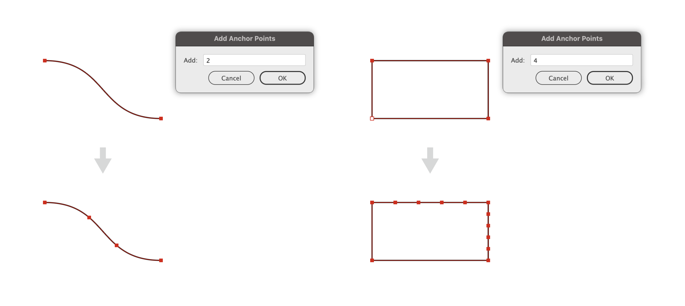

### Usage
1. Select two or more anchor points with the Direct Selection Tool, and run this script.
2. Enter the number of anchor points to add.

> [!NOTE]
> Anchor points for type on a path and area type are also supported.

### Requirements
Illustrator CS4 or higher

<div align="right">[ <a href="#path">↑ Back to Top ↑</a> ]</div>
<br>


# <a name="addNumericSeparatorsjs">addNumericSeparators.js</a>
[](https://github.com/sky-chaser-high/adobe-illustrator-scripts/releases/latest/download/Text.zip)
  
This script changes a number to a 3-digit comma delimited string.


### Usage
Select text objects or specify a text range in an editing state, and run this script.

### Requirements
Illustrator CS or higher

<div align="right">[ <a href="#text">↑ Back to Top ↑</a> ]</div>
<br>


# <a name="addSelectedGradientsToSwatchjs">addSelectedGradientsToSwatch.js</a>
[](https://github.com/sky-chaser-high/adobe-illustrator-scripts/releases/latest/download/Color.zip)
  
This script adds selected gradients to Swatches.


### Usage
Select path objects, and run this script.

> [!NOTE]
> Text object and stroke color are not supported.

### Requirements
Illustrator CS or higher

<div align="right">[ <a href="#color">↑ Back to Top ↑</a> ]</div>
<br>


# <a name="alignInCenterOfSpaceHorizontaljsalignInCenterOfSpaceVerticaljs">alignInCenterOfSpace(Horizontal).js<br>alignInCenterOfSpace(Vertical).js</a>
[](https://github.com/sky-chaser-high/adobe-illustrator-scripts/releases/latest/download/Path.zip)
  
This script aligns objects in the center of space.

For example, alignInCenterOfSpace(Vertical).js:


### Usage
Select three or more objects, and run this script.  
The position of alignment depends on the reference point.

> [!NOTE]
> Include or exclude the stroke width depends on the Align panel menu > Use Preview Bounds.  
> Select at least three objects.

### Requirements
Illustrator CS3 or higher

<div align="right">[ <a href="#path">↑ Back to Top ↑</a> ]</div>
<br>


# <a name="alignObjectsjs">alignObjects.js</a>
[](https://github.com/sky-chaser-high/adobe-illustrator-scripts/releases/latest/download/Path.zip)
  
This script aligns objects horizontally and vertically at the same time.

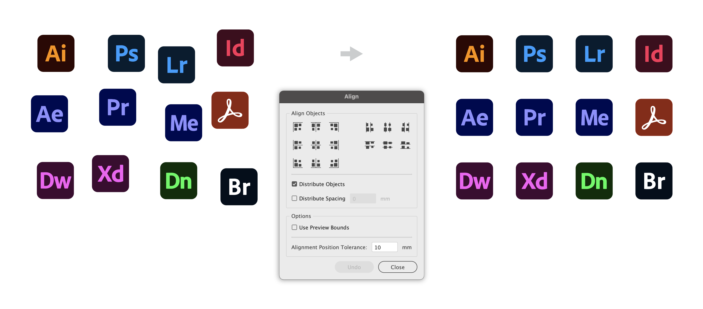

### Usage
1. Select any objects, and run this script.
2. Select the Distribute Objects or the Distribute Spacing.  
   If you don't want evenly spaced distribution, uncheck both checkboxes.
3. To include stroke width, check the Use Preview Bounds checkbox.
4. Enter a value of the Alignment Position Tolerance. (0 or higher number)  
   
5. Click the Align icon button.

> [!NOTE]
> The top row and the left-most column are the basis for alignment.  
> Compound paths, texts, linked files, and embedded files are also supported.

### Support units
Point, Pixel, Pica, Inch, Feet, Yard, Millimeter, Centimeter, Meter.  
These units depend on the ruler units.

### Requirements
Illustrator 2021 or higher

<div align="right">[ <a href="#path">↑ Back to Top ↑</a> ]</div>
<br>


# <a name="arrangeWindowsjs">arrangeWindows.js</a>
[](https://github.com/sky-chaser-high/adobe-illustrator-scripts/releases/latest/download/View.zip)
  
This script splits and arranges all open windows.

> [!TIP]
> The Arrange document icon has been implemented in the Application Bar since version 2022.


### Usage
Just run this script.

> [!NOTE]
> Open at least two files.  

### Requirements
Illustrator CS6 or higher

<div align="right">[ <a href="#view">↑ Back to Top ↑</a> ]</div>
<br>


# <a name="bulkRelinkjs">bulkRelink.js</a>
[](https://github.com/sky-chaser-high/adobe-illustrator-scripts/releases/latest/download/Link.zip)
  
This script replaces missing links, linked and embedded files in bulk.

> [!IMPORTANT]
> Since version 2024, the Apply to All checkbox has been removed from the dialog that appears when there are missing link files. As a result, it is no longer possible to replace files in bulk using this dialog.


### Usage
1. Select any missing link, linked or embedded files, and run this script.
2. Select a new file.
3. For PDF, select a crop to option and enter a page number from the import options.

> [!NOTE]
> When selecting linked files, select them in the document rather than the Links panel.

### Requirements
Illustrator CS6 or higher

<div align="right">[ <a href="#link">↑ Back to Top ↑</a> ]</div>
<br>


# <a name="checkDayOfWeekjs">checkDayOfWeek.js</a>
[](https://github.com/sky-chaser-high/adobe-illustrator-scripts/releases/latest/download/Utility.zip)
  
This script checks the day of the week.

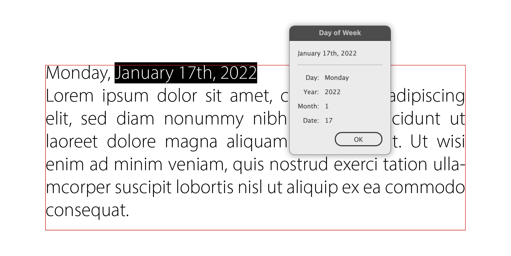

### Usage
Select a date section in the text with the cursor, and run this script.

> [!NOTE]
> If there is no year, it will considered as this year.

### Format
The following formats are supported.  
`YYYY/MM/DD`, `MM/DD/YYYY`, `DD/MM/YYYY`,   
`YYYY-MM-DD`, `MM-DD-YYYY`, `DD-MM-YYYY`,  
`YYYY.MM.DD`, `MM.DD.YYYY`, `DD.MM.YYYY`,  
`YYYY MM DD`, `MM DD YYYY`, `DD MM YYYY`,  
`Jan(uary) (the) DD(st|nd|rd|th)(,) YYYY`, `MM DD(st|nd|rd|th)(,) YYYY`,  
`DD(st|nd|rd|th) (of) Jan(uary)(,) YYYY`, `DD(st|nd|rd|th) MM(,) YYYY`,  
`YYYY年MM月DD日`, `令和YY年MM月DD日`, `平成YY年MM月DD日`, `昭和YY年MM月DD日`, `大正YY年MM月DD日`, `明治YY年MM月DD日`

### Requirements
Illustrator CS4 or higher

<div align="right">[ <a href="#utility">↑ Back to Top ↑</a> ]</div>
<br>


# <a name="closeAllDocumentsjs">closeAllDocuments.js</a>
[](https://github.com/sky-chaser-high/adobe-illustrator-scripts/releases/latest/download/Utility.zip)
  
This script closes all documents.

> [!TIP]
> It has been implemented in the File menu since version 2021.

### Usage
Just run this script. If there are unsaved documents, choose to save them or not.

### Requirements
Illustrator CS4 or higher

<div align="right">[ <a href="#utility">↑ Back to Top ↑</a> ]</div>
<br>


# <a name="closePathjs">closePath.js</a>
[](https://github.com/sky-chaser-high/adobe-illustrator-scripts/releases/latest/download/Path.zip)
  
This script closes the path objects.


### Usage
Select the path objects, and run this script.

### Requirements
Illustrator CS or higher

<div align="right">[ <a href="#path">↑ Back to Top ↑</a> ]</div>
<br>


# <a name="compareScalejs">compareScale.js</a>
[](https://github.com/sky-chaser-high/adobe-illustrator-scripts/releases/latest/download/Utility.zip)
  
This script compares the scales of two objects.


### Usage
1. Select two objects, and run this script.
2. To include stroke width, check the Use Preview Bounds checkbox.

### Support units
Point, Pixel, Pica, Inch, Feet, Yard, Millimeter, Centimeter, Meter.  
These units depend on the ruler units.

### Requirements
Illustrator CC or higher

<div align="right">[ <a href="#utility">↑ Back to Top ↑</a> ]</div>
<br>


# <a name="convertAllAnchorPointsToCornerjs">convertAllAnchorPointsToCorner.js</a>
[](https://github.com/sky-chaser-high/adobe-illustrator-scripts/releases/latest/download/Path.zip)
  
This script converts all anchor points to the corner.  
The anchor point conversion options in the Control panel require the anchor point to be selected, but this script selects the entire object.

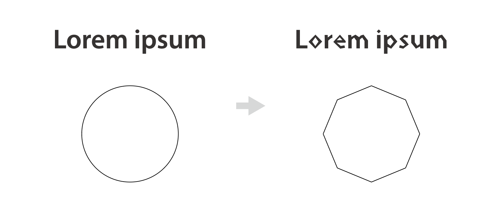

### Usage
Select the entire path with the Selection Tool, and run this script.  
If you select anchor points with the Direct Selection Tool, a dialog will show to convert all or only selected anchor points to corner points.  


> [!NOTE]
> Anchor points for type on a path and area type are also supported.

### Requirements
Illustrator CS4 or higher

<div align="right">[ <a href="#path">↑ Back to Top ↑</a> ]</div>
<br>


# <a name="convertToGlobalColorjsconvertToSpotColorjs">convertToGlobalColor.js<br>convertToSpotColor.js</a>
[](https://github.com/sky-chaser-high/adobe-illustrator-scripts/releases/latest/download/Color.zip)
  
This script converts any colors in the Swatches panel to global or spot colors.

convertToGlobalColor.js:


convertToSpotColor.js:


### Usage
Select colors in the Swatches panel, and run this script.  
If not selected, all swatches are converted.

> [!NOTE]
> If there is a swatch with the same name, it will not convert.  
> When converting a process color to a global or spot color, the order in which the colors display changes because they reregister in the swatch.

### Requirements
Illustrator CS or higher

<div align="right">[ <a href="#color">↑ Back to Top ↑</a> ]</div>
<br>


# <a name="convertTypeOnAPathToPointTypejs">convertTypeOnAPathToPointType.js</a>
[](https://github.com/sky-chaser-high/adobe-illustrator-scripts/releases/latest/download/Text.zip)
  
This script converts types on a path to point types.

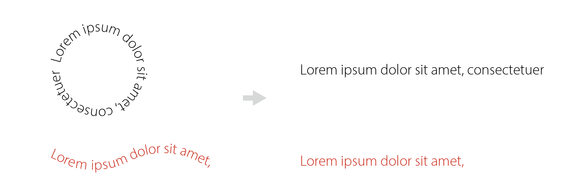

### Usage
Select type on a path object, and run this script.

> [!NOTE]
> The original type objects will delete.  
> Any effects applied in the appearance will be lost.

### Requirements
Illustrator CS or higher

<div align="right">[ <a href="#text">↑ Back to Top ↑</a> ]</div>
<br>


# <a name="copyLineDownjscopyLineUpjs">copyLineDown.js<br>copyLineUp.js</a>
[](https://github.com/sky-chaser-high/adobe-illustrator-scripts/releases/latest/download/Text.zip)
  
This script is equivalent to Visual Studio Code's Selection > 
Copy Line Down( <kbd>Option</kbd> / <kbd>Alt</kbd> + <kbd>Shift</kbd> + <kbd>↓</kbd> ) & 
Copy Line Up( <kbd>Option</kbd> / <kbd>Alt</kbd> + <kbd>Shift</kbd> + <kbd>↑</kbd> ).  
If you assign shortcuts using [Keyboard Maestro](https://www.keyboardmaestro.com), [AutoHotkey](https://www.autohotkey.com) or similar, 
you will be able to achieve more of a Visual Studio Code feel.  
Both point and area types are supported.


For example, copyLineDown.js:


### Usage
Move the cursor to the line you want to copy, and run this script.  
It is not necessary to select a line.

> [!WARNING]
> Since using copy and paste functions inside the script, it will lose if you have copied the content in advance.

> [!NOTE]
> Area type with wrapping may not work well.  
> In the case of copyLineDown.js, when copying the last line, a new line is added to work around a bug.  
> Only one line can be copied. Multiple lines are not supported.  
> If you are using version 2020 or earlier, you will not be able to enter keyboard input after running the script.  
> If you want to enter text, you must click with the mouse.

### Requirements
Illustrator CC 2018 or higher

<div align="right">[ <a href="#text">↑ Back to Top ↑</a> ]</div>
<br>


# <a name="copyLineEmptySelectionjscutLineEmptySelectionjs">copyLine(emptySelection).js<br>cutLine(emptySelection).js</a>
[](https://github.com/sky-chaser-high/adobe-illustrator-scripts/releases/latest/download/Text.zip)
  
This script is equivalent to Visual Studio Code's keyboard shortcut 
"Copy line (empty selection)"( <kbd>⌘</kbd> / <kbd>Ctrl</kbd> + <kbd>C</kbd> ) & 
"Cut line (empty selection)"( <kbd>⌘</kbd> / <kbd>Ctrl</kbd> + <kbd>X</kbd> ).  
If you assign shortcuts using [Keyboard Maestro](https://www.keyboardmaestro.com), [AutoHotkey](https://www.autohotkey.com) or similar, 
you will be able to achieve more of a Visual Studio Code feel.  
Both point and area types are supported.

For example, cutLine(emptySelection).js:


### Usage
Move the cursor to the line you want to copy or cut, and run this script.  
It is not necessary to select a line.

> [!IMPORTANT]
> Linefeed are not included to work around a bug in Illustrator.

> [!NOTE]
> Area type with wrapping may not work well.  
> If you are using version 2020 or earlier, you will not be able to enter keyboard input after running the script.  
> If you want to enter text, you must click with the mouse.

### Requirements
Illustrator CC 2018 or higher

<div align="right">[ <a href="#text">↑ Back to Top ↑</a> ]</div>
<br>


# <a name="createColorChartjs">createColorChart.js</a>
[](https://github.com/sky-chaser-high/adobe-illustrator-scripts/releases/latest/download/Color.zip)
  
This script creates a color chart. Both CMYK and RGB colors are supported.


### Usage
1. Run this script.
2. Select CMYK or RGB mode.
3. Enter the target color values.  
   If select a path or text object, its fill color value is used as the initial value.
4. Select colors for the vertical and horizontal axis.
5. Enter the increase or decrease value as a percentage.
6. Select Addition or Intensity.
   - `Addition` The value of the steps is added as is.
   - `Intensity` The percentage of the target color is added. It is equivalent to Edit > Edit Colors > Saturate.  
   
7. Set the units, artboard size, and color chip size according to your preference.

> [!NOTE]
> Spot color, gradient, and pattern are not supported.  
> Create a color chart in a new document.

### Requirements
Illustrator CS6 or higher

<div align="right">[ <a href="#color">↑ Back to Top ↑</a> ]</div>
<br>


# <a name="createGridLinesjs">createGridLines.js</a>
[](https://github.com/sky-chaser-high/adobe-illustrator-scripts/releases/latest/download/Path.zip)
  
This script creates grid lines on artboards.


### Usage
Just run this script.

> [!NOTE]
> Grid spacing is determined by the Guides & Grid in Preferences.

### Requirements
Illustrator CS or higher

<div align="right">[ <a href="#path">↑ Back to Top ↑</a> ]</div>
<br>


# <a name="createPageNumbersjs">createPageNumbers.js</a>
[](https://github.com/sky-chaser-high/adobe-illustrator-scripts/releases/latest/download/Text.zip)
  
This script is equivalent to InDesign's Type > Insert Special Character > Markers > Current Page Number.  
Places a page number at a specified location on the artboards.


### Usage
1. Run this script.
2. Set up each parameter in the dialog that appears.
   - `Position` Position of the page number relative to the artboard.
   - `Facing Pages` If true, the facing page.
   - `Start Page Number` A start page number.
   - `Section Prefix` Add a Section Prefix in front of the page number. If facing page, in back of the page number.
   - `Font Size` Font size of the page number.
   - `Margin` Distance from the artboard. Switch the units according to the ruler units.

> [!NOTE]
> The page numbering style is numeric only.  
> Assign page numbers in artboard order.

### Requirements
Illustrator CS4 or higher

<div align="right">[ <a href="#text">↑ Back to Top ↑</a> ]</div>
<br>


# <a name="createTextParallelToPathSegmentjs">createTextParallelToPathSegment.js</a>
[](https://github.com/sky-chaser-high/adobe-illustrator-scripts/releases/latest/download/Text.zip)
  
This script creates a text parallel to a straight segment or a line connecting two anchor points.


### Usage
1. Select two anchor points with the Direct Selection Tool, and run this script.
2. Enter any text. The default values are the distance and angle between two points.
3. Select either Point Type or Area Type.  
   `Point Type` Select left, center, or right align.  
   `Area Type` Enter area width and height values.
4. Check the Flip checkbox reverses the drawing position.
5. Check the Middle checkbox to draw in the middle of the path segment.
6. Enter a value of the margin will space them from the path segment.

> [!NOTE]
> Curves are not supported.  
> Anchor points for type on a path and area type are also supported.

### Support units
Point, Pixel, Pica, Inch, Feet, Yard, Millimeter, Centimeter, Meter.  
These units depend on the ruler units.

### Requirements
Illustrator 2021 or higher

<div align="right">[ <a href="#text">↑ Back to Top ↑</a> ]</div>
<br>


# <a name="createThreadedTextjs">createThreadedText.js</a>
[](https://github.com/sky-chaser-high/adobe-illustrator-scripts/releases/latest/download/Text.zip)
  
This script creates a threaded text. It can also be made from a mixture of point types and path objects.  
The vertical text is also supported.

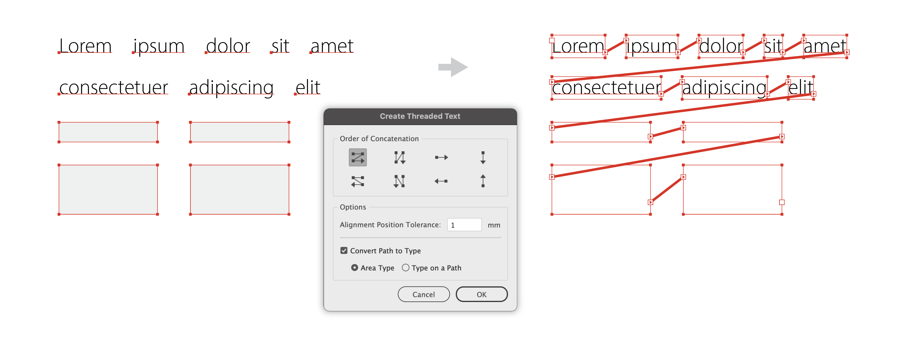

### Usage
1. Select two or more text and/or path objects, and run this script. There is no need to convert to the area types in advance.
2. Select an order of concatenation.
3. Enter a value of the alignment position tolerance. (0 or higher number)  
   
4. To convert the paths to the texts, check the Convert Path to Type checkbox and select either the Area Type or Type on a Path.

> [!NOTE]
> The stacking order of objects and layers has no bearing on the order of concatenation.  
> When converting the path to the area type, ignore anchor points with fewer than two anchor points.

### Support units
Point, Pixel, Pica, Inch, Feet, Yard, Millimeter, Centimeter, Meter.  
These units depend on the ruler units.

### Requirements
Illustrator CC or higher

<div align="right">[ <a href="#text">↑ Back to Top ↑</a> ]</div>
<br>


# <a name="decreaseSelectedAnchorPointsCWjsdecreaseSelectedAnchorPointsCCWjs">decreaseSelectedAnchorPointsCW.js<br>decreaseSelectedAnchorPointsCCW.js</a>
[](https://github.com/sky-chaser-high/adobe-illustrator-scripts/releases/latest/download/Path.zip)
  
This script decreases selected anchor points clockwise or counterclockwise.

For example, decreaseSelectedAnchorPointsCW.js:


### Usage
Select any anchor points with Direct Selection Tool, and run this script.

### Requirements
Illustrator CS or higher

<div align="right">[ <a href="#path">↑ Back to Top ↑</a> ]</div>
<br>


# <a name="deleteAllLeftjsdeleteAllRightjs">deleteAllLeft.js<br>deleteAllRight.js</a>
[](https://github.com/sky-chaser-high/adobe-illustrator-scripts/releases/latest/download/Text.zip)
  
This script is equivalent to Visual Studio Code's keyboard shortcut 
"Delete All Left"( <kbd>⌘</kbd> + <kbd>Backspace</kbd> ) & 
"Delete All Right"( <kbd>⌘</kbd> + <kbd>Delete</kbd> ).  
If you assign shortcuts using [Keyboard Maestro](https://www.keyboardmaestro.com), [AutoHotkey](https://www.autohotkey.com) or similar, 
you will be able to achieve more of a Visual Studio Code feel.  
Both point and area types are supported.

For example, deleteAllRight.js:


### Usage
Move the cursor to the position of the character you want to delete and run this script.  
It is not necessary to select a string to be deleted.

> [!WARNING]
> Since using copy and paste functions inside the script, it will lose if you have copied the content in advance.

> [!NOTE]
> Only one line can be deleted. Multiple lines are not supported.  
> If you are using version 2020 or earlier, you will not be able to enter keyboard input after running the script.  
> If you want to enter text, you must click with the mouse.

### Requirements
Illustrator CC 2018 or higher

<div align="right">[ <a href="#text">↑ Back to Top ↑</a> ]</div>
<br>


# <a name="deleteAllSwatchesjs">deleteAllSwatches.js</a>
[](https://github.com/sky-chaser-high/adobe-illustrator-scripts/releases/latest/download/Color.zip)
  
This script deletes all swatches except None and Registration.

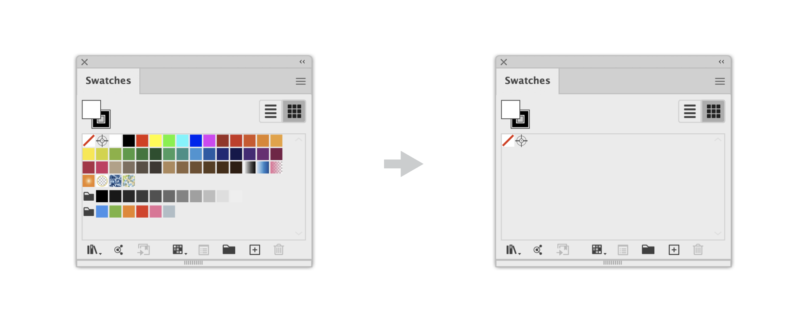

### Usage
Just run this script.

> [!NOTE]
> Delete any swatches in use for the objects as well.

### Requirements
Illustrator CS or higher

<div align="right">[ <a href="#color">↑ Back to Top ↑</a> ]</div>
<br>


# <a name="deleteHiddenLayersjs">deleteHiddenLayers.js</a>
[](https://github.com/sky-chaser-high/adobe-illustrator-scripts/releases/latest/download/Layer.zip)
  
This script deletes hidden layers.

> [!TIP]
> It has been implement in the Layers panel menu since version 2021.


### Usage
Just run this script.

### Requirements
Illustrator CS or higher

<div align="right">[ <a href="#layer">↑ Back to Top ↑</a> ]</div>
<br>


# <a name="deleteLockedLayersjs">deleteLockedLayers.js</a>
[](https://github.com/sky-chaser-high/adobe-illustrator-scripts/releases/latest/download/Layer.zip)
  
This script deletes locked layers.


### Usage
Just run this script.

### Requirements
Illustrator CS or higher

<div align="right">[ <a href="#layer">↑ Back to Top ↑</a> ]</div>
<br>


# <a name="deleteTrailingSpacesjs">deleteTrailingSpaces.js</a>
[](https://github.com/sky-chaser-high/adobe-illustrator-scripts/releases/latest/download/Text.zip)
  
This script deletes trailing spaces and tabs.
Both point and area types are supported.


### Usage
Select the text objects, and run this script.  
It is not necessary to select a line.

> [!NOTE]
> Area type with wrapping may not work well.

### Requirements
Illustrator CS or higher

<div align="right">[ <a href="#text">↑ Back to Top ↑</a> ]</div>
<br>


# <a name="deleteUnusedLayersjs">deleteUnusedLayers.js</a>
[](https://github.com/sky-chaser-high/adobe-illustrator-scripts/releases/latest/download/Layer.zip)
  
This script deletes unused layers.


### Usage
Just run this script. It is not necessary to select any layers.

### Requirements
Illustrator CS or higher

<div align="right">[ <a href="#layer">↑ Back to Top ↑</a> ]</div>
<br>


# <a name="deleteWordjs">deleteWord.js</a>
[](https://github.com/sky-chaser-high/adobe-illustrator-scripts/releases/latest/download/Text.zip)
  
This script deletes a word under the cursor.
Both point and area types are supported.


### Usage
Move the cursor to the position of the word you want to delete and run this script.  
It is not necessary to select a word.

> [!WARNING]
> Since using copy and paste functions inside the script, it will lose if you have copied the content in advance.

> [!NOTE]
> Area type with wrapping may not work well.  
> If you are using version 2020 or earlier, you will not be able to enter keyboard input after running the script.  
> If you want to enter text, you must click with the mouse.

### Requirements
Illustrator CC 2018 or higher

<div align="right">[ <a href="#text">↑ Back to Top ↑</a> ]</div>
<br>


# <a name="disjoinPathjs">disjoinPath.js</a>
[](https://github.com/sky-chaser-high/adobe-illustrator-scripts/releases/latest/download/Path.zip)
  
This script breaks apart the path object with anchor points.


### Usage
Select any path objects, and run this script.

> [!NOTE]
> The original path object will deleted.

### Requirements
Illustrator CS or higher

<div align="right">[ <a href="#path">↑ Back to Top ↑</a> ]</div>
<br>


# <a name="distributeInSpaceHorizontaljsdistributeInSpaceVerticaljs">distributeInSpace(Horizontal).js<br>distributeInSpace(Vertical).js</a>
[](https://github.com/sky-chaser-high/adobe-illustrator-scripts/releases/latest/download/Path.zip)
  
This script distributes objects evenly spaced in space.

For example, distributeInSpace(Vertical).js:


### Usage
Select three or more objects, and run this script.  
The position of alignment depends on the reference point.

> [!NOTE]
> Include or exclude the stroke width depends on the Align panel menu > Use Preview Bounds.  
> Select at least three objects.

### Requirements
Illustrator CS3 or higher

<div align="right">[ <a href="#path">↑ Back to Top ↑</a> ]</div>
<br>


# <a name="drawCircumscribedCirclejs">drawCircumscribedCircle.js</a>
[](https://github.com/sky-chaser-high/adobe-illustrator-scripts/releases/latest/download/Path.zip)
  
This script draws a circumscribed circle through 3 or 2 anchor points.

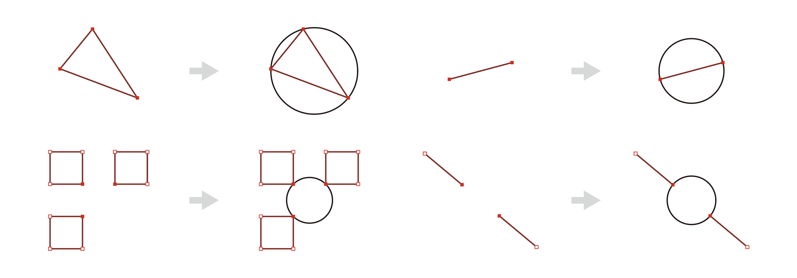

### Usage
Select 3 or 2 anchor points with Direct Selection Tool, and run this script.

> [!NOTE]
> For two anchor points, it is the diameter.  
> Anchor points for type on a path and area type are also supported.

### Requirements
Illustrator CS or higher

<div align="right">[ <a href="#path">↑ Back to Top ↑</a> ]</div>
<br>


# <a name="drawNormalLinejs">drawNormalLine.js</a>
[](https://github.com/sky-chaser-high/adobe-illustrator-scripts/releases/latest/download/Path.zip)
  
This script draws normal lines (line perpendicular to a tangent) to a curve or line between two anchor points.

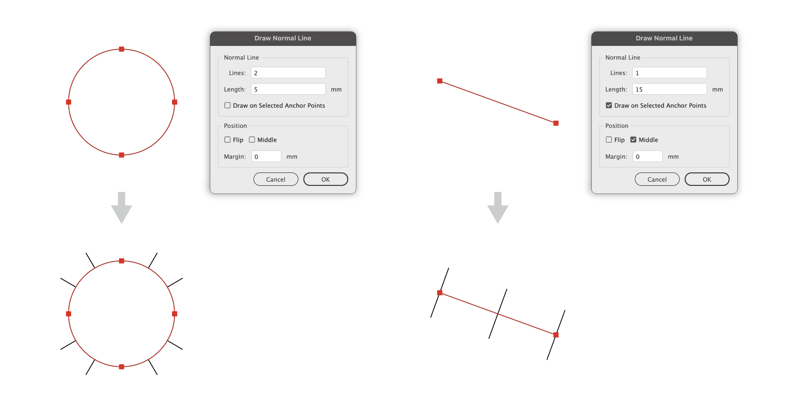

### Usage
1. Select two or more anchor points with the Direct Selection Tool, and run this script.
2. Enter the number of normal lines to draw.
3. Enter the length of normal line to draw.
4. Check the Draw on Selected Anchor Points checkbox if you want to draw on the selected anchor points.
5. Check the Flip checkbox reverses the drawing position.
6. Check the Middle checkbox to draw in the middle of the path segment.
7. Enter a value of the margin will space them from the path segment.

> [!NOTE]
> Anchor points for type on a path and area type are not supported.

### Support units
Point, Pixel, Pica, Inch, Feet, Yard, Millimeter, Centimeter, Meter.  
These units depend on the ruler units.

### Requirements
Illustrator CS4 or higher

<div align="right">[ <a href="#path">↑ Back to Top ↑</a> ]</div>
<br>


# <a name="drawRectanglejs">drawRectangle.js</a>
[](https://github.com/sky-chaser-high/adobe-illustrator-scripts/releases/latest/download/Path.zip)
  
This script draws rectangles around selected objects.


### Usage
1. Select any objects, and run this script.
2. Enter a margin value.
3. To draw a rectangle on each object in the group, check the Ignore Groups checkbox.
4. To include stroke width, check the Use Preview Bounds checkbox.

> [!NOTE]
> The rectangle is drawn with no fill and stroke width.

### Support units
Point, Pixel, Pica, Inch, Feet, Yard, Millimeter, Centimeter, Meter.  
These units depend on the ruler units.

### Requirements
Illustrator CS4 or higher

<div align="right">[ <a href="#path">↑ Back to Top ↑</a> ]</div>
<br>


# <a name="draws-curvejs">drawS-curve.js</a>
[](https://github.com/sky-chaser-high/adobe-illustrator-scripts/releases/latest/download/Path.zip)
  
This script draws an S-curve between two objects or converts an open path to an S-curve.

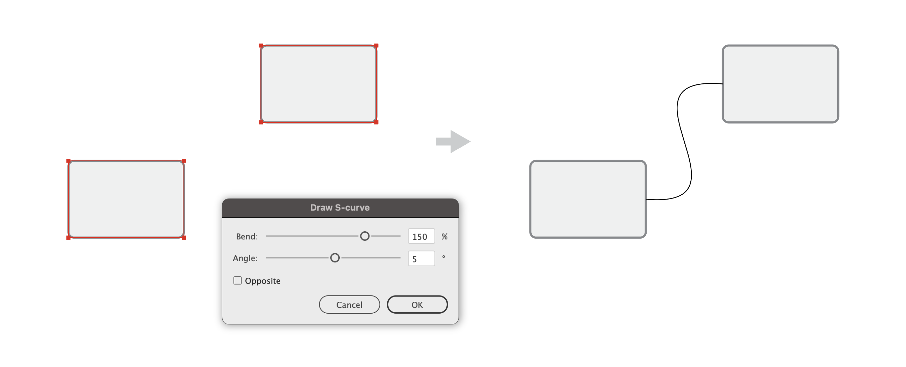

### Usage
1. Select two objects or one open path object, and run this script.
2. To change the curvature, enter the bend in the text field or use the slider to set the value.  
   The slider allows only up to 200%, but you can enter higher values in the text field.
3. To angle the S-curve, enter the angle in the text field or use the slider to set the value.  
   The angle is specified in degrees.
4. Check the Opposite checkbox to draw the curve at the opposite side.

### Requirements
Illustrator CS4 or higher

<div align="right">[ <a href="#path">↑ Back to Top ↑</a> ]</div>
<br>


# <a name="drawShapeOnAnchorPointjs">drawShapeOnAnchorPoint.js</a>
[](https://github.com/sky-chaser-high/adobe-illustrator-scripts/releases/latest/download/Path.zip)
  
This script draws shapes on anchor points.

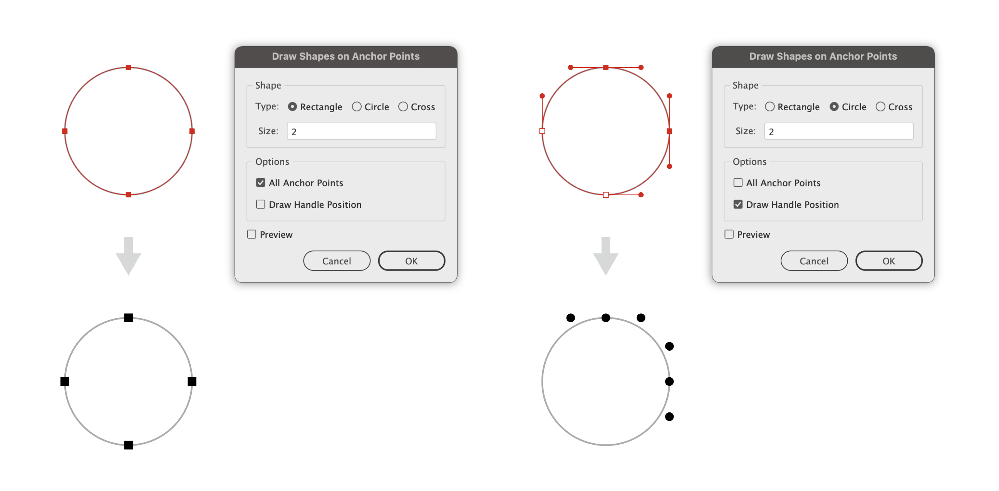

### Usage
1. Select any path objects, and run this script.
2. Select a shape.
3. Enter a shape size.
4. If you select anchor points with the Direct Selection Tool, choose whether to draw the shape on all anchor points or only on the selected anchor points.
5. Check the Draw Handle Position checkbox if you want to draw the shapes on the handle positions.

### Support units
Point, Pixel, Pica, Inch, Feet, Yard, Millimeter, Centimeter, Meter.  
These units depend on the ruler units.

### Requirements
Illustrator CS4 or higher

<div align="right">[ <a href="#path">↑ Back to Top ↑</a> ]</div>
<br>


# <a name="drawShapeParallelToPathSegmentjs">drawShapeParallelToPathSegment.js</a>
[](https://github.com/sky-chaser-high/adobe-illustrator-scripts/releases/latest/download/Path.zip)
  
This script draws a shape parallel to a straight segment or a line connecting two anchor points.


### Usage
1. Select two anchor points with the Direct Selection Tool, and run this script.
2. Select a Square, Rectangle or Ellipse.
3. If you select the Rectangle or Ellipse, enter width and height values.
4. Check the Flip checkbox reverses the drawing position.
5. Check the Middle checkbox to draw in the middle of the path segment.
6. Enter a value of the margin will space them from the path segment.

> [!NOTE]
> Curves are not supported.  
> Anchor points for type on a path and area type are also supported.

### Support units
Point, Pixel, Pica, Inch, Feet, Yard, Millimeter, Centimeter, Meter.  
These units depend on the ruler units.

### Requirements
Illustrator CS4 or higher

<div align="right">[ <a href="#path">↑ Back to Top ↑</a> ]</div>
<br>


# <a name="encloseWordInParenthesesjs">encloseWordInParentheses.js</a>
[](https://github.com/sky-chaser-high/adobe-illustrator-scripts/releases/latest/download/Text.zip)
  
This script encloses words in parentheses.


### Usage
Move the cursor to the position of the word you want to enclose and run this script.  
If you select text ranges, enclose them.

> [!WARNING]
> Since using cut and paste functions inside the script, it will lose if you have copied the content in advance.

> [!NOTE]
> Area type with wrapping may not work well.  
> If you are using version 2020 or earlier, you will not be able to enter keyboard input after running the script.  
> If you want to enter text, you must click with the mouse.

If you want to enclose it with other characters, change lines 41 and 42 inside the script.  
For example, if you enclose it in brackets:
```javascript
var parentheses = {
    start: '[',
    end: ']'
};
```

### Requirements
Illustrator CC 2018 or higher

<div align="right">[ <a href="#text">↑ Back to Top ↑</a> ]</div>
<br>


# <a name="exportAsPDFjs">exportAsPDF.js</a>
[](https://github.com/sky-chaser-high/adobe-illustrator-scripts/releases/latest/download/Utility.zip)
  
This script exports multiple PDFs simultaneously from a single Adobe Illustrator document. Up to 5 presets can be selected.
You can also export open documents or all documents in a folder together.

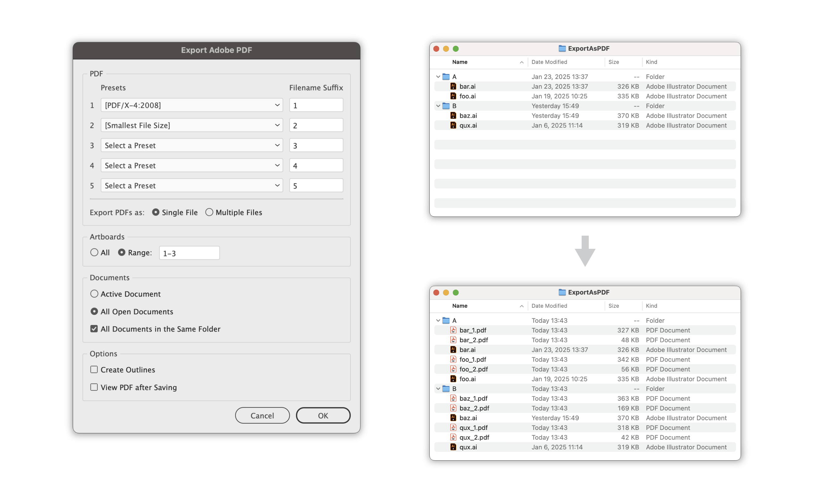

### Usage
1. Open some documents to be exported to PDF, and run this script.
2. Select some PDF presets.
3. Enter the string to be added to the end of the file name. The default value is a serial number.
4. If the document has multiple artboards, select whether the exported PDF should be a single or multiple file.
5. Select the range of the artboards to export.
   - `All` All artboards to export.
   - `Ranges` Specifies the range of the artboards to export.
6. You can specify the document to export to PDF with the following options.
   - `Active Document` Export only the currently displayed document to PDF.
   - `All Open Documents` Export all open documents to PDF.
   - `All Documents in the Same Folder` Checking the checkbox will export all documents in the same folder as the active or all open documents. No need to open all documents.
7. To create an outline, check the Create Outline checkbox.

> [!NOTE]
> The PDF files export in the same folder as the Illustrator documents.  
> If the PDF file with the same name exists, it overwrites.

### Requirements
Illustrator CS6 or higher

<div align="right">[ <a href="#utility">↑ Back to Top ↑</a> ]</div>
<br>


# <a name="exportColorValuesToCSVjs">exportColorValuesToCSV.js</a>
[](https://github.com/sky-chaser-high/adobe-illustrator-scripts/releases/latest/download/Color.zip)
  
This script exports color values of a path object or swatches to a CSV file.


### Usage
Select path objects or swatches, and run this script.  
If you want to export all swatches, deselect path objects and swatches.

> [!NOTE]
> If you want to get the swatch name, use a global color.  
> Export to the desktop.  
> Prioritize the path object over swatches.  
> Text object and gradient are not supported.

### Requirements
Illustrator CS or higher

<div align="right">[ <a href="#color">↑ Back to Top ↑</a> ]</div>
<br>


# <a name="extendHandlejs">extendHandle.js</a>
[](https://github.com/sky-chaser-high/adobe-illustrator-scripts/releases/latest/download/Path.zip)
  
This script extends and shrinks handles. It also changes the angle.

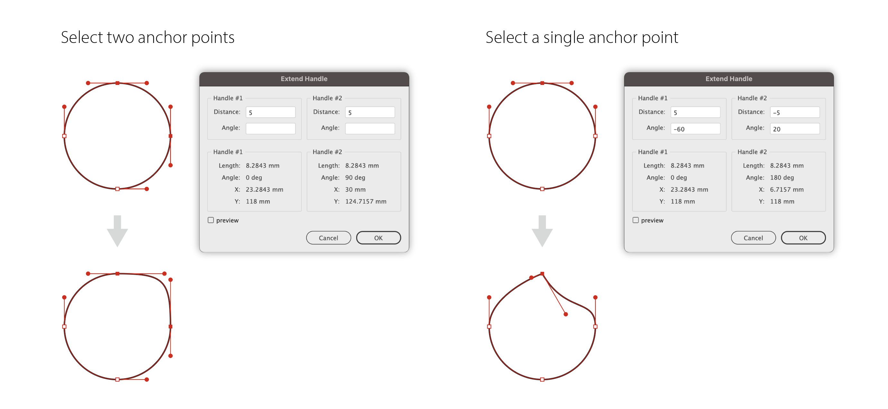

### Usage
1. Select one or two anchor points with the Direct Selection Tool, and run this script.
2. Enter a positive value in the Distance fields to extend or a negative value to shrink.
3. Enter a positive value in the Angle fields will rotate counterclockwise. Enter a negative value clockwise.

> [!NOTE]
> Handles cannot delete.  
> The angle increases or decreases based on the current value.

### Support units
Point, Pixel, Pica, Inch, Feet, Yard, Millimeter, Centimeter, Meter.  
These units depend on the ruler units.

### Requirements
Illustrator CS4 or higher

<div align="right">[ <a href="#path">↑ Back to Top ↑</a> ]</div>
<br>


# <a name="extendLinejs">extendLine.js</a>
[](https://github.com/sky-chaser-high/adobe-illustrator-scripts/releases/latest/download/Path.zip)
  
This script extends and shrinks path segments.


### Usage
1. Select any anchor points with the Direct Selection Tool, and run this script.
2. Enter a positive value to extend or a negative value to shrink.

> [!NOTE]
> Closed paths and curves are not supported.  
> Anchor points for type on a path are also supported.

### Support units
Point, Pixel, Pica, Inch, Feet, Yard, Millimeter, Centimeter, Meter.  
These units depend on the ruler units.

### Requirements
Illustrator CS4 or higher

<div align="right">[ <a href="#path">↑ Back to Top ↑</a> ]</div>
<br>


# <a name="extractColorsFromGradientjs">extractColorsFromGradient.js</a>
[](https://github.com/sky-chaser-high/adobe-illustrator-scripts/releases/latest/download/Color.zip)
  
This script extracts colors as swatches from the gradient stops.


### Usage
Select any path objects or swatches, and run this script.

> [!NOTE]
> Prioritize the path object over swatches.  
> To extract color from swatches, deselect the path objects.  
> Text object and stroke color are not supported.

### Requirements
Illustrator CS or higher

<div align="right">[ <a href="#color">↑ Back to Top ↑</a> ]</div>
<br>


# <a name="fitGuideInArtboardjs">fitGuideInArtboard.js</a>
[](https://github.com/sky-chaser-high/adobe-illustrator-scripts/releases/latest/download/Path.zip)
  
This script fits guide objects in an artboard.


### Usage
Select guide objects, and run this script.

> [!NOTE]
> Closed paths and curves are not supported.

### Requirements
Illustrator CS or higher

<div align="right">[ <a href="#path">↑ Back to Top ↑</a> ]</div>
<br>


# <a name="fitSelectedObjectsInWindowjs">fitSelectedObjectsInWindow.js</a>
[](https://github.com/sky-chaser-high/adobe-illustrator-scripts/releases/latest/download/View.zip)
  
This script changes the zoom factor that the selected object fills the display.

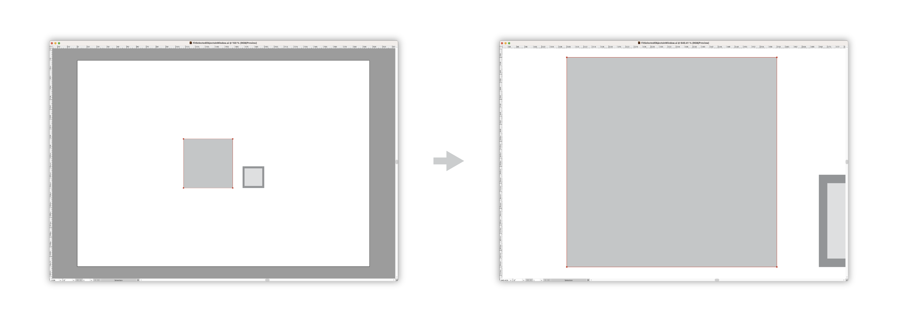

### Usage
Select any objects, and run this script.  

> [!NOTE]
> If no objects are selected, all objects should fit in the window. Ignore guides.

### Requirements
Illustrator CS or higher

<div align="right">[ <a href="#view">↑ Back to Top ↑</a> ]</div>
<br>


# <a name="generateGradientColorjs">generateGradientColor.js</a>
[](https://github.com/sky-chaser-high/adobe-illustrator-scripts/releases/latest/download/Color.zip)
  
This script generates a gradient color from fill colors or swatches.

> [!TIP]
> It has been implement in the Swatch panel menu since version 2025.


### Usage
Select two or more path objects or swatches, and run this script.

> [!NOTE]
> Prioritize the path object over swatches.  
> To generate gradient color from swatches, deselect the path objects.  
> Text object and stroke color are not supported.

### Requirements
Illustrator CS4 or higher

<div align="right">[ <a href="#color">↑ Back to Top ↑</a> ]</div>
<br>


# <a name="goToLinejs">goToLine.js</a>
[](https://github.com/sky-chaser-high/adobe-illustrator-scripts/releases/latest/download/Text.zip)
  
This script is equivalent to Visual Studio Code's Go > Go to Line/Column( <kbd>Ctrl</kbd> + <kbd>G</kbd> ).  
If you assign shortcuts using [Keyboard Maestro](https://www.keyboardmaestro.com), [AutoHotkey](https://www.autohotkey.com) or similar, 
you will be able to achieve more of a Visual Studio Code feel.  
Both point and area types are supported.


### Usage
1. Run this script in the text editing state.
2. Enter a line number or select a line from the list below that you want to move.

> [!WARNING]
> Since using copy and paste functions inside the script, it will be lost if you have copied the content in advance.

> [!NOTE]
> Pan that the selected line is centered in the window.  
> If you are using version 2020 or earlier, you will not be able to enter keyboard input after running the script.  
> If you want to enter text, you must click with the mouse.

### Requirements
Illustrator CC 2018 or higher

<div align="right">[ <a href="#text">↑ Back to Top ↑</a> ]</div>
<br>


# <a name="goToNextTextjsgoToPreviousTextjs">goToNextText.js<br>goToPreviousText.js</a>
[](https://github.com/sky-chaser-high/adobe-illustrator-scripts/releases/latest/download/Text.zip)
  
This script moves the cursor to the beginning of the next or previous text while in the text editing state.  
Both point and area types are supported.

For example, goToNextText.js:


### Usage
Run this script in the text editing state.

> [!WARNING]
> Since using cut and paste functions inside the script, it will lose if you have copied the content in advance.

> [!NOTE]
> It will not move to locked, hidden, or threaded texts. The layer also as well.  
> The cursor moving order is text stacking order.  
> Pan that the next or previous text is centered in the window.  
> If you are using version 2020 or earlier, you will not be able to enter keyboard input after running the script.  
> If you want to enter text, you must click with the mouse.

### Requirements
Illustrator CC 2018 or higher

<div align="right">[ <a href="#text">↑ Back to Top ↑</a> ]</div>
<br>


# <a name="highlightWordjs">highlightWord.js</a>
[](https://github.com/sky-chaser-high/adobe-illustrator-scripts/releases/latest/download/Color.zip)
  
This script highlights the searched string by fill color, swatch or character style.  
Both CMYK and RGB colors are supported.


### Usage
1. Select any text objects, and run this script.  
   If no texts are selected, it highlights all texts in the document.
2. Enter a string. Regular expressions are supported.
3. To specify a color, enter the color values or use the sliders
4. To specify a swatch, select a swatch name from the list on the Swatches tab and check the Ignore Color Settings checkbox.
5. To specify a character style, select a style name from the list on the Character Styles tab.
6. To specify a paragraph style, select a style name from the list on the Paragraph Styles tab.

If you wish to color the character and paragraph styles, uncheck the Ignore Color Settings checkbox.

> [!NOTE]
> Color and swatch cannot be applied at the same time.

### Requirements
Illustrator CS6 or higher

<div align="right">[ <a href="#color">↑ Back to Top ↑</a> ]</div>
<br>


# <a name="importCSVtoSwatchjs">importCSVtoSwatch.js</a>
[](https://github.com/sky-chaser-high/adobe-illustrator-scripts/releases/latest/download/Color.zip)
  
This script imports a CSV file to the Swatches panel.


### Usage
1. Run this script.
2. Select a CSV file.

> [!IMPORTANT]
> Make sure the document color mode and CSV file format are the same.

### Format
CSV files are available in the following 3 formats.  

> [!NOTE]
> Commas or tabs separate columns.  
> Line 1 is used as the title.  
> The swatch name is not required.

##### For CMYK:  
| Cyan | Magenta | Yellow | Black | Swatch name |
| --- | --- | --- | --- | --- |
| 100  | 0 | 0 | 0 | Cyan |

##### For RGB:  
| Red | Green | Blue | Swatch name |
| --- | --- | --- | --- |
| 255 | 0 | 0 | Red |

##### For HEX:  
| Hex | Swatch name |
| --- | --- |
| FF0000 | Red |

> [!NOTE]
> The leading "#" may be omitted in the case of Hex color.  
> If the Hex color is 3-digit, it behaves like CSS. (e.g. #F0F becomes #FF00FF.)

### Requirements
Illustrator CS or higher

<div align="right">[ <a href="#color">↑ Back to Top ↑</a> ]</div>
<br>


# <a name="increaseSelectedAnchorPointsCWjsincreaseSelectedAnchorPointsCCWjs">increaseSelectedAnchorPointsCW.js<br>increaseSelectedAnchorPointsCCW.js</a>
[](https://github.com/sky-chaser-high/adobe-illustrator-scripts/releases/latest/download/Path.zip)
  
This script increases selected anchor points clockwise or counterclockwise.

For example, increaseSelectedAnchorPointsCW.js:


### Usage
Select any anchor points with Direct Selection Tool, and run this script.

### Requirements
Illustrator CS or higher

<div align="right">[ <a href="#path">↑ Back to Top ↑</a> ]</div>
<br>


# <a name="insertLineAbovejsinsertLineBelowjs">insertLineAbove.js<br>insertLineBelow.js</a>
[](https://github.com/sky-chaser-high/adobe-illustrator-scripts/releases/latest/download/Text.zip)
  
This script is equivalent to Visual Studio Code's keyboard shortcut 
"Insert Line Above"( <kbd>⌘</kbd> / <kbd>Ctrl</kbd> + <kbd>Shift</kbd> + <kbd>Enter</kbd> ) & 
"Insert Line Below" ( <kbd>⌘</kbd> / <kbd>Ctrl</kbd> + <kbd>Enter</kbd> ).  
If you assign shortcuts using [Keyboard Maestro](https://www.keyboardmaestro.com), [AutoHotkey](https://www.autohotkey.com) or similar, 
you will be able to achieve more of a Visual Studio Code feel.  
Both point and area types are supported.

For example, insertLineBelow.js:


### Usage
Move the cursor to the line below or above you want to add a line, and run this script.  
It is not necessary to move the cursor to the end of the line.

> [!NOTE]
> Area type with wrapping may not work well.  
> If you are using version 2020 or earlier, you will not be able to enter keyboard input after running the script.  
> If you want to enter text, you must click with the mouse.

### Requirements
Illustrator CC 2018 or higher

<div align="right">[ <a href="#text">↑ Back to Top ↑</a> ]</div>
<br>


# <a name="invertLockedLayerjs">invertLockedLayer.js</a>
[](https://github.com/sky-chaser-high/adobe-illustrator-scripts/releases/latest/download/Layer.zip)
  
This script inverts locked layers.


### Usage
Just run this script.

### Requirements
Illustrator CS or higher

<div align="right">[ <a href="#layer">↑ Back to Top ↑</a> ]</div>
<br>


# <a name="invertVisibleLayerjs">invertVisibleLayer.js</a>
[](https://github.com/sky-chaser-high/adobe-illustrator-scripts/releases/latest/download/Layer.zip)
  
This script inverts visible layers.


### Usage
Just run this script.

### Requirements
Illustrator CS or higher

<div align="right">[ <a href="#layer">↑ Back to Top ↑</a> ]</div>
<br>


# <a name="justifyContentSpaceBetweenjs">justifyContentSpaceBetween.js</a>
[](https://github.com/sky-chaser-high/adobe-illustrator-scripts/releases/latest/download/Text.zip)
  
This script adjusts tracking to align point texts at both ends. The vertical text is also supported.

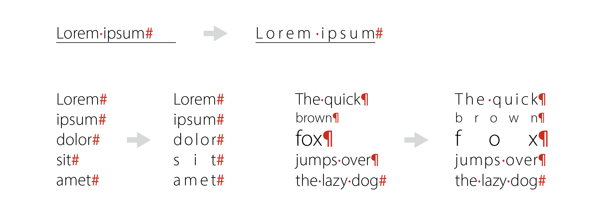

### Usage
Select point text objects and a reference path object, and run this script.  
Text objects can also align with each other. In this case, select only the text objects.

> [!NOTE]
> Different font sizes mixed within a single-line point text will not work well.  
> The text position does not change.  
> The object to use as a reference will be the longest one.

### Requirements
Illustrator CS or higher

<div align="right">[ <a href="#text">↑ Back to Top ↑</a> ]</div>
<br>


# <a name="matchLocationOfGradientStopjs">matchLocationOfGradientStop.js</a>
[](https://github.com/sky-chaser-high/adobe-illustrator-scripts/releases/latest/download/Color.zip)
  
This script matches the location of the gradient stops and midpoints.


### Usage
1. Select two or more gradients in the Swatches panel, and run this script.
2. Select a source gradient.

> [!NOTE]
> Only gradients in the Swatches panel are supported.

### Requirements
Illustrator CS4 or higher

<div align="right">[ <a href="#color">↑ Back to Top ↑</a> ]</div>
<br>


# <a name="measureDistancejs">measureDistance.js</a>
[](https://github.com/sky-chaser-high/adobe-illustrator-scripts/releases/latest/download/Utility.zip)
  
This script is an alternative to the Measure Tool and accurately measures the distance between two anchor points.


### Usage
Select two anchor points with Direct Selection Tool, and run this script.

> [!NOTE]
> Highlight the measurement points.  
> The angle is based on point #1. Range: -180.0 to 180.0  
> Anchor points for type on a path and area type are also supported.  
> Due to the small font size, labels will not appear when enlarged above 15500%.

### Support units
Point, Pixel, Pica, Inch, Feet, Yard, Millimeter, Centimeter, Meter.  
These units depend on the ruler units.

### Requirements
Illustrator CS4 or higher

<div align="right">[ <a href="#utility">↑ Back to Top ↑</a> ]</div>
<br>


# <a name="moveGuidesjs">moveGuides.js</a>
[](https://github.com/sky-chaser-high/adobe-illustrator-scripts/releases/latest/download/Path.zip)
  
This script moves all guide objects to a specified layer, frontmost, and backmost.


### Usage
1. Run this script. There is no need to select any guide objects.
2. Select a destination.  
   - `Layer` Move to the specified layer. If it does not exist, create a new layer.  
   - `Bring to Front` Move to the frontmost of each layer.  
   - `Send to Back` Move to the backmost of each layer.

> [!NOTE]
> Guides in locked or hidden layers are not supported.

### Requirements
Illustrator CS6 or higher

<div align="right">[ <a href="#path">↑ Back to Top ↑</a> ]</div>
<br>


# <a name="moveLineDownjsmoveLineUpjs">moveLineDown.js<br>moveLineUp.js</a>
[](https://github.com/sky-chaser-high/adobe-illustrator-scripts/releases/latest/download/Text.zip)
  
This script is equivalent to Visual Studio Code's Selection > 
Move Line Down( <kbd>Option</kbd> / <kbd>Alt</kbd> + <kbd>↓</kbd> ) & 
Move Line Up( <kbd>Option</kbd> / <kbd>Alt</kbd> + <kbd>↑</kbd> ).  
If you assign shortcuts using [Keyboard Maestro](https://www.keyboardmaestro.com), [AutoHotkey](https://www.autohotkey.com) or similar, 
you will be able to achieve more of a Visual Studio Code feel.  
Both point and area types are supported.


For example, moveLineDown.js:


### Usage
Move the cursor to the line you want to move, and run this script.  
It is not necessary to select a line.

> [!WARNING]
> Since using copy and paste functions inside the script, it will lose if you have copied the content in advance.

> [!NOTE]
> Area type with wrapping may not work well.  
> In the case of moveLineUp.js, when moving the last line, a new line is added to work around a bug.  
> Only one line can be moved. Multiple lines are not supported.  
> If you are using version 2020 or earlier, you will not be able to enter keyboard input after running the script.  
> If you want to enter text, you must click with the mouse.

### Requirements
Illustrator CC 2018 or higher

<div align="right">[ <a href="#text">↑ Back to Top ↑</a> ]</div>
<br>


# <a name="moveSublayerToMainLayerjs">moveSublayerToMainLayer.js</a>
[](https://github.com/sky-chaser-high/adobe-illustrator-scripts/releases/latest/download/Layer.zip)
  
This script moves sublayers to the main layer above.

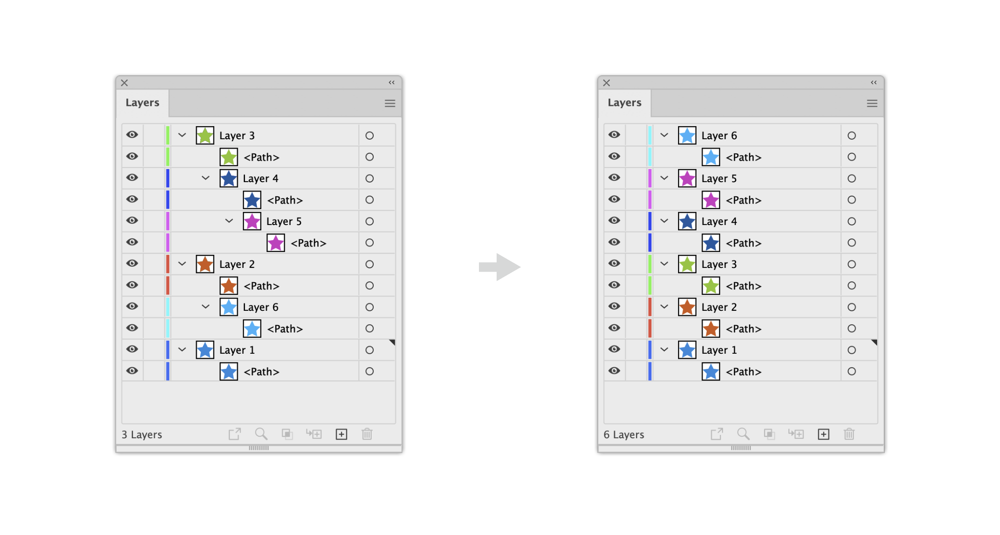

### Usage
Just run this script. It is not necessary to select any sublayers.

> [!NOTE]
> Force all layers to show and unlock.

### Requirements
Illustrator CS or higher

<div align="right">[ <a href="#layer">↑ Back to Top ↑</a> ]</div>
<br>


# <a name="navigateToFirstArtboardjsnavigateToLastArtboardjsnavigateToNextArtboardjsnavigateToPreviousArtboardjs">navigateToFirstArtboard.js<br>navigateToLastArtboard.js<br>navigateToNextArtboard.js<br>navigateToPreviousArtboard.js</a>
[](https://github.com/sky-chaser-high/adobe-illustrator-scripts/releases/latest/download/View.zip)
  
This script navigates to the first, last, next, or previous artboard while maintaining the view position and zoom factor of the artboard.

> [!IMPORTANT]
> It can be done with the standard functions( <kbd>shift</kbd> + <kbd>pagedown</kbd> / <kbd>pageup</kbd> ), but it displays the entire artboard.

### Usage
Just run this script.

> [!NOTE]
> At least two artboards are required.

> [!TIP]
> `navigateToNextArtboard.js` will navigate to the first artboard if it is the last artboard.  
> `navigateToPreviousArtboard.js` will navigate to the last artboard if it is the first artboard.  
> It is more effective if the artboards are the same size.

### Requirements
Illustrator CS4 or higher

<div align="right">[ <a href="#view">↑ Back to Top ↑</a> ]</div>
<br>


# <a name="randomTextColorjs">randomTextColor.js</a>
[](https://github.com/sky-chaser-high/adobe-illustrator-scripts/releases/latest/download/Color.zip)
  
This script changes the text color randomly by word, character or sentence.  
Both CMYK and RGB colors are supported.


### Usage
1. Select any text objects, and run this script.
2. Enter the color values or use the sliders to set the threshold.
3. Click the Random button to change the color according to the threshold value.

> [!NOTE]
> If there are many characters, the conversion will take time.  
> Some characters, such as periods and commas, are not applied.

### Requirements
Illustrator CS4 or higher

<div align="right">[ <a href="#color">↑ Back to Top ↑</a> ]</div>
<br>


# <a name="rearrangeObjectsjs">rearrangeObjects.js</a>
[](https://github.com/sky-chaser-high/adobe-illustrator-scripts/releases/latest/download/Path.zip)
  
This script rearranges selected objects.

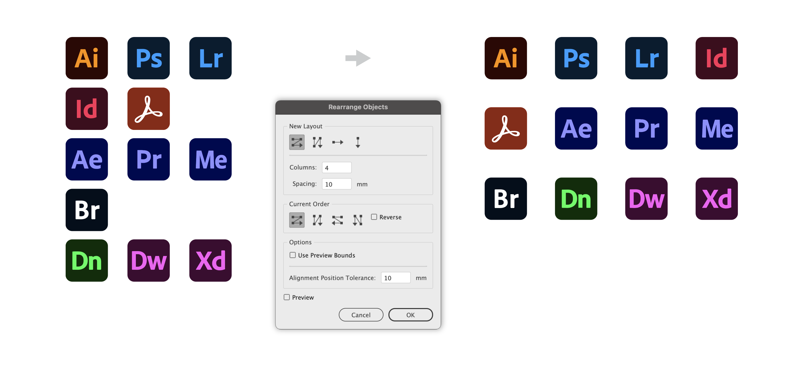

### Usage
1. Select any objects, and run this script.
2. Select a new layout.
3. Enter the number of objects to place in a line.
4. Enter a value of the spacing between the objects.
5. Select a current order of the objects. Check the Reverse checkbox to reverse the order.
6. To include stroke width, check the Use Preview Bounds checkbox.
7. Enter a value of the Alignment Position Tolerance. (0 or higher number)  
   
8. Check the Preview checkbox to confirm the rearranging.

> [!NOTE]
> The object in the top-left is the basis for rearranging.  
> Compound paths, texts, linked files, and embedded link files are also supported.

### Support units
Point, Pixel, Pica, Inch, Feet, Yard, Millimeter, Centimeter, Meter.  
These units depend on the ruler units.

### Requirements
Illustrator 2021 or higher

<div align="right">[ <a href="#path">↑ Back to Top ↑</a> ]</div>
<br>


# <a name="relinkFileExtensionjs">relinkFileExtension.js</a>
[](https://github.com/sky-chaser-high/adobe-illustrator-scripts/releases/latest/download/Link.zip)
  
This script replaces linked files with the specified file extension, equivalent to InDesign's Links panel menu > Relink File Extension.
For more advanced settings, use [relinkFileExtensionExtra.js](#relinkFileExtensionExtrajs).


### Usage
1. Select any linked files, and run this script. If no files are selected, it replaces all files in the document.
2. Enter an extension.

> [!WARNING]
> Missing linked files and embedded files are not replaced.

> [!NOTE]
> Place the relink files in the same place as the original files.  
> When selecting linked files, select them in the document rather than the Links panel.

### Requirements
Illustrator CS4 or higher

<div align="right">[ <a href="#link">↑ Back to Top ↑</a> ]</div>
<br>


# <a name="relinkFileExtensionExtrajs">relinkFileExtensionExtra.js</a>
[](https://github.com/sky-chaser-high/adobe-illustrator-scripts/releases/latest/download/Link.zip)
  
This script is an enhanced version of [relinkFileExtension.js](#relinkFileExtensionjs) with more advanced settings for relinking linked files.


### Usage
1. Select any linked files, and run this script. If no files are selected, it replaces all files in the document.
2. Select either file renaming method.
   - `Replace` Enter the current file name in the Find field and a new file name in the Replace field.  
   It can also be part of the file name. Regular expressions are supported in the Find field.
   - `Add` Enter a string to be added to the prefix, suffix, or both of the original file names.
3. Enter an extension. If the file extension is the same, enter nothing.
4. If you specify PDF as the extension, select the Crop to option and enter the page number.  
   **See also:** [Import Adobe PDF files](https://helpx.adobe.com/illustrator/using/importing-pdf-files.html)
5. To change the folder for the linked file, select a new folder.  
   If the folder is the same as the original file, select nothing.  
   To clear the new folder path, hold down the <kbd>Option</kbd> / <kbd>Alt</kbd> key and click the Clear button.

> [!WARNING]
> Missing linked files and embedded files are not replaced.

> [!NOTE]
> When selecting linked files, select them in the document rather than the Links panel.

### Requirements
Illustrator CS6 or higher

<div align="right">[ <a href="#link">↑ Back to Top ↑</a> ]</div>
<br>


# <a name="relinkToFolderjs">relinkToFolder.js</a>
[](https://github.com/sky-chaser-high/adobe-illustrator-scripts/releases/latest/download/Link.zip)
  
This script replaces linked files with a file of the same name in the selected folder, equivalent to InDesign's Links panel menu > Relink to Folder.

### Usage
1. Select any linked files, and run this script.  
   If no files are selected, it replaces all files in the document.
2. Select a folder from the dialog that appears.

> [!WARNING]
> Missing linked files and embedded files are not replaced.

> [!NOTE]
> When selecting linked files, select them in the document rather than the Links panel.

### Requirements
Illustrator CS4 or higher

<div align="right">[ <a href="#link">↑ Back to Top ↑</a> ]</div>
<br>


# <a name="removeColorInGuideObjectjs">removeColorInGuideObject.js</a>
[](https://github.com/sky-chaser-high/adobe-illustrator-scripts/releases/latest/download/Path.zip)
  
This script removes fill and stroke colors in all guide objects.


### Usage
Just run this script. There is no need to select any guide objects.

> [!NOTE]
> If you have added fill or stroke colors in the Appearance panel, they may not work properly.

### Requirements
Illustrator CS6 or higher

<div align="right">[ <a href="#path">↑ Back to Top ↑</a> ]</div>
<br>


# <a name="removeDeletedGlobalColorjs">removeDeletedGlobalColor.js</a>
[](https://github.com/sky-chaser-high/adobe-illustrator-scripts/releases/latest/download/Color.zip)
  
This script deletes the Deleted Global Colors displayed in the Separations Preview panel.


### Usage
Just run this script.

> [!NOTE]
> In rare cases, you may not be able to delete it.  
> If you save the file and reopen it, it may be restored.  
> In this case, there is no way to delete it.

### Requirements
Illustrator CS or higher

<div align="right">[ <a href="#color">↑ Back to Top ↑</a> ]</div>
<br>


# <a name="renameArtboardjs">renameArtboard.js</a>
[](https://github.com/sky-chaser-high/adobe-illustrator-scripts/releases/latest/download/Artboard.zip)
  
This script renames all artboard names at once.

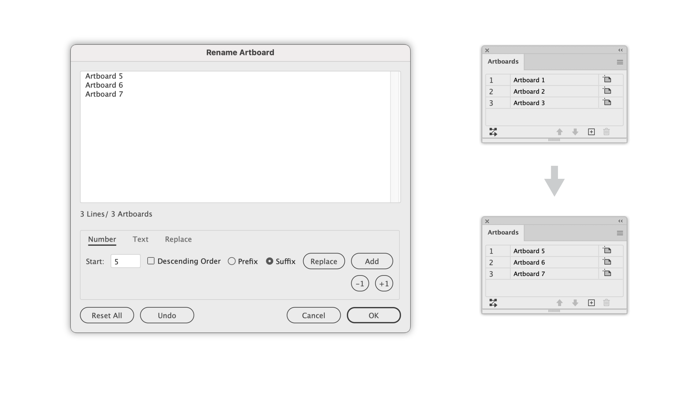

### Usage
1. Run this script.
2. Edit the artboard name displayed in the text field.

### Options
Options are available for quickly editing artboard names.
#### Number
- `Replace` Replace the number at the beginning or end of the artboard name.
- `Add` Add a number to the beginning or end of the artboard name.
- `-1` `+1` Increase or decrease the number at the beginning or end of the artboard name.
- Check the Descending Order checkbox to change to descending order.
#### Text
- Add text to the beginning or end of the artboard name.
#### Replace
- Replace the artboard name with the specified string.
- Regular expressions support in the Find field.

> [!NOTE]
> A warning is issued if the number of lines in a text field does not match the number of artboards.

### Requirements
Illustrator CS4 or higher

<div align="right">[ <a href="#artboard">↑ Back to Top ↑</a> ]</div>
<br>


# <a name="renameLayerjs">renameLayer.js</a>
[](https://github.com/sky-chaser-high/adobe-illustrator-scripts/releases/latest/download/Layer.zip)
  
This script renames all layer names at once.


### Usage
1. Run this script.
2. Edit the layer name displayed in the text field.

### Options
Options are available for quickly editing layer names.
#### Number
- `Replace` Replace the number at the beginning or end of the layer name.
- `Add` Add a number to the beginning or end of the layer name.
- `-1` `+1` Increase or decrease the number at the beginning or end of the layer name.
- Check the Descending Order checkbox to change to descending order.
#### Text
- Add text to the beginning or end of the layer name.
#### Replace
- Replace the layer name with the specified string.
- Regular expressions support in the Find field.

> [!NOTE]
> Sublayers are not supported.  
> A warning is issued if the number of lines of the text field is less than the number of layers.  
> Add layers for the increased number of lines if the number of lines of the text field is greater than the number of layers.

### Requirements
Illustrator CS4 or higher

<div align="right">[ <a href="#layer">↑ Back to Top ↑</a> ]</div>
<br>


# <a name="renameLinkedFilejs">renameLinkedFile.js</a>
[](https://github.com/sky-chaser-high/adobe-illustrator-scripts/releases/latest/download/Link.zip)
  
This script renames the name of the linked files and relink.

> [!CAUTION]
> **It is not possible to undo file names with Edit > Undo.( <kbd>⌘</kbd> / <kbd>Ctrl</kbd> + <kbd>Z</kbd> )**  
> **File manipulation is dangerous, so we recommend backing up your data before running the script.**


### Usage
1. Select any linked files, and run this script.  
   If not selected, all files in the document are renamed.
2. Enter the current file name in the Find field and a new file name in the Replace field.  
   It can also be part of the file name. Regular expressions are supported in the Find field.
3. Clicking the Preview button shows the renamed file names in the list.  
   A check in the Already Exists column indicates that a file with the same name already exists.

> [!WARNING]
> Missing linked files and embedded files are not replaced.  
> If you are using linked files for other documents, the link will be missing.

> [!NOTE]
> When selecting linked files, select them in the document rather than the Links panel.  
> If you wish to hide the alert that appears when the script is executed, delete or comment out line 50.

### Requirements
Illustrator CS4 or higher

<div align="right">[ <a href="#link">↑ Back to Top ↑</a> ]</div>
<br>


# <a name="resetToFullScalejs">resetToFullScale.js</a>
[](https://github.com/sky-chaser-high/adobe-illustrator-scripts/releases/latest/download/Link.zip)
  
This script resets the scale to 100% and the rotation angle to 0 degrees for the linked or embedded files.


### Usage
Select any linked or embedded files, and run this script.

### Requirements
Illustrator CS6 or higher

<div align="right">[ <a href="#link">↑ Back to Top ↑</a> ]</div>
<br>


# <a name="rotateTextToMatchPathSegmentAnglejs">rotateTextToMatchPathSegmentAngle.js</a>
[](https://github.com/sky-chaser-high/adobe-illustrator-scripts/releases/latest/download/Text.zip)
  
This script rotates the text to match the angle of the path segment or a line connecting two anchor points. The vertical text is also supported.

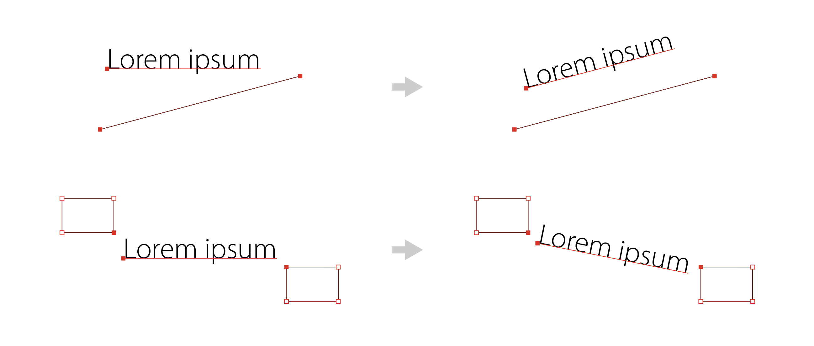

### Usage
Select two anchor points or a path segment with the Direct Selection Tool and some text objects, and run this script.

> [!NOTE]
> Curves are not supported.  
> For point types, rotate around the anchor point.

### Requirements
Illustrator CS or higher

<div align="right">[ <a href="#text">↑ Back to Top ↑</a> ]</div>
<br>


# <a name="roundColorValuejs">roundColorValue.js</a>
[](https://github.com/sky-chaser-high/adobe-illustrator-scripts/releases/latest/download/Color.zip)
  
This script rounds color values. Both fill and stroke colors are supported.


### Usage
Select any objects, and run this script.

### Requirements
Illustrator CS or higher

<div align="right">[ <a href="#color">↑ Back to Top ↑</a> ]</div>
<br>


# <a name="roundLocationOfGradientStopjs">roundLocationOfGradientStop.js</a>
[](https://github.com/sky-chaser-high/adobe-illustrator-scripts/releases/latest/download/Color.zip)
  
This script rounds the location of the gradient color stops and midpoints.  
Both fill and stroke colors are supported.

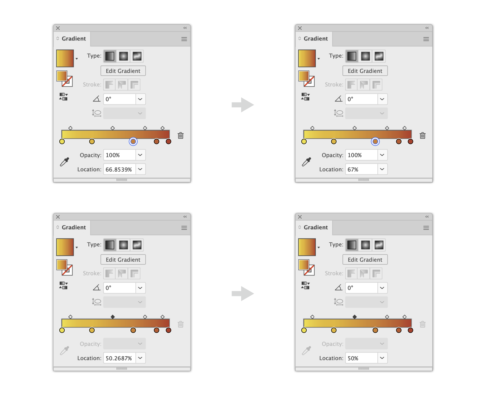

### Usage
Select any objects, and run this script.

### Requirements
Illustrator CS or higher

<div align="right">[ <a href="#color">↑ Back to Top ↑</a> ]</div>
<br>


# <a name="selectEmbeddedLinkjs">selectEmbeddedLink.js</a>
[](https://github.com/sky-chaser-high/adobe-illustrator-scripts/releases/latest/download/Link.zip)
  
This script selects all embedded files.

### Usage
Just run this script.

> [!NOTE]
> Locked and hidden embedded files are not selected. The layer also as well.

### Requirements
Illustrator CS or higher

<div align="right">[ <a href="#link">↑ Back to Top ↑</a> ]</div>
<br>


# <a name="selectGuidesjs">selectGuides.js</a>
[](https://github.com/sky-chaser-high/adobe-illustrator-scripts/releases/latest/download/Path.zip)
  
This script selects all guide objects.

### Usage
Just run this script.

> [!NOTE]
> Guides in locked or hidden layers are not supported.

### Requirements
Illustrator CS6 or higher

<div align="right">[ <a href="#path">↑ Back to Top ↑</a> ]</div>
<br>


# <a name="selectLinkjs">selectLink.js</a>
[](https://github.com/sky-chaser-high/adobe-illustrator-scripts/releases/latest/download/Link.zip)
  
This script selects the specified linked files.


### Usage
1. Run this script.
2. Enter a file name in the Find field or select the file name from the list below. If the Find field is empty, all linked files are selected.
   Regular expressions support in the Find field.

> [!NOTE]
> Locked and hidden linked files are not selected. The layer also as well.  
> Missing linked files may not be selected.

### Requirements
Illustrator CS4 or higher

<div align="right">[ <a href="#link">↑ Back to Top ↑</a> ]</div>
<br>


# <a name="selectMissingLinkjs">selectMissingLink.js</a>
[](https://github.com/sky-chaser-high/adobe-illustrator-scripts/releases/latest/download/Link.zip)
  
This script selects all missing linked files.

### Usage
Just run this script.

> [!NOTE]
> Locked and hidden missing files are not selected. The layer also as well.

### Requirements
Illustrator CS or higher

<div align="right">[ <a href="#link">↑ Back to Top ↑</a> ]</div>
<br>


# <a name="shiftObjectsjs">shiftObjects.js</a>
[](https://github.com/sky-chaser-high/adobe-illustrator-scripts/releases/latest/download/Path.zip)
  
This script shifts selected objects in the specified direction.

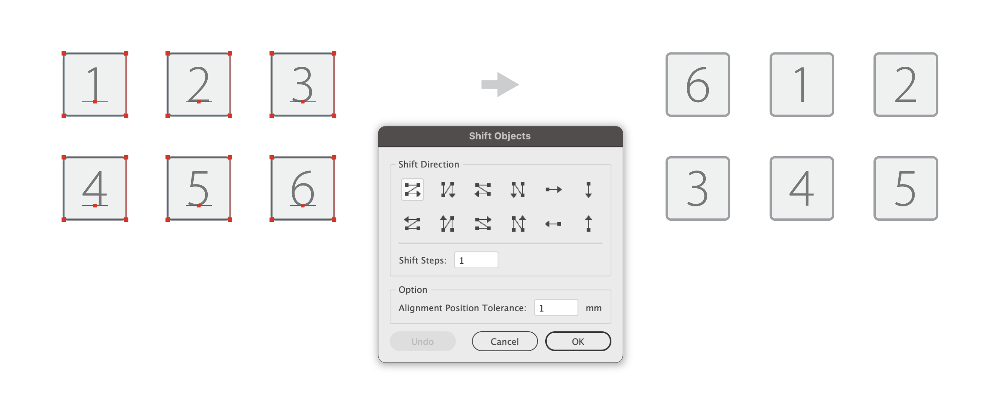

### Usage
1. Select two or more objects, and run this script.
2. Click any one of the Shift Direction buttons.

### Options
1. Enter the number of steps in the Shift Steps field for how many pieces to move.
2. The value of the Alignment Position Tolerance affects the sort order.  
   

> [!NOTE]
> Reposition the objects based on its center.

### Support units
Point, Pixel, Pica, Inch, Feet, Yard, Millimeter, Centimeter, Meter.  
These units depend on the ruler units.

### Requirements
Illustrator 2021 or higher

<div align="right">[ <a href="#path">↑ Back to Top ↑</a> ]</div>
<br>


# <a name="shiftSelectedAnchorPointsCWjsshiftSelectedAnchorPointsCCWjs">shiftSelectedAnchorPointsCW.js<br>shiftSelectedAnchorPointsCCW.js</a>
[](https://github.com/sky-chaser-high/adobe-illustrator-scripts/releases/latest/download/Path.zip)
  
This script shifts selected anchor points clockwise or counterclockwise.

For example, shiftSelectedAnchorPointsCW.js:


### Usage
Select any anchor points with Direct Selection Tool, and run this script.

### Requirements
Illustrator CS or higher

<div align="right">[ <a href="#path">↑ Back to Top ↑</a> ]</div>
<br>


# <a name="showArtboardNamejs">showArtboardName.js</a>
[](https://github.com/sky-chaser-high/adobe-illustrator-scripts/releases/latest/download/Artboard.zip)
  
This script shows the artboard name and size in the document.


### Usage
Just run this script.

### Support units
Point, Pixel, Pica, Inch, Feet, Yard, Millimeter, Centimeter, Meter.  
These units depend on the ruler units.

### Requirements
Illustrator CS4 or higher

<div align="right">[ <a href="#artboard">↑ Back to Top ↑</a> ]</div>
<br>


# <a name="showColorValuesjs">showColorValues.js</a>
[](https://github.com/sky-chaser-high/adobe-illustrator-scripts/releases/latest/download/Color.zip)
  
This script shows color values. Both fill and stroke colors are supported.


### Usage
Select any path objects, and run this script.

> [!NOTE]
> CMYK, RGB, HEX, grayscale, spot color, and pattern are supported.  
> Text object and gradient are not supported.

### Requirements
Illustrator CS or higher

<div align="right">[ <a href="#color">↑ Back to Top ↑</a> ]</div>
<br>


# <a name="showDimensionsjs">showDimensions.js</a>
[](https://github.com/sky-chaser-high/adobe-illustrator-scripts/releases/latest/download/Path.zip)
  
This script shows the dimension of the anchor point between two points of the path objects.

> [!TIP]
> The Dimension Tool has been implemented in the Toolbar since version 2024.


### Usage
Select any path objects, and run this script.  
If you select anchor points with the Direct Selection Tool, dimensions are displayed only at the selected. In this case, select at least two anchor points.

> [!NOTE]
> Supports curves.  
> Group and color dimensions by path object.  
> In complex shapes, dimensions may be displayed overlapping each other.

### Support units
Point, Pixel, Pica, Inch, Feet, Yard, Millimeter, Centimeter, Meter.  
These units depend on the ruler units.

### Requirements
Illustrator CS6 or higher

<div align="right">[ <a href="#path">↑ Back to Top ↑</a> ]</div>
<br>


# <a name="shuffleGradientColorjs">shuffleGradientColor.js</a>
[](https://github.com/sky-chaser-high/adobe-illustrator-scripts/releases/latest/download/Color.zip)
  
This script shuffles the gradient color.


### Usage
Select any path objects, and run this script.

> [!NOTE]
> Only a fill color. A stroke color is not supported.  
> For compound path objects, select them with Direct Selection Tool.

### Requirements
Illustrator CS or higher

<div align="right">[ <a href="#color">↑ Back to Top ↑</a> ]</div>
<br>


# <a name="shuffleObjectsjs">shuffleObjects.js</a>
[](https://github.com/sky-chaser-high/adobe-illustrator-scripts/releases/latest/download/Path.zip)
  
This script shuffles the selected objects.


### Usage
Select some objects, and run this script.

> [!NOTE]
> Reposition the objects based on its center.

### Requirements
Illustrator CS or higher

<div align="right">[ <a href="#path">↑ Back to Top ↑</a> ]</div>
<br>


# <a name="sortArtboardsjs">sortArtboards.js</a>
[](https://github.com/sky-chaser-high/adobe-illustrator-scripts/releases/latest/download/Artboard.zip)
  
This script sorts the artboards in the Artboards panel.


### Usage
Just run this script.

> [!NOTE]
> Only the Artboards panel. Artboards in the document are not sorted.

### Requirements
Illustrator CS5 or higher

<div align="right">[ <a href="#artboard">↑ Back to Top ↑</a> ]</div>
<br>


# <a name="sortLinesjs">sortLines.js</a>
[](https://github.com/sky-chaser-high/adobe-illustrator-scripts/releases/latest/download/Text.zip)
  
This script sorts lines of the text. The vertical text is also supported.


### Usage
1. Select either the text objects or the lines to be sorted, and run this script.
2. Check the Match Case checkbox to make the text case-sensitive.
3. Check the Entire Threaded Text checkbox to sort the entire threaded text.
4. Click one of the sort buttons below.  
   `A → Z` Sort in A to Z order.  
   `Z → A` Sort in Z to A order.  
   `Reverse` Sort in reverse order.

> [!NOTE]
> Wrapped lines in the area type split on each line.  
> If the selection spans next threads, it cannot be sorted.  
> Type on a paths are not supported.

### Requirements
Illustrator CS4 or higher

<div align="right">[ <a href="#text">↑ Back to Top ↑</a> ]</div>
<br>


# <a name="splitTextjs">splitText.js</a>
[](https://github.com/sky-chaser-high/adobe-illustrator-scripts/releases/latest/download/Text.zip)
  
This script splits a text by lines, words, or characters. The vertical text is also supported.


### Usage
1. Select any text objects, and run this script.
2. Select lines, words, or characters.

> [!NOTE]
> Area types converts to point types.  
> If there are many characters, it will take time to split them.  
> After splitting, the text position may move slightly.

### Requirements
Illustrator CC or higher

<div align="right">[ <a href="#text">↑ Back to Top ↑</a> ]</div>
<br>


# <a name="splitTextAtCursorPositionjs">splitTextAtCursorPosition.js</a>
[](https://github.com/sky-chaser-high/adobe-illustrator-scripts/releases/latest/download/Text.zip)
  
This script splits a point text at the cursor position. The vertical text is also supported.


### Usage
Move the cursor to the position you want to split, and run this script.

> [!NOTE]
> Area types are not supported.  
> In the case of multi-lines, the layout will break.  
> After splitting, the text position may move slightly.

### Requirements
Illustrator CS6 or higher

<div align="right">[ <a href="#text">↑ Back to Top ↑</a> ]</div>
<br>


# <a name="stepAndRepeatjs">stepAndRepeat.js</a>
[](https://github.com/sky-chaser-high/adobe-illustrator-scripts/releases/latest/download/Path.zip)
  
This script repeatedly duplicates selected objects. It is equivalent to InDesign's Edit > Step and Repeat.

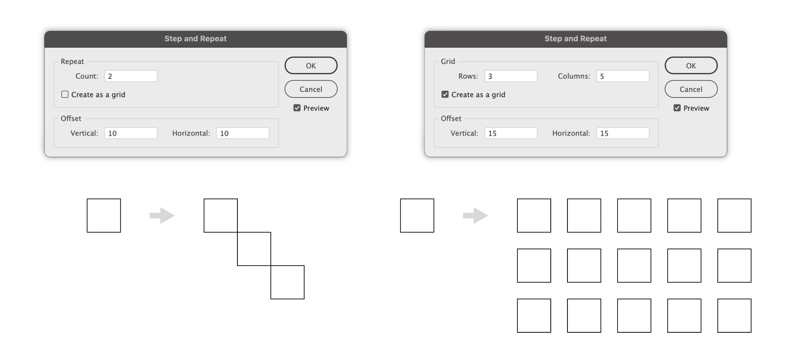

### Usage
1. Select any objects, and run this script.
2. If you want to create as a grid, check the create as a grid.
3. Enter the number of times to repeat.
4. Enter the offset values.

### Support units
Point, Pixel, Pica, Inch, Feet, Yard, Millimeter, Centimeter, Meter.  
These units depend on the ruler units.

### Requirements
Illustrator CS4 or higher

<div align="right">[ <a href="#path">↑ Back to Top ↑</a> ]</div>
<br>


# <a name="sumNumbersjs">sumNumbers.js</a>
[](https://github.com/sky-chaser-high/adobe-illustrator-scripts/releases/latest/download/Utility.zip)
  
This script adds up the numbers in the text.


### Usage
Select text objects or specify a text range in an editing state, and run this script.  
You can also edit numbers in the text field and recalculate the totals.

> [!NOTE]
> Editing numbers in the text field does not affect the original text objects.

### Requirements
Illustrator CS4 or higher

<div align="right">[ <a href="#utility">↑ Back to Top ↑</a> ]</div>
<br>


# <a name="swapTextContentsjs">swapTextContents.js</a>
[](https://github.com/sky-chaser-high/adobe-illustrator-scripts/releases/latest/download/Text.zip)
  
This script swap the text contents.


### Usage
Select two text objects, and run this script.

### Requirements
Illustrator CS or higher

<div align="right">[ <a href="#text">↑ Back to Top ↑</a> ]</div>
<br>


# <a name="syncViewjs">syncView.js</a>
[](https://github.com/sky-chaser-high/adobe-illustrator-scripts/releases/latest/download/View.zip)
  
This script synchronizes all open windows with the zoom factor and the view position of the active window.


### Usage
Just run this script.

> [!NOTE]
> Open at least two files.  

### Requirements
Illustrator CS or higher

<div align="right">[ <a href="#view">↑ Back to Top ↑</a> ]</div>
<br>


# <a name="textAlign_CenterjstextAlign_LeftjstextAlign_Rightjs">textAlign_Center.js<br>textAlign_Left.js<br>textAlign_Right.js</a>
[](https://github.com/sky-chaser-high/adobe-illustrator-scripts/releases/latest/download/Text.zip)
  
This script changes the text alignment without moving the position. The vertical text is also supported.

For example, textAlign_Center.js:


### Usage
Select point text objects, and run this script.

### Requirements
Illustrator CS or higher

<div align="right">[ <a href="#text">↑ Back to Top ↑</a> ]</div>
<br>


# <a name="toggleAlignToGlyphBoundsjs">toggleAlignToGlyphBounds.js</a>
[](https://github.com/sky-chaser-high/adobe-illustrator-scripts/releases/latest/download/Preferences.zip)
  
This script toggles the Align panel menu > Align to Glyph Bounds > Point Text and Area Text.


### Usage
Just run this script.

### Requirements
Illustrator 2020 or higher

<div align="right">[ <a href="#preferences">↑ Back to Top ↑</a> ]</div>
<br>


# <a name="toggleFillNewTypeObjectsWithPlaceholderTextjs">toggleFillNewTypeObjectsWithPlaceholderText.js</a>
[](https://github.com/sky-chaser-high/adobe-illustrator-scripts/releases/latest/download/Preferences.zip)
  
This script toggles the Preferences > Type > Fill New Type Objects With Placeholder Text.


### Usage
Just run this script.

### Requirements
Illustrator 2018 or higher

<div align="right">[ <a href="#preferences">↑ Back to Top ↑</a> ]</div>
<br>


# <a name="togglePasteRemembersLayersjs">togglePasteRemembersLayers.js</a>
[](https://github.com/sky-chaser-high/adobe-illustrator-scripts/releases/latest/download/Preferences.zip)
  
This script toggles the Layers panel menu > Paste Remembers Layers.

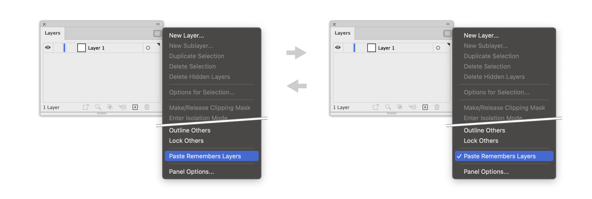

### Usage
Just run this script.

### Requirements
Illustrator CC or higher

<div align="right">[ <a href="#preferences">↑ Back to Top ↑</a> ]</div>
<br>


# <a name="toggleSelectSameTintPercentagejs">toggleSelectSameTintPercentage.js</a>
[](https://github.com/sky-chaser-high/adobe-illustrator-scripts/releases/latest/download/Preferences.zip)
  
This script toggles the Preferences > General > Select Same Tint %.


### Usage
Just run this script.

### Requirements
Illustrator CC or higher

<div align="right">[ <a href="#preferences">↑ Back to Top ↑</a> ]</div>
<br>


# <a name="toggleShowCharacterAlternatesjs">toggleShowCharacterAlternates.js</a>
[](https://github.com/sky-chaser-high/adobe-illustrator-scripts/releases/latest/download/Preferences.zip)
  
This script toggles the Preferences > Type > Show Character Alternates.


### Usage
Just run this script.

### Requirements
Illustrator 2020 or higher

<div align="right">[ <a href="#preferences">↑ Back to Top ↑</a> ]</div>
<br>


# <a name="toggleShowHandlesjs">toggleShowHandles.js</a>
[](https://github.com/sky-chaser-high/adobe-illustrator-scripts/releases/latest/download/Preferences.zip)
  
This script toggles the Preferences > Selection & Anchor Display > Anchor Points, Handle, and Bounding Box Display > Show handles when multiple anchors are selected.


### Usage
Just run this script.

### Requirements
Illustrator CC or higher

<div align="right">[ <a href="#preferences">↑ Back to Top ↑</a> ]</div>
<br>


# <a name="toggleTransformPatternTilesjs">toggleTransformPatternTiles.js</a>
[](https://github.com/sky-chaser-high/adobe-illustrator-scripts/releases/latest/download/Preferences.zip)
  
This script toggles the Preferences > General > Transform Pattern Tiles.


### Usage
Just run this script.

### Requirements
Illustrator CC or higher

<div align="right">[ <a href="#preferences">↑ Back to Top ↑</a> ]</div>
<br>


# <a name="toggleUsePreviewBoundsjs">toggleUsePreviewBounds.js</a>
[](https://github.com/sky-chaser-high/adobe-illustrator-scripts/releases/latest/download/Preferences.zip)
  
This script toggles the Align panel menu > Use Preview Bounds or the Preferences > General > Use Preview Bounds.


### Usage
Just run this script.

### Requirements
Illustrator CC or higher

<div align="right">[ <a href="#preferences">↑ Back to Top ↑</a> ]</div>
<br>


# <a name="toggleZoomToSelectionjs">toggleZoomToSelection.js</a>
[](https://github.com/sky-chaser-high/adobe-illustrator-scripts/releases/latest/download/Preferences.zip)
  
This script toggles the Preferences > Selection & Anchor Display > Selection > Zoom to Selection.


### Usage
Just run this script.

### Requirements
Illustrator 2018 or higher

<div align="right">[ <a href="#preferences">↑ Back to Top ↑</a> ]</div>
<br>


# <a name="toggleZoomWithMouseWheeljs">toggleZoomWithMouseWheel.js</a>
[](https://github.com/sky-chaser-high/adobe-illustrator-scripts/releases/latest/download/Preferences.zip)
  
This script toggles the Preferences > General > Zoom with Mouse Wheel.


### Usage
Just run this script.

### Requirements
Illustrator 2022 or higher

<div align="right">[ <a href="#preferences">↑ Back to Top ↑</a> ]</div>
<br>


# <a name="unifyLayerColorsjs">unifyLayerColors.js</a>
[](https://github.com/sky-chaser-high/adobe-illustrator-scripts/releases/latest/download/Layer.zip)
  
This script unifies layer colors.


### Usage
1. Unlock all layers. Keep the layers that colors you do not want to change locked.
2. Select a layer that will be the reference color, and run this script.

> [!NOTE]
> Sublayers are also supported.

### Requirements
Illustrator CS or higher

<div align="right">[ <a href="#layer">↑ Back to Top ↑</a> ]</div>
<br>


# <a name="unitCalculatorjs">unitCalculator.js</a>
[](https://github.com/sky-chaser-high/adobe-illustrator-scripts/releases/latest/download/Utility.zip)
  
This script converts almost all units supported by Illustrator.


### Usage
1. Run this script.
   If you want to refer to an object's width or height value, select any objects with the Selection Tool and then run this script.
2. Enter a value in one of the units.

> [!NOTE]
> If the document is open, the ruler unit is the reference.

### Support units
Point, Pixel, Pica, Inch, Feet, Yard, Millimeter, Centimeter, Meter.  
These units depend on the ruler units.

### Requirements
Illustrator CC or higher

<div align="right">[ <a href="#utility">↑ Back to Top ↑</a> ]</div>
<br>


# License
All scripts are licensed under the MIT license.  
See the included LICENSE file for more details.  
