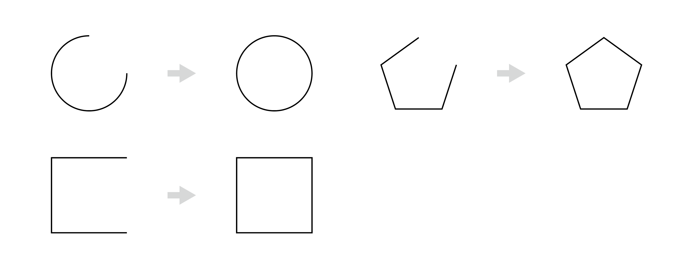
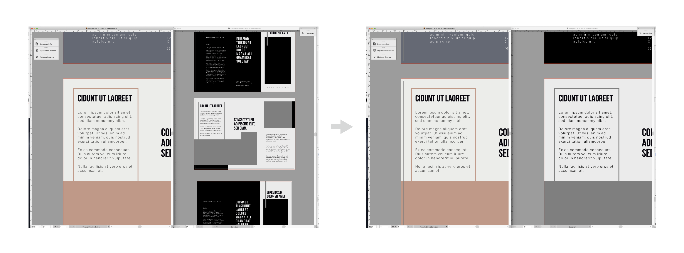

[日本語の README はこちらです。](README_ja.md)

# Adobe Illustrator Scripts
This is a collection of scripts for Adobe Illustrator.  

- [closePath.js](#closePath.js)
- [createColorChart.js](#createColorChart.js)
- [createPageNumbers.js](#createPageNumbers.js) `new`
- [deleteUnusedLayers.js](#deleteUnusedLayers.js)
- [disjoinPath.js](#disjoinPath.js)
- [measurePathItems.js](#measurePathItems.js)
- [relinkFileExtension.js](#relinkFileExtension.js)
- [relinkFileExtensionExtra.js](#relinkFileExtensionExtra.js)
- [relinkToFolder.js](#relinkToFolder.js)
- [removeDeletedGlobalColor.js](#removeDeletedGlobalColor.js)
- [resetToFullScale.js](#resetToFullScale.js)
- [stepandRepeat.js](#stepandRepeat.js)
- [syncView.js](#syncView.js)
- [textAlign_Center.js<br>textAlign_Left.js<br>textAlign_Right.js](#textAlign)
- [XmpFunctions.js](#XmpFunctions.js)


## Installation
Download the zip file and unzip it. The scripts can be placed anywhere on your computer.  
To run the scripts, from File > Scripts > Other Script...


## Notes
In rare cases, if you continue to use the script, it may stop working.  
In that case, restart Illustrator and run this script again.


# <a name="closePath.js">closePath.js</a>

### Description
This script closes the path objects.



### Usage
Select the path objects, and run this script.

### Requirements
Illustrator CS or higher


# <a name="createColorChart.js">createColorChart.js</a>

### Description
This script creates a color chart.


### Usage
1. Run this script.
2. Select either CMYK or RGB, and enter the color values.  
   If an object is selected, the fill value of the object will be used as the initial value.
3. Select the color you want to increase or decrease with vertical, or horizontal.
4. Enter the increase or decrease value.  
   Enter the percentage to be increased or decreased.
5. Set the artboard size, chip size, and units according to your preference.

### Notes
For CMYK, K cannot be increased or decreased.  

### Requirements
Illustrator CS4 or higher


# <a name="createPageNumbers.js">createPageNumbers.js</a>

### Description
This script is equivalent to InDesign's Type menu > Insert Special Character > Markers > Current Page Number.  
Places a page number at a specified location on the artboards.


### Usage
1. Run this script.
2. Set up each parameter in the dialog that appears.
   - `Position` Position of the page number.
   - `Facing Pages` If true, the facing page.
   - `Start Page Numbering at` a Start page number.
   - `Section Prefix` Add a Section Prefix in front of the page number. If facing page, in back of the page number.
   - `Font Size` Font size of the page number.
   - `Margin` Distance from the artboard. Switch the units according to the ruler units.

### Notes
The page numbering style is numeric only.  
Assign page numbers in artboard order.

### Requirements
Illustrator CS4 or higher


# <a name="deleteUnusedLayers.js">deleteUnusedLayers.js</a>

### Description
This script deletes unused layers.


### Usage
Just run this script.

### Requirements
Illustrator CS or higher


# <a name="disjoinPath.js">disjoinPath.js</a>

### Description
This script breaks apart the path object with anchor points.


### Usage
Select the path objects, and run this script.

### Notes
The original path object will be deleted.  

### Requirements
Illustrator CS or higher


# <a name="measurePathItems.js">measurePathItems.js</a>

### Description
This script measures the distance of an anchor point between two points of an object.


### Usage
Select the path objects, and run this script.

### Feature
Group and color measurements by path object.  
Switch the dimension units according to the ruler units.

### Notes
In complex shapes, measurements may be displayed overlapping each other.  
Curves are not supported.  

### Requirements
Illustrator CS4 or higher


# <a name="relinkFileExtension.js">relinkFileExtension.js</a>

### Description
This script is equivalent to InDesign's Links panel menu "Relink File Extension".


### Usage
1. Run this script.  
   If you don't select an image, all images will be targeted in the document.
2. Enter the extension at the prompt that appears.


### Notes
Place the relink files in the same place as the original files.  
When selecting an image, select the image on the artboard rather than the image in the links panel.  
Broken link files are not replaced.  
Embedded files are also not possible.

### Requirements
Illustrator CS4 or higher


# <a name="relinkFileExtensionExtra.js">relinkFileExtensionExtra.js</a>

### Description
This script is an enhanced version of relinkFileExtension.js.


### Usage
1. Run this script.  
   If you don't select an image, all images will be targeted in the document.
2. Choose to replace or add the string.  
   To replace, you can use regular expressions.  
   To add, specify a string to be added to the beginning or end of the original file name, or both.
3. Enter the extension.  
   If you don't enter an extension, the extension of the original file will be used.

### Notes
Place the relink files in the same place as the original files.  
When selecting an image, select the image on the artboard rather than the image in the links panel.  
Broken link files are not replaced.  
Embedded files are also not possible.

### Requirements
Illustrator CS4 or higher


# <a name="relinkToFolder.js">relinkToFolder.js</a>

### Description
This script is equivalent to InDesign's Links panel menu "Relink To Folder".  
Replaces the image with an image of the same name in the specified folder.


### Usage
1. Run this script.  
   If you don't select an image, all images will be targeted in the document.
2. Select a folder in the dialog that appears.

### Notes
When selecting an image, select the image on the artboard rather than the image in the links panel.  
Broken link files are not replaced.  
Embedded files are also not possible.

### Requirements
Illustrator CS4 or higher


# <a name="removeDeletedGlobalColor.js">removeDeletedGlobalColor.js</a>

### Description
Deletes the Deleted Global Color displayed in the Separations Preview panel.  


### Usage
Just run this script.

### Notes
In rare cases, you may not be able to delete it.  
If you save the file and reopen it, it may be restored.  
In this case, there is no way to delete it.

### Requirements
Illustrator CS or higher


# <a name="resetToFullScale.js">resetToFullScale.js</a>

### Description
This script resets the scale to 100% and the rotation angle to 0 degrees for the linked files.  
Embedded images are also supported.


### Usage
Select the linked files or the embedded images, and run this script.

### Requirements
Illustrator CS6 or higher


# <a name="stepandRepeat.js">stepandRepeat.js</a>

### Description
This script is equivalent to InDesign's Edit menu "Step and Repeat".  


### Usage
1. Select the objects, and run this script.
2. Select Repeat or Grid.
3. Enter the number of copies to be duplicated.
4. Enter the offset values.

### Requirements
Illustrator CS4 or higher


# <a name="syncView.js">syncView.js</a>

### Description
This script synchronizes the scale ratio and the position of the current work area for all documents.  



### Usage
Just run this script.

### Notes
Open at least two files.  

### Requirements
Illustrator CS or higher


# <a name="textAlign">textAlign_Center.js<br>textAlign_Left.js<br>textAlign_Right.js</a>

### Description
This script changes the text alignment without moving the text position.  
Vertical text is also supported.

### Usage
Select the text objects, and run this script.

### Requirements
Illustrator CS or higher


# <a name="XmpFunctions.js">XmpFunctions.js</a>

### Description
These functions get the font, color, or history properties that are used in the document from XMP.  
**See also:** [Adobe XMP Document](https://www.adobe.io/xmp/docs/)

### Usage
You can include this script or copy the function to use it.

```javascript
// @include '/Path1/Path2/XmpFunctions.js'
var fonts = xmpGetFonts(app.activeDocument.fullName);
```
It can also be used for linked files.
```javascript
// @include '/Path1/Path2/XmpFunctions.js'
var src = app.activeDocument.placedItems[0].file;
var history = xmpGetHistory(src);
```

### Functions
- [xmpGetFonts(src)](#xmpGetFonts(src))
- [xmpGetHistory(src)](#xmpGetHistory(src))
- [xmpGetLinkedFiles(src)](#xmpGetLinkedFiles(src))
- [xmpGetPlateNames(src)](#xmpGetPlateNames(src))
- [xmpGetSwatches(src)](#xmpGetSwatches(src))

### <a name="xmpGetFonts(src)">xmpGetFonts(src)</a>
Get font properties that are used in the document from XMP.  

**Param**: `src` `<File>`  
**Returns**: `Array<Object>` An unordered array of font properties.  
- `composite` `<boolean>` When true, this is a composite font.
- `face` `<string>` The font face name.
- `family` `<string>` The font family name.
- `filename` `<string>` The font file name. (not a complete path)
- `name` `<string>` PostScript name of the font.
- `type` `<string>` The font type, such as TrueType, Type 1, Open Type, and so on.
- `version` `<string>` The version string.

##### Example
```javascript
// @include '/Path1/Path2/XmpFunctions.js'
var fonts = xmpGetFonts(app.activeDocument.fullName);
alert(fonts[0].face);
```

### <a name="xmpGetHistory(src)">xmpGetHistory(src)</a>
Get history properties from XMP.

**Param**: `src` `<File>`  
**Returns**: `Array<Object>` An ordered array of user actions that resulted in the document.  
- `action` `<string>` The action that occurred.
- `parameter` `<string> | null` Additional description of the action.
- `software` `<string> | null` The software agent that performed the action.
- `when` `<Date> | null` Timestamp of when the action occurred.

##### Example
```javascript
// @include '/Path1/Path2/XmpFunctions.js'
var history = xmpGetHistory(app.activeDocument.fullName);
var date = history[0].when;
alert(date.getFullYear());
```

### <a name="xmpGetLinkedFiles(src)">xmpGetLinkedFiles(src)</a>
Get linked file properties from XMP.

**Param**: `src` `<File>`  
**Returns**: `Array<Object>` References to resources that were incorporated, by inclusion or reference, into this resource.  
- `exists` `<boolean>` When true, the path name of this object refers to an existing file.
- `filePath` `<string>` The referenced resource's file path or URL.

##### Example
```javascript
// @include '/Path1/Path2/XmpFunctions.js'
var files = xmpGetLinkedFiles(app.activeDocument.fullName);
alert(files[0].filePath);
```

### <a name="xmpGetPlateNames(src)">xmpGetPlateNames(src)</a>
Get plate names that are used in the document from XMP.

**Param**: `src` `<File>`  
**Returns**: `Array<string>` An ordered array of plate names that are needed to print the document.  

##### Example
```javascript
// @include '/Path1/Path2/XmpFunctions.js'
var platenames = xmpGetPlateNames(app.activeDocument.fullName);
alert(platenames[0]);
```

### <a name="xmpGetSwatches(src)">xmpGetSwatches(src)</a>
Get swatch properties that are used in the document from XMP.

**Param**: `src` `<File>`  
**Returns**: `Array<Object>` A structure containing the characteristics of a colorant (swatch) used in the document.  
- `colorant` `<Object>` The color values.
    - `cyan` `<number>` Cyan color value when the mode is CMYK. Range 0-100.
    - `magenta` `<number>` Magenta color value when the mode is CMYK. Range 0-100.
    - `yellow` `<number>` Yellow color value when the mode is CMYK. Range 0-100.
    - `black` `<number>` Black color value when the mode is CMYK. Range 0-100.
    - `gray` `<number>` Gray color value when the mode is GRAY. Range 0-255.
    - `l` `<number>` L value when the mode is LAB. Range 0-100.
    - `a` `<number>` A value when the mode is LAB. Range -128 to 127.
    - `b` `<number>` B value when the mode is LAB. Range -128 to 127.
    - `red` `<number>` Red color value when the mode is RGB. Range 0-255.
    - `green` `<number>` Green color value when the mode is RGB. Range 0-255.
    - `blue` `<number>` Blue color value when the mode is RGB. Range 0-255.
- `mode` `<string>` The color space in which the color is defined.
- `name` `<string>` Name of the swatch.
- `swatch` `<swatch> | null` Swatch object.
- `tint` `<number>` The tint of the color.
- `type` `<string>` The type of color, one of PROCESS or SPOT.

##### Example
```javascript
// @include '/Path1/Path2/XmpFunctions.js'
var swatches = xmpGetSwatches(app.activeDocument.fullName);
alert(swatches[0].colorant.cyan);
```


### Requirements
Illustrator CS or higher


# Licence
All scripts are licensed under the MIT license.  
See the included LICENSE file for more details.  
