[日本語の README はこちらです。](README_ja.md)

# Adobe Illustrator Scripts
[](https://github.com/sky-chaser-high/adobe-illustrator-scripts/releases/latest/download/AllScripts.zip)

This is a collection of scripts for Adobe Illustrator. I created it with simplicity and ease of use in mind.  
Click the script name to jump to learn more about the script.  
If you find a script that interests you, please download it from [](https://github.com/sky-chaser-high/adobe-illustrator-scripts/releases/latest).
<br><br>

### Artboard
[](https://github.com/sky-chaser-high/adobe-illustrator-scripts/releases/latest/download/Artboard.zip)
- [Show Artboard Name](#showArtboardNamejs)
- [Sort Artboards](#sortArtboardsjs)

### Color
[](https://github.com/sky-chaser-high/adobe-illustrator-scripts/releases/latest/download/Color.zip)
- [Add Selected Gradients to Swatch](#addSelectedGradientsToSwatchjs)
- [Convert to Global Color](#convertToGlobalColorjsconvertToSpotColorjs)
- [Convert to Spot Color](#convertToGlobalColorjsconvertToSpotColorjs)
- [Create Color Chart](#createColorChartjs)
- [Delete All Swatches](#deleteAllSwatchesjs) `New`
- [Export Color Values to CSV](#exportColorValuesToCSVjs) `New`
- [Extract Colors from Gradient](#extractColorsFromGradientjs)
- [Generate Gradient Color](#generateGradientColorjs)
- [Highlight Word](#highlightWordjs)
- [Import CSV to Swatch](#importCSVtoSwatchjs) `New`
- [Match Location of Gradient Stop](#matchLocationOfGradientStopjs)
- [Random Text Color](#randomTextColorjs)
- [Remove Deleted Global Color](#removeDeletedGlobalColorjs)
- [Round Color Value](#roundColorValuejs)
- [Round Location of Gradient Stop](#roundLocationOfGradientStopjs)
- [Show Color Values](#showColorValuesjs)
- [Shuffle Gradient Color](#shuffleGradientColorjs)

### Layer
[](https://github.com/sky-chaser-high/adobe-illustrator-scripts/releases/latest/download/Layer.zip)
- [Delete Hidden Layers](#deleteHiddenLayersjs)
- [Delete Locked Layers](#deleteLockedLayersjs)
- [Delete Unused Layers](#deleteUnusedLayersjs)
- [Invert Locked Layer](#invertLockedLayerjs)
- [Invert Visible Layer](#invertVisibleLayerjs)
- [Move Sublayer to Main Layer](#moveSublayerToMainLayerjs)
- [Unify Layer Colors](#unifyLayerColorsjs)

### Link
[](https://github.com/sky-chaser-high/adobe-illustrator-scripts/releases/latest/download/Link.zip)
- [Relink File Extension](#relinkFileExtensionjs)
- [Relink File Extension Extra](#relinkFileExtensionExtrajs)
- [Relink to Folder](#relinkToFolderjs)
- [Reset to Full Scale](#resetToFullScalejs)
- [Select Embedded Link](#selectEmbeddedLinkjs)
- [Select Link](#selectLinkjs)

### Path
[](https://github.com/sky-chaser-high/adobe-illustrator-scripts/releases/latest/download/Path.zip)
- [Align in Center of Space (Horizontal)](#alignInCenterOfSpaceHorizontal--Verticaljs)
- [Align in Center of Space (Vertical)](#alignInCenterOfSpaceHorizontal--Verticaljs)
- [Close Path](#closePathjs)
- [Convert All Anchor Points to Corner](#convertAllAnchorPointsToCornerjs)
- [Create Grid Lines](#createGridLinesjs)
- [Disjoin Path](#disjoinPathjs)
- [Distribute in Space (Horizontal)](#distributeInSpaceHorizontal--Verticaljs)
- [Distribute in Space (Vertical)](#distributeInSpaceHorizontal--Verticaljs)
- [Draw Rectangle](#drawRectanglejs)
- [Draw Shape on Anchor Point](#drawShapeOnAnchorPointjs)
- [Extend Line](#extendLinejs)
- [Fit Guide in Artboard](#fitGuideInArtboardjs)
- [Measure Path Items](#measurePathItemsjs)
- [Remove Color in Guide Object](#removeColorInGuideObjectjs)
- [Select Guides](#selectGuidesjs)
- [Shuffle Objects](#shuffleObjectsjs)
- [Step and Repeat](#stepAndRepeatjs)

### Text
[](https://github.com/sky-chaser-high/adobe-illustrator-scripts/releases/latest/download/Text.zip)
- [Add Numeric Separators](#addNumericSeparatorsjs)
- [Convert Type on a Path to Point Type](#convertTypeOnAPathToPointTypejs)
- [Copy Line Down](#copyLineDownjscopyLineUpjs)
- [Copy Line Up](#copyLineDownjscopyLineUpjs)
- [Copy Line (empty selection)](#copyLineEmptySelectionjscutLineEmptySelectionjs)
- [Create Page Numbers](#createPageNumbersjs)
- [Cut Line (empty selection)](#copyLineEmptySelectionjscutLineEmptySelectionjs)
- [Delete All Left](#deleteAllLeftjsdeleteAllRightjs)
- [Delete All Right](#deleteAllLeftjsdeleteAllRightjs)
- [Delete Trailing Spaces](#deleteTrailingSpacesjs)
- [Delete Word](#deleteWordjs)
- [Enclose Word in Parentheses](#encloseWordInParenthesesjs)
- [Go to Line](#goToLinejs)
- [Go to Next Text](#goToNextTextjsgoToPreviousTextjs)
- [Go to Previous Text](#goToNextTextjsgoToPreviousTextjs)
- [Insert Line Above](#insertLineAbovejsinsertLineBelowjs)
- [Insert Line Below](#insertLineAbovejsinsertLineBelowjs)
- [Move Line Down](#moveLineDownjsmoveLineUpjs)
- [Move Line Up](#moveLineDownjsmoveLineUpjs)
- [Swap Text Contents](#swapTextContentsjs)
- [Text Align Center](#textAlign_CenterjstextAlign_LeftjstextAlign_Rightjs)
- [Text Align Left](#textAlign_CenterjstextAlign_LeftjstextAlign_Rightjs)
- [Text Align Right](#textAlign_CenterjstextAlign_LeftjstextAlign_Rightjs)

### Utility
[](https://github.com/sky-chaser-high/adobe-illustrator-scripts/releases/latest/download/Utility.zip)
- [Arrange Windows](#arrangeWindowsjs)
- [Check Day of Week](#checkDayOfWeekjs)
- [Close All Documents](#closeAllDocumentsjs)
- [Compare Scale](#compareScalejs)
- [Sum Numbers](#sumNumbersjs)
- [Sync View](#syncViewjs)
- [XMP Functions](#XmpFunctionsjs)
<br><br><br>


## Installation
[Download](https://github.com/sky-chaser-high/adobe-illustrator-scripts/releases/latest) the zip archive from 
[](https://github.com/sky-chaser-high/adobe-illustrator-scripts/releases/latest) or 
[Releases](https://github.com/sky-chaser-high/adobe-illustrator-scripts/releases/latest) and unzip it.  
The scripts can be placed anywhere on your computer.  
To run the scripts, from File > Scripts > Other Script... ( <kbd>⌘</kbd> / <kbd>Ctrl</kbd> + <kbd>F12</kbd> )

> **Note**  
> In rare cases, if you continue to use the script, it may not work.  
> In that case, restart Illustrator and try again.


## Extensions, software
The following extensions or software make it easy to run scripts.
- [Scripshon Trees](https://exchange.adobe.com/apps/cc/15873/scripshon-trees) (free extension)
- [LAScripts](https://exchange.adobe.com/apps/cc/19405/lascripts) (free extension)
- [Keyboard Maestro](https://www.keyboardmaestro.com) (Mac / paid software)
- [AutoHotkey](https://www.autohotkey.com) (Windows / free software)


## UI
[ScriptUI Dialog Builder (SDB)](https://scriptui.joonas.me/) was used to design the UI.  
**See also:** [ScriptUI-Dialog-Builder-Joonas](https://github.com/joonaspaakko/ScriptUI-Dialog-Builder-Joonas).
<br><br><br>


# <a name="addNumericSeparatorsjs">addNumericSeparators.js</a>
[](https://github.com/sky-chaser-high/adobe-illustrator-scripts/releases/latest/download/Text.zip)  
This script changes a number to a 3-digit comma delimited string.


### Usage
Select the text objects, and run this script.  
Or, run this script in the text editing state.

### Requirements
Illustrator CS or higher

<div align="right">[ <a href="#text">↑ Back to Top ↑</a> ]</div>
<br>


# <a name="addSelectedGradientsToSwatchjs">addSelectedGradientsToSwatch.js</a>
[](https://github.com/sky-chaser-high/adobe-illustrator-scripts/releases/latest/download/Color.zip)  
This script adds selected gradients to Swatches.


### Usage
Select the path objects, and run this script.

> **Note**  
> Text object and stroke color are not supported.

### Requirements
Illustrator CS or higher

<div align="right">[ <a href="#color">↑ Back to Top ↑</a> ]</div>
<br>


# <a name="alignInCenterOfSpaceHorizontal--Verticaljs">alignInCenterOfSpace(Horizontal | Vertical).js</a>
[](https://github.com/sky-chaser-high/adobe-illustrator-scripts/releases/latest/download/Path.zip)  
This script aligns objects in the center of space.

For example, alignInCenterOfSpace(Vertical).js:


### Usage
Select objects, and run this script.  
The position of alignment depends on the reference point.

> **Note**  
> The space excludes the stroke width.  
> Select at least three objects.

### Requirements
Illustrator CS3 or higher

<div align="right">[ <a href="#path">↑ Back to Top ↑</a> ]</div>
<br>


# <a name="arrangeWindowsjs">arrangeWindows.js</a>
[](https://github.com/sky-chaser-high/adobe-illustrator-scripts/releases/latest/download/Utility.zip)  
This script splits and arranges all open windows.

> **Note**  
> It has been implemented in the Application Bar since version 2022.


### Usage
Just run this script.

### Requirements
Illustrator CS6 or higher

<div align="right">[ <a href="#utility">↑ Back to Top ↑</a> ]</div>
<br>


# <a name="checkDayOfWeekjs">checkDayOfWeek.js</a>
[](https://github.com/sky-chaser-high/adobe-illustrator-scripts/releases/latest/download/Utility.zip)  
This script checks the day of the week.


### Usage
Select a date with the cursor, and run this script.

> **Note**  
> If there is no year, it is considered as this year.  
> If the date is incorrect, a warning is issued.  
> The following formats are supported.

> **Format**  
> `YYYY/MM/DD`, `MM/DD/YYYY`, `DD/MM/YYYY`,   
> `YYYY-MM-DD`, `MM-DD-YYYY`, `DD-MM-YYYY`,  
> `YYYY.MM.DD`, `MM.DD.YYYY`, `DD.MM.YYYY`,  
> `YYYY MM DD`,  
> `YYYY年MM月DD日`,  
> `Jan(uary) (the) DD(st|nd|rd|th)(,) YYYY`, `MM DD(st|nd|rd|th)(,) YYYY`,  
> `DD(st|nd|rd|th) (of) Jan(uary)(,) YYYY`, `DD(st|nd|rd|th) MM(,) YYYY`

### Requirements
Illustrator CS4 or higher

<div align="right">[ <a href="#utility">↑ Back to Top ↑</a> ]</div>
<br>


# <a name="closeAllDocumentsjs">closeAllDocuments.js</a>
[](https://github.com/sky-chaser-high/adobe-illustrator-scripts/releases/latest/download/Utility.zip)  
This script closes all documents.  
If there are documents not saved, choose to save them.

> **Note**  
> It has been implemented in the File menu since version 2021.

### Usage
Just run this script.

### Requirements
Illustrator CS4 or higher

<div align="right">[ <a href="#utility">↑ Back to Top ↑</a> ]</div>
<br>


# <a name="closePathjs">closePath.js</a>
[](https://github.com/sky-chaser-high/adobe-illustrator-scripts/releases/latest/download/Path.zip)  
This script closes the path objects.


### Usage
Select the path objects, and run this script.

### Requirements
Illustrator CS or higher

<div align="right">[ <a href="#path">↑ Back to Top ↑</a> ]</div>
<br>


# <a name="compareScalejs">compareScale.js</a>
[](https://github.com/sky-chaser-high/adobe-illustrator-scripts/releases/latest/download/Utility.zip)  
This script compares two objects' scales.


### Usage
Select two objects, and run this script.

> **Note**  
> The dimensional units depend on the ruler units.

### Requirements
Illustrator CS4 or higher

<div align="right">[ <a href="#utility">↑ Back to Top ↑</a> ]</div>
<br>


# <a name="convertAllAnchorPointsToCornerjs">convertAllAnchorPointsToCorner.js</a>
[](https://github.com/sky-chaser-high/adobe-illustrator-scripts/releases/latest/download/Path.zip)  
This script converts all anchor points to the corner.  
The anchor point conversion options in the Control panel require the anchor point to be selected, but this script selects the entire object.


### Usage
Select the entire path with selection tool, and run this script.

> **Note**  
> It is not necessary to select anchor points with direct selection tool.

### Requirements
Illustrator CS or higher

<div align="right">[ <a href="#path">↑ Back to Top ↑</a> ]</div>
<br>


# <a name="convertToGlobalColorjsconvertToSpotColorjs">convertToGlobalColor.js<br>convertToSpotColor.js</a>
[](https://github.com/sky-chaser-high/adobe-illustrator-scripts/releases/latest/download/Color.zip)  
This script converts any colors in the Swatches panel to global or spot colors.

convertToGlobalColor.js:
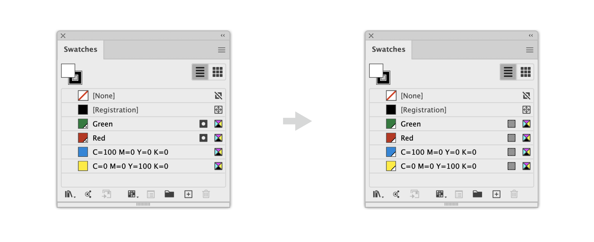

convertToSpotColor.js:


### Usage
Select colors in the Swatches panel, and run this script.  
If you don't select them, all colors will target.

> **Note**  
> If there is a swatch with the same name, it will not convert.  
> When converting a process color to a global or spot color, the order in which the colors display changes because they reregister in the swatch.

### Requirements
Illustrator CS or higher

<div align="right">[ <a href="#color">↑ Back to Top ↑</a> ]</div>
<br>


# <a name="convertTypeOnAPathToPointTypejs">convertTypeOnAPathToPointType.js</a>
[](https://github.com/sky-chaser-high/adobe-illustrator-scripts/releases/latest/download/Text.zip)  
This script converts types on a path to point types.


### Usage
Select type on a path object, and run this script.

> **Warning**  
> The original type objects will delete.  
> Any effects applied in the appearance will be lost.

### Requirements
Illustrator CS or higher

<div align="right">[ <a href="#text">↑ Back to Top ↑</a> ]</div>
<br>


# <a name="copyLineDownjscopyLineUpjs">copyLineDown.js<br>copyLineUp.js</a>
[](https://github.com/sky-chaser-high/adobe-illustrator-scripts/releases/latest/download/Text.zip)  
This script is equivalent to Visual Studio Code's Selection menu 
"Copy Line Down"( <kbd>Option</kbd> / <kbd>Alt</kbd> + <kbd>Shift</kbd> + <kbd>↓</kbd> ) & 
"Copy Line Up"( <kbd>Option</kbd> / <kbd>Alt</kbd> + <kbd>Shift</kbd> + <kbd>↑</kbd> ).  
If you assign shortcuts using [Keyboard Maestro](https://www.keyboardmaestro.com), [AutoHotkey](https://www.autohotkey.com) or similar, 
you will be able to achieve more of a Visual Studio Code feel.  
Both point and area types are supported.


For example, copyLineDown.js:


### Usage
Move the cursor to the line you want to copy, and run this script.  
It is not necessary to select a line.

> **Warning**  
> Since using copy and paste functions inside the script, it will lose if you have copied the content in advance.  
> Area type with wrapping may not work well.  
> In the case of copyLineDown.js, when copying the last line, a new line is added to work around a bug.

> **Note**  
> Only one line can be copied. Multiple lines are not supported.  
> If you are using version 2020 or earlier, you will not be able to enter keyboard input after running the script.  
> If you want to enter text, you must click with the mouse.

### Requirements
Illustrator CC 2018 or higher

<div align="right">[ <a href="#text">↑ Back to Top ↑</a> ]</div>
<br>


# <a name="copyLineEmptySelectionjscutLineEmptySelectionjs">copyLine(emptySelection).js<br>cutLine(emptySelection).js</a>
[](https://github.com/sky-chaser-high/adobe-illustrator-scripts/releases/latest/download/Text.zip)  
This script is equivalent to Visual Studio Code's keyboard shortcut 
"Copy line (empty selection)"( <kbd>⌘</kbd> / <kbd>Ctrl</kbd> + <kbd>C</kbd> ) & 
"Cut line (empty selection)"( <kbd>⌘</kbd> / <kbd>Ctrl</kbd> + <kbd>X</kbd> ).  
If you assign shortcuts using [Keyboard Maestro](https://www.keyboardmaestro.com), [AutoHotkey](https://www.autohotkey.com) or similar, 
you will be able to achieve more of a Visual Studio Code feel.  
Both point and area types are supported.

For example, cutLine(emptySelection).js:


### Usage
Move the cursor to the line you want to copy or cut, and run this script.  
It is not necessary to select a line.

> **Warning**  
> Linefeed are not included to work around a bug in Illustrator.  
> Area type with wrapping may not work well.

> **Note**  
> If you are using version 2020 or earlier, you will not be able to enter keyboard input after running the script.  
> If you want to enter text, you must click with the mouse.

### Requirements
Illustrator CC 2018 or higher

<div align="right">[ <a href="#text">↑ Back to Top ↑</a> ]</div>
<br>


# <a name="createColorChartjs">createColorChart.js</a>
[](https://github.com/sky-chaser-high/adobe-illustrator-scripts/releases/latest/download/Color.zip)  
This script creates a color chart.  
Both CMYK and RGB colors are supported.


### Usage
1. Run this script.
2. Select either CMYK or RGB, and enter the color values.  
   If an object is selected, the fill value of the object will be used as the initial value.
3. Select the color you want to increase or decrease with vertical, or horizontal.
4. Enter the increase or decrease value.  
   Enter the percentage to be increased or decreased.
5. Set the artboard size, color chip size, and units according to your preference.

> **Note**  
> Create a color chart in a new document.

### Requirements
Illustrator CS4 or higher

<div align="right">[ <a href="#color">↑ Back to Top ↑</a> ]</div>
<br>


# <a name="createGridLinesjs">createGridLines.js</a>
[](https://github.com/sky-chaser-high/adobe-illustrator-scripts/releases/latest/download/Path.zip)  
This script creates grid lines on artboards.


### Usage
Just run this script.

> **Note**  
> Grid spacing is determined by the Guides & Grid in Preferences.

### Requirements
Illustrator CS or higher

<div align="right">[ <a href="#path">↑ Back to Top ↑</a> ]</div>
<br>


# <a name="createPageNumbersjs">createPageNumbers.js</a>
[](https://github.com/sky-chaser-high/adobe-illustrator-scripts/releases/latest/download/Text.zip)  
This script is equivalent to InDesign's Type menu > Insert Special Character > Markers > Current Page Number.  
Places a page number at a specified location on the artboards.


### Usage
1. Run this script.
2. Set up each parameter in the dialog that appears.
   - `Position` Position of the page number.
   - `Facing Pages` If true, the facing page.
   - `Start Page Numbering at` a Start page number.
   - `Section Prefix` Add a Section Prefix in front of the page number. If facing page, in back of the page number.
   - `Font Size` Font size of the page number.
   - `Margin` Distance from the artboard. Switch the units according to the ruler units.

> **Note**  
> The page numbering style is numeric only.  
> Assign page numbers in artboard order.

### Requirements
Illustrator CS4 or higher

<div align="right">[ <a href="#text">↑ Back to Top ↑</a> ]</div>
<br>


# <a name="deleteAllLeftjsdeleteAllRightjs">deleteAllLeft.js<br>deleteAllRight.js</a>
[](https://github.com/sky-chaser-high/adobe-illustrator-scripts/releases/latest/download/Text.zip)  
This script is equivalent to Visual Studio Code's keyboard shortcut 
"Delete All Left"( <kbd>⌘</kbd> + <kbd>Backspace</kbd> ) & 
"Delete All Right"( <kbd>⌘</kbd> + <kbd>Delete</kbd> ).  
If you assign shortcuts using [Keyboard Maestro](https://www.keyboardmaestro.com), [AutoHotkey](https://www.autohotkey.com) or similar, 
you will be able to achieve more of a Visual Studio Code feel.  
Both point and area types are supported.

For example, deleteAllRight.js:


### Usage
Move the cursor to the position of the character you want to delete and run this script.  
It is not necessary to select a string to be deleted.

> **Warning**  
> Since using copy and paste functions inside the script, it will lose if you have copied the content in advance.

> **Note**  
> Only one line can be deleted. Multiple lines are not supported.  
> If you are using version 2020 or earlier, you will not be able to enter keyboard input after running the script.  
> If you want to enter text, you must click with the mouse.

### Requirements
Illustrator CC 2018 or higher

<div align="right">[ <a href="#text">↑ Back to Top ↑</a> ]</div>
<br>


# <a name="deleteAllSwatchesjs">deleteAllSwatches.js</a>
[](https://github.com/sky-chaser-high/adobe-illustrator-scripts/releases/latest/download/Color.zip)  
This script deletes all swatches except None and Registration.


### Usage
Just run this script.

> **Note**  
> Delete any swatches in use for the objects as well.

### Requirements
Illustrator CS or higher

<div align="right">[ <a href="#color">↑ Back to Top ↑</a> ]</div>
<br>


# <a name="deleteHiddenLayersjs">deleteHiddenLayers.js</a>
[](https://github.com/sky-chaser-high/adobe-illustrator-scripts/releases/latest/download/Layer.zip)  
This script deletes hidden layers.

> **Note**  
> It has been implemented in the Layers panel menu since version 2021.


### Usage
Just run this script.

### Requirements
Illustrator CS or higher

<div align="right">[ <a href="#layer">↑ Back to Top ↑</a> ]</div>
<br>


# <a name="deleteLockedLayersjs">deleteLockedLayers.js</a>
[](https://github.com/sky-chaser-high/adobe-illustrator-scripts/releases/latest/download/Layer.zip)  
This script deletes locked layers.


### Usage
Just run this script.

### Requirements
Illustrator CS or higher

<div align="right">[ <a href="#layer">↑ Back to Top ↑</a> ]</div>
<br>


# <a name="deleteTrailingSpacesjs">deleteTrailingSpaces.js</a>
[](https://github.com/sky-chaser-high/adobe-illustrator-scripts/releases/latest/download/Text.zip)  
This script deletes trailing spaces.
Both point and area types are supported.


### Usage
Select the text objects, and run this script.  
It is not necessary to select a line.

> **Warning**  
> Area type with wrapping may not work well.

> **Note**  
> Delete tabs as well.

### Requirements
Illustrator CS or higher

<div align="right">[ <a href="#text">↑ Back to Top ↑</a> ]</div>
<br>


# <a name="deleteUnusedLayersjs">deleteUnusedLayers.js</a>
[](https://github.com/sky-chaser-high/adobe-illustrator-scripts/releases/latest/download/Layer.zip)  
This script deletes unused layers.


### Usage
Just run this script.

### Requirements
Illustrator CS or higher

<div align="right">[ <a href="#layer">↑ Back to Top ↑</a> ]</div>
<br>


# <a name="deleteWordjs">deleteWord.js</a>
[](https://github.com/sky-chaser-high/adobe-illustrator-scripts/releases/latest/download/Text.zip)  
This script deletes a word under the cursor.
Both point and area types are supported.


### Usage
Move the cursor to the position of the word you want to delete and run this script.  
It is not necessary to select a word.

> **Warning**  
> Since using copy and paste functions inside the script, it will lose if you have copied the content in advance.  
> Area type with wrapping may not work well.

> **Note**  
> If you are using version 2020 or earlier, you will not be able to enter keyboard input after running the script.  
> If you want to enter text, you must click with the mouse.

### Requirements
Illustrator CC 2018 or higher

<div align="right">[ <a href="#text">↑ Back to Top ↑</a> ]</div>
<br>


# <a name="disjoinPathjs">disjoinPath.js</a>
[](https://github.com/sky-chaser-high/adobe-illustrator-scripts/releases/latest/download/Path.zip)  
This script breaks apart the path object with anchor points.


### Usage
Select the path objects, and run this script.

> **Warning**  
> The original path object will be deleted.

### Requirements
Illustrator CS or higher

<div align="right">[ <a href="#path">↑ Back to Top ↑</a> ]</div>
<br>


# <a name="distributeInSpaceHorizontal--Verticaljs">distributeInSpace(Horizontal | Vertical).js</a>
[](https://github.com/sky-chaser-high/adobe-illustrator-scripts/releases/latest/download/Path.zip)  
This script distributes objects evenly spaced in space.

For example, distributeInSpace(Vertical).js:


### Usage
Select objects, and run this script.  
The position of alignment depends on the reference point.

> **Note**  
> The space excludes the stroke width.  
> Select at least three objects.

### Requirements
Illustrator CS3 or higher

<div align="right">[ <a href="#path">↑ Back to Top ↑</a> ]</div>
<br>


# <a name="drawRectanglejs">drawRectangle.js</a>
[](https://github.com/sky-chaser-high/adobe-illustrator-scripts/releases/latest/download/Path.zip)  
This script draws a rectangle on a selected object.

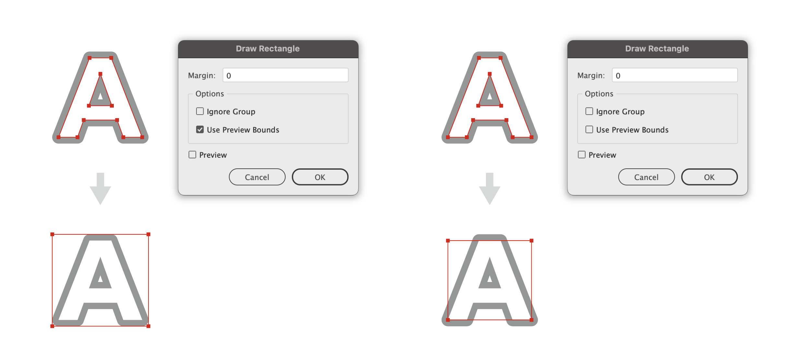

### Usage
1. Select the path objects, and run this script.
2. Enter a margin value.  
   To include stroke width, check the Include stroke width checkbox.

> **Note**  
> The rectangle is drawn with no fill and stroke width.  
> The units of margin value depend on the ruler units.

### Requirements
Illustrator CS4 or higher

<div align="right">[ <a href="#path">↑ Back to Top ↑</a> ]</div>
<br>


# <a name="drawShapeOnAnchorPointjs">drawShapeOnAnchorPoint.js</a>
[](https://github.com/sky-chaser-high/adobe-illustrator-scripts/releases/latest/download/Path.zip)  
This script draws shapes on anchor points.


### Usage
1. Select the path objects, and run this script.
2. Select a shape.
3. Enter a shape size.
4. Check the Draw Handle Position checkbox if you want to draw the shapes on the handle positions.

> **Note**  
> If you select anchor points with Direct Selection Tool, the shape is drawn only for the selected anchor points.  
> The handle position is drawn with a stroke.  
> The units of shape size depend on the ruler units.

### Requirements
Illustrator CS4 or higher

<div align="right">[ <a href="#path">↑ Back to Top ↑</a> ]</div>
<br>


# <a name="encloseWordInParenthesesjs">encloseWordInParentheses.js</a>
[](https://github.com/sky-chaser-high/adobe-illustrator-scripts/releases/latest/download/Text.zip)  
This script encloses words in parentheses.


### Usage
Move the cursor to the position of the word you want to enclose and run this script.  
If you select text ranges, enclose them.

> **Warning**  
> Since using cut and paste functions inside the script, it will lose if you have copied the content in advance.  
> Area type with wrapping may not work well.

> **Note**  
> If you are using version 2020 or earlier, you will not be able to enter keyboard input after running the script.  
> If you want to enter text, you must click with the mouse.

If you want to enclose it with other characters, change lines 41 and 42 inside the script.  
For example, if you enclose it in brackets:
```javascript
var parentheses = {
    start: '[',
    end: ']'
};
```

### Requirements
Illustrator CC 2018 or higher

<div align="right">[ <a href="#text">↑ Back to Top ↑</a> ]</div>
<br>


# <a name="exportColorValuesToCSVjs">exportColorValuesToCSV.js</a>
[](https://github.com/sky-chaser-high/adobe-illustrator-scripts/releases/latest/download/Color.zip)  
This script exports color values of a path object or swatches to a CSV file.

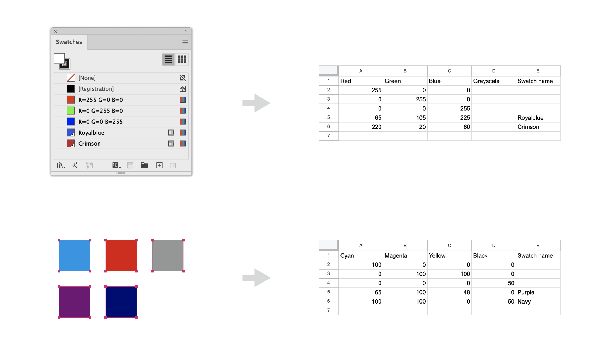

### Usage
Select path objects or swatches, and run this script.  
If you want to export all swatches, deselect path objects and swatches.

> **Note**  
> If you want to get the swatch name, use a global color.  
> Export to the desktop.  
> Prioritize the path object over swatches.  
> Text object and gradient are not supported.

### Requirements
Illustrator CS or higher

<div align="right">[ <a href="#color">↑ Back to Top ↑</a> ]</div>
<br>


# <a name="extendLinejs">extendLine.js</a>
[](https://github.com/sky-chaser-high/adobe-illustrator-scripts/releases/latest/download/Path.zip)  
This script extends a path object.

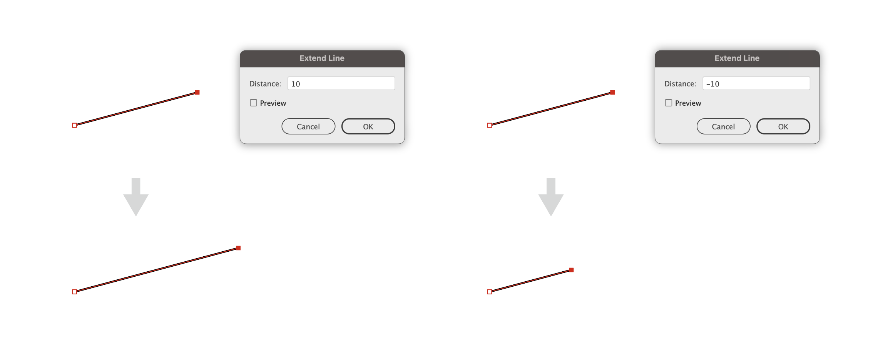

### Usage
1. Select an anchor point with Direct Selection Tool, and run this script.
2. Enter a positive value to extend or a negative value to shrink.

> **Warning**  
> Closed paths and curves are not supported.

> **Note**  
> The units of extension value depend on the ruler units.

### Requirements
Illustrator CS4 or higher

<div align="right">[ <a href="#path">↑ Back to Top ↑</a> ]</div>
<br>


# <a name="extractColorsFromGradientjs">extractColorsFromGradient.js</a>
[](https://github.com/sky-chaser-high/adobe-illustrator-scripts/releases/latest/download/Color.zip)  
This script extracts colors as swatches from the gradient stops.


### Usage
Select the path objects or swatches, and run this script.

> **Note**  
> Prioritize the path object over swatches.  
> To extract color from swatches, deselect the path objects.  
> Text object and stroke color are not supported.

### Requirements
Illustrator CS or higher

<div align="right">[ <a href="#color">↑ Back to Top ↑</a> ]</div>
<br>


# <a name="fitGuideInArtboardjs">fitGuideInArtboard.js</a>
[](https://github.com/sky-chaser-high/adobe-illustrator-scripts/releases/latest/download/Path.zip)  
This script fits guide objects in an artboard.


### Usage
Select guide objects, and run this script.

> **Note**  
> Closed paths and curves are not supported.

### Requirements
Illustrator CS or higher

<div align="right">[ <a href="#path">↑ Back to Top ↑</a> ]</div>
<br>


# <a name="generateGradientColorjs">generateGradientColor.js</a>
[](https://github.com/sky-chaser-high/adobe-illustrator-scripts/releases/latest/download/Color.zip)  
This script generates the gradient color from fill colors or swatches.


### Usage
Select the path objects or swatches, and run this script.

> **Note**  
> Prioritize the path object over swatches.  
> To generate gradient color from swatches, deselect the path objects.  
> Text object and stroke color are not supported.

### Requirements
Illustrator CS4 or higher

<div align="right">[ <a href="#color">↑ Back to Top ↑</a> ]</div>
<br>


# <a name="goToLinejs">goToLine.js</a>
[](https://github.com/sky-chaser-high/adobe-illustrator-scripts/releases/latest/download/Text.zip)  
This script is equivalent to Visual Studio Code's Go menu 
"Go to Line/Column..."( <kbd>Ctrl</kbd> + <kbd>G</kbd> ).  
If you assign shortcuts using [Keyboard Maestro](https://www.keyboardmaestro.com), [AutoHotkey](https://www.autohotkey.com) or similar, 
you will be able to achieve more of a Visual Studio Code feel.  
Both point and area types are supported.


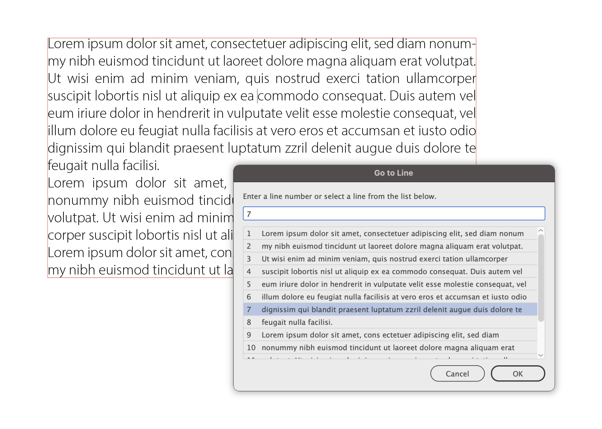

### Usage
1. Run this script in the text editing state.
2. Enter a line number or select a line from the list below that you want to move.

> **Warning**  
> Since using copy and paste functions inside the script, it will lose if you have copied the content in advance.

> **Note**  
> Pan that the selected line is centered in the window.  
> If you are using version 2020 or earlier, you will not be able to enter keyboard input after running the script.  
> If you want to enter text, you must click with the mouse.

### Requirements
Illustrator CC 2018 or higher

<div align="right">[ <a href="#text">↑ Back to Top ↑</a> ]</div>
<br>


# <a name="goToNextTextjsgoToPreviousTextjs">goToNextText.js<br>goToPreviousText.js</a>
[](https://github.com/sky-chaser-high/adobe-illustrator-scripts/releases/latest/download/Text.zip)  
This script moves the cursor to the beginning of the next or previous text while in the text editing state.  
Both point and area types are supported.

For example, goToNextText.js:


### Usage
Run this script in the text editing state.

> **Warning**  
> Since using cut and paste functions inside the script, it will lose if you have copied the content in advance.  
> It will not move to locked, hidden, or threaded texts. The layer also as well.

> **Note**  
> The cursor moving order is text stacking order.  
> Pan that the next or previous text is centered in the window.  
> If you are using version 2020 or earlier, you will not be able to enter keyboard input after running the script.  
> If you want to enter text, you must click with the mouse.

### Requirements
Illustrator CC 2018 or higher

<div align="right">[ <a href="#text">↑ Back to Top ↑</a> ]</div>
<br>


# <a name="highlightWordjs">highlightWord.js</a>
[](https://github.com/sky-chaser-high/adobe-illustrator-scripts/releases/latest/download/Color.zip)  
This script highlights the searched words with the fill color.  
Both CMYK and RGB colors are supported.


### Usage
1. Select the text objects, and run this script.
2. Type the word.
3. Use the slider to determine the color if necessary.

### Requirements
Illustrator CS4 or higher

<div align="right">[ <a href="#color">↑ Back to Top ↑</a> ]</div>
<br>


# <a name="importCSVtoSwatchjs">importCSVtoSwatch.js</a>
[](https://github.com/sky-chaser-high/adobe-illustrator-scripts/releases/latest/download/Color.zip)  
This script imports a CSV file to the Swatches panel.

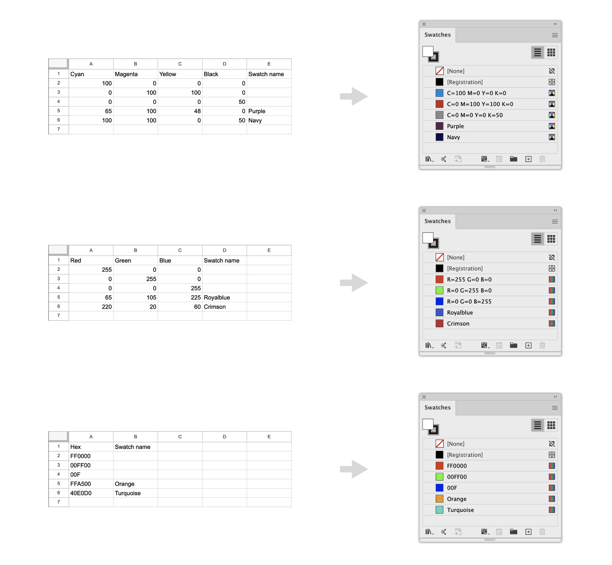

### Usage
1. Run this script.
2. Select a CSV file.

> **Note**  
> Make sure the document color mode and CSV file format are the same.

### Format
CSV files are available in the following two formats.  

##### For CMYK:  
| Cyan | Magenta | Yellow | Black | Swatch name |
| --- | --- | --- | --- | --- |
| 100  | 0 | 0 | 0 | Cyan |

##### For RGB:  
| Red | Green | Blue | Swatch name |
| --- | --- | --- | --- |
| 255 | 0 | 0 | Red |

> **Note**  
> Commas or tabs separate columns.  
> Line 1 is used as the title.  
> The swatch name is not required.

### Requirements
Illustrator CS or higher

<div align="right">[ <a href="#color">↑ Back to Top ↑</a> ]</div>
<br>


# <a name="insertLineAbovejsinsertLineBelowjs">insertLineAbove.js<br>insertLineBelow.js</a>
[](https://github.com/sky-chaser-high/adobe-illustrator-scripts/releases/latest/download/Text.zip)  
This script is equivalent to Visual Studio Code's keyboard shortcut 
"Insert Line Above"( <kbd>⌘</kbd> / <kbd>Ctrl</kbd> + <kbd>Shift</kbd> + <kbd>Enter</kbd> ) & 
"Insert Line Below" ( <kbd>⌘</kbd> / <kbd>Ctrl</kbd> + <kbd>Enter</kbd> ).  
If you assign shortcuts using [Keyboard Maestro](https://www.keyboardmaestro.com), [AutoHotkey](https://www.autohotkey.com) or similar, 
you will be able to achieve more of a Visual Studio Code feel.  
Both point and area types are supported.

For example, insertLineBelow.js:


### Usage
Move the cursor to the line below or above you want to add a line, and run this script.  
It is not necessary to move the cursor to the end of the line.

> **Warning**  
> Area type with wrapping may not work well.

> **Note**  
> If you are using version 2020 or earlier, you will not be able to enter keyboard input after running the script.  
> If you want to enter text, you must click with the mouse.

### Requirements
Illustrator CC 2018 or higher

<div align="right">[ <a href="#text">↑ Back to Top ↑</a> ]</div>
<br>


# <a name="invertLockedLayerjs">invertLockedLayer.js</a>
[](https://github.com/sky-chaser-high/adobe-illustrator-scripts/releases/latest/download/Layer.zip)  
This script inverts locked layers.

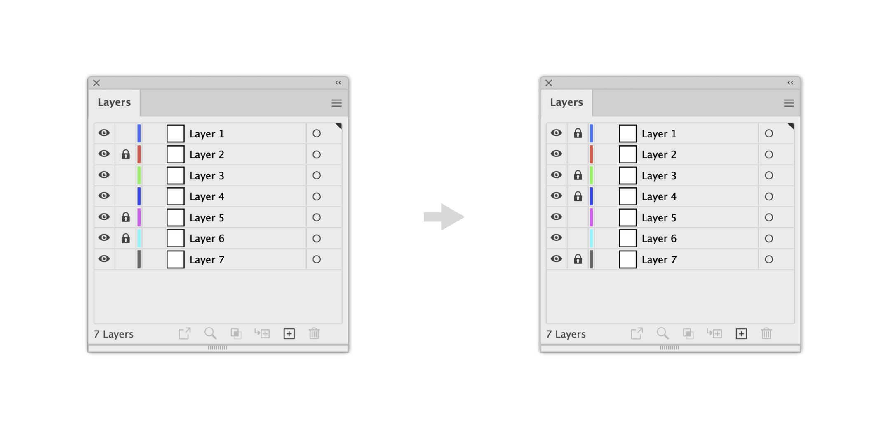

### Usage
Just run this script.

### Requirements
Illustrator CS or higher

<div align="right">[ <a href="#layer">↑ Back to Top ↑</a> ]</div>
<br>


# <a name="invertVisibleLayerjs">invertVisibleLayer.js</a>
[](https://github.com/sky-chaser-high/adobe-illustrator-scripts/releases/latest/download/Layer.zip)  
This script inverts visible layers.


### Usage
Just run this script.

### Requirements
Illustrator CS or higher

<div align="right">[ <a href="#layer">↑ Back to Top ↑</a> ]</div>
<br>


# <a name="matchLocationOfGradientStopjs">matchLocationOfGradientStop.js</a>
[](https://github.com/sky-chaser-high/adobe-illustrator-scripts/releases/latest/download/Color.zip)  
This script matches the location of the gradient stops and midpoints.

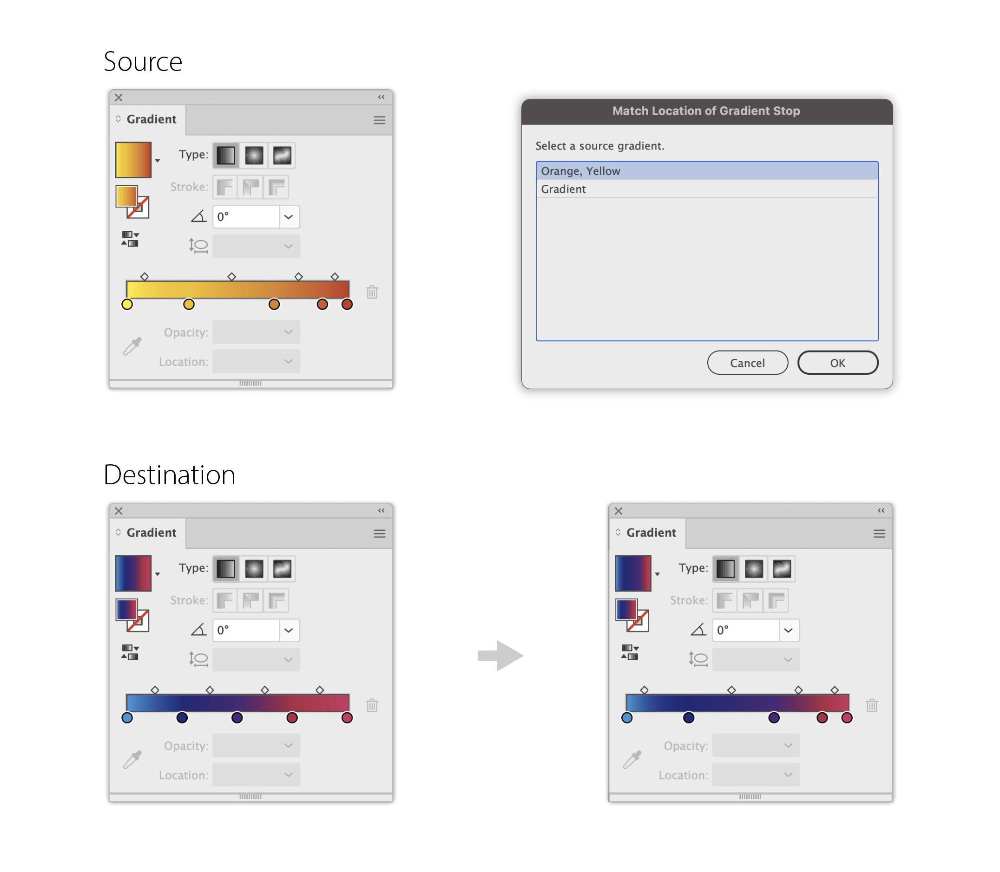

### Usage
1. Select two or more gradients in the Swatches panel, and run this script.
2. Select a source gradient.

> **Note**  
> Only gradients in the Swatches panel are supported.

### Requirements
Illustrator CS4 or higher

<div align="right">[ <a href="#color">↑ Back to Top ↑</a> ]</div>
<br>


# <a name="measurePathItemsjs">measurePathItems.js</a>
[](https://github.com/sky-chaser-high/adobe-illustrator-scripts/releases/latest/download/Path.zip)  
This script measures the distance of an anchor point between two points of an object.


### Usage
Select the path objects, and run this script.

### Feature
Group and color measurements by path object.  
Switch the dimension units according to the ruler units.

> **Warning**  
> Curves are not supported.

> **Note**  
> In complex shapes, measurements may be displayed overlapping each other.

### Requirements
Illustrator CS4 or higher

<div align="right">[ <a href="#path">↑ Back to Top ↑</a> ]</div>
<br>


# <a name="moveLineDownjsmoveLineUpjs">moveLineDown.js<br>moveLineUp.js</a>
[](https://github.com/sky-chaser-high/adobe-illustrator-scripts/releases/latest/download/Text.zip)  
This script is equivalent to Visual Studio Code's Selection menu 
"Move Line Down"( <kbd>Option</kbd> / <kbd>Alt</kbd> + <kbd>↓</kbd> ) & 
"Move Line Up"( <kbd>Option</kbd> / <kbd>Alt</kbd> + <kbd>↑</kbd> ).  
If you assign shortcuts using [Keyboard Maestro](https://www.keyboardmaestro.com), [AutoHotkey](https://www.autohotkey.com) or similar, 
you will be able to achieve more of a Visual Studio Code feel.  
Both point and area types are supported.

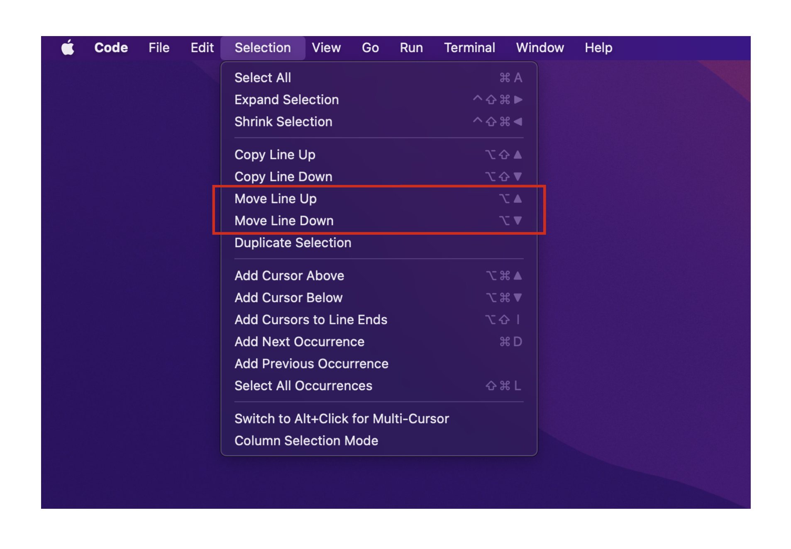

For example, moveLineDown.js:


### Usage
Move the cursor to the line you want to move, and run this script.  
It is not necessary to select a line.

> **Warning**  
> Since using copy and paste functions inside the script, it will lose if you have copied the content in advance.  
> Area type with wrapping may not work well.  
> In the case of moveLineUp.js, when moving the last line, a new line is added to work around a bug.

> **Note**  
> Only one line can be moved. Multiple lines are not supported.  
> If you are using version 2020 or earlier, you will not be able to enter keyboard input after running the script.  
> If you want to enter text, you must click with the mouse.

### Requirements
Illustrator CC 2018 or higher

<div align="right">[ <a href="#text">↑ Back to Top ↑</a> ]</div>
<br>


# <a name="moveSublayerToMainLayerjs">moveSublayerToMainLayer.js</a>
[](https://github.com/sky-chaser-high/adobe-illustrator-scripts/releases/latest/download/Layer.zip)  
This script moves sublayers to the main layer above.


### Usage
Just run this script.

### Requirements
Illustrator CS or higher

<div align="right">[ <a href="#layer">↑ Back to Top ↑</a> ]</div>
<br>


# <a name="randomTextColorjs">randomTextColor.js</a>
[](https://github.com/sky-chaser-high/adobe-illustrator-scripts/releases/latest/download/Color.zip)  
This script changes the text color randomly by word, character or sentence.  
Both CMYK and RGB colors are supported.


### Usage
1. Select the text objects, and run this script.
2. Assign the threshold value with the slider.
3. Click the Random button to assign a color according to the threshold value.

> **Note**  
> If there are many characters, the conversion will take time.  
> Some characters, such as periods and commas, are not applied.

### Requirements
Illustrator CS4 or higher

<div align="right">[ <a href="#color">↑ Back to Top ↑</a> ]</div>
<br>


# <a name="relinkFileExtensionjs">relinkFileExtension.js</a>
[](https://github.com/sky-chaser-high/adobe-illustrator-scripts/releases/latest/download/Link.zip)  
This script is equivalent to InDesign's Links panel menu "Relink File Extension...".


### Usage
1. Run this script.  
   If you don't select linked files, all in the document replace.
2. Enter an extension.

> **Warning**  
> Missing linked files and embedded link files not replaced.  
> Place the relink files in the same place as the original files.

> **Note**  
> When selecting linked files, select them in the document rather than the links panel.

### Requirements
Illustrator CS4 or higher

<div align="right">[ <a href="#link">↑ Back to Top ↑</a> ]</div>
<br>


# <a name="relinkFileExtensionExtrajs">relinkFileExtensionExtra.js</a>
[](https://github.com/sky-chaser-high/adobe-illustrator-scripts/releases/latest/download/Link.zip)  
This script is an enhanced version of relinkFileExtension.js.

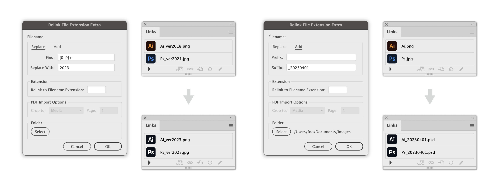

### Usage
1. Run this script.  
   If you don't select linked files, all in the document replace.
2. Choose to Replace or Add.  
   To Replace, you can use regular expressions.  
   To Add, enter a string to be added to the prefix, suffix, or both of the original file names.
3. Enter an extension.  
   If you don't enter an extension, it uses the original file extension.

> **Warning**  
> Missing linked files and embedded link files not replaced.  
> Place the relink files in the same place as the original files.

> **Note**  
> When selecting linked files, select them in the document rather than the links panel.

### Requirements
Illustrator CS4 or higher

<div align="right">[ <a href="#link">↑ Back to Top ↑</a> ]</div>
<br>


# <a name="relinkToFolderjs">relinkToFolder.js</a>
[](https://github.com/sky-chaser-high/adobe-illustrator-scripts/releases/latest/download/Link.zip)  
This script is equivalent to InDesign's Links panel menu "Relink to Folder...".  
Replace linked files with a file of the same name in the selected folder.

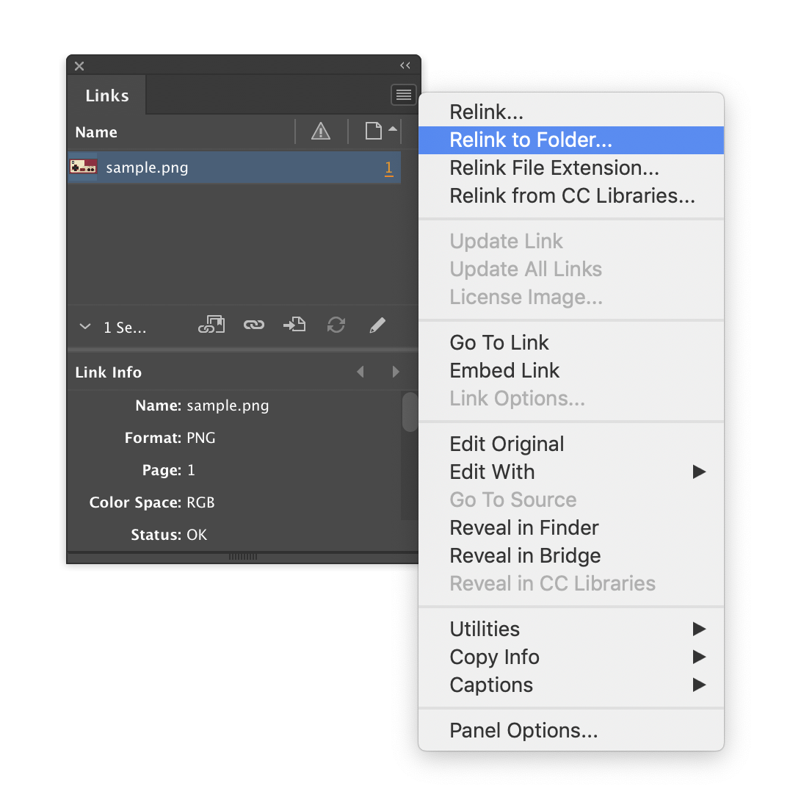

### Usage
1. Run this script.  
   If you don't select linked files, all in the document replace.
2. Select a folder in the dialog that appears.

> **Warning**  
> Missing linked files and embedded link files not replaced.

> **Note**  
> When selecting linked files, select them in the document rather than the links panel.

### Requirements
Illustrator CS4 or higher

<div align="right">[ <a href="#link">↑ Back to Top ↑</a> ]</div>
<br>


# <a name="removeColorInGuideObjectjs">removeColorInGuideObject.js</a>
[](https://github.com/sky-chaser-high/adobe-illustrator-scripts/releases/latest/download/Path.zip)  
This script removes fill and stroke colors in all guide objects.

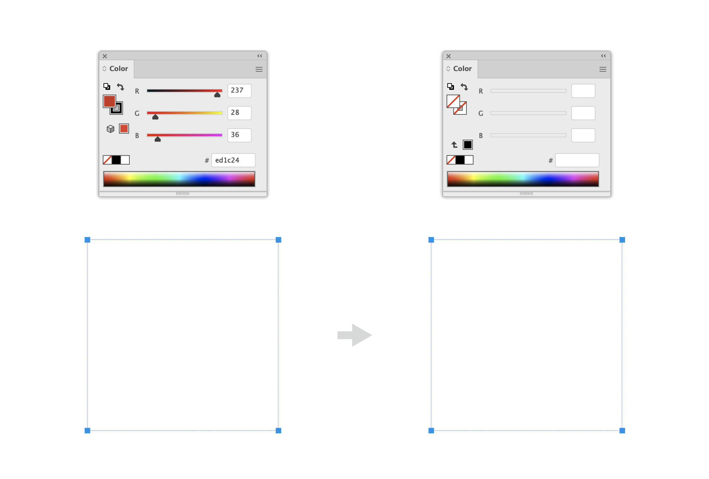

### Usage
Just run this script.  
It is not necessary to select guide objects.

> **Note**  
> Show and unlock all layers.  
> Guide objects hidden with <kbd>⌘</kbd> / <kbd>Ctrl</kbd> + <kbd>3</kbd> are not supported.  
> If you have added fill or stroke colors in the Appearance panel, they may not work well.

### Requirements
Illustrator CS6 or higher

<div align="right">[ <a href="#path">↑ Back to Top ↑</a> ]</div>
<br>


# <a name="removeDeletedGlobalColorjs">removeDeletedGlobalColor.js</a>
[](https://github.com/sky-chaser-high/adobe-illustrator-scripts/releases/latest/download/Color.zip)  
This script deletes the Deleted Global Color displayed in the Separations Preview panel.


### Usage
Just run this script.

> **Note**  
> In rare cases, you may not be able to delete it.  
> If you save the file and reopen it, it may be restored.  
> In this case, there is no way to delete it.

### Requirements
Illustrator CS or higher

<div align="right">[ <a href="#color">↑ Back to Top ↑</a> ]</div>
<br>


# <a name="resetToFullScalejs">resetToFullScale.js</a>
[](https://github.com/sky-chaser-high/adobe-illustrator-scripts/releases/latest/download/Link.zip)  
This script resets the scale to 100% and the rotation angle to 0 degrees for the linked files.  
Embedded link files are also supported.


### Usage
Select linked files or embedded link files, and run this script.

### Requirements
Illustrator CS6 or higher

<div align="right">[ <a href="#link">↑ Back to Top ↑</a> ]</div>
<br>


# <a name="roundColorValuejs">roundColorValue.js</a>
[](https://github.com/sky-chaser-high/adobe-illustrator-scripts/releases/latest/download/Color.zip)  
This script rounds color values. Both fill and stroke colors are supported.

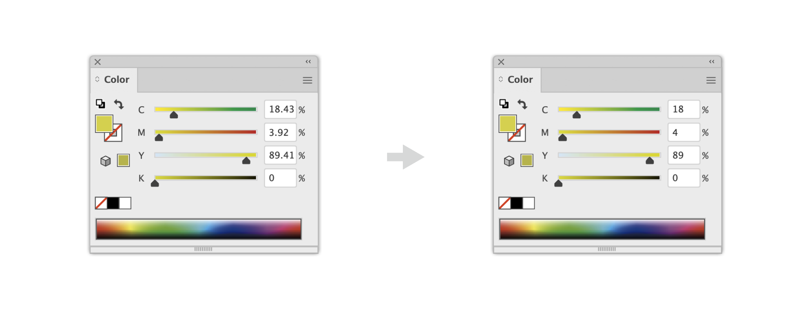

### Usage
Select the objects, and run this script.

### Requirements
Illustrator CS or higher

<div align="right">[ <a href="#color">↑ Back to Top ↑</a> ]</div>
<br>


# <a name="roundLocationOfGradientStopjs">roundLocationOfGradientStop.js</a>
[](https://github.com/sky-chaser-high/adobe-illustrator-scripts/releases/latest/download/Color.zip)  
This script rounds the location of the gradient color stops and midpoints.  
Both fill and stroke colors are supported.


### Usage
Select the objects, and run this script.

### Requirements
Illustrator CS or higher

<div align="right">[ <a href="#color">↑ Back to Top ↑</a> ]</div>
<br>


# <a name="selectEmbeddedLinkjs">selectEmbeddedLink.js</a>
[](https://github.com/sky-chaser-high/adobe-illustrator-scripts/releases/latest/download/Link.zip)  
This script selects embedded link files.

### Usage
Just run this script.

> **Warning**  
> Locked or hidden embedded link files are not selected. The layer also as well.

### Requirements
Illustrator CS or higher

<div align="right">[ <a href="#link">↑ Back to Top ↑</a> ]</div>
<br>


# <a name="selectGuidesjs">selectGuides.js</a>
[](https://github.com/sky-chaser-high/adobe-illustrator-scripts/releases/latest/download/Path.zip)  
This script selects guide objects.

### Usage
Just run this script.

> **Warning**  
> Locked or hidden guides are not selected. The layer also as well.

### Requirements
Illustrator CS6 or higher

<div align="right">[ <a href="#path">↑ Back to Top ↑</a> ]</div>
<br>


# <a name="selectLinkjs">selectLink.js</a>
[](https://github.com/sky-chaser-high/adobe-illustrator-scripts/releases/latest/download/Link.zip)  
This script selects linked files.  


### Usage
1. Run this script.
2. Enter a file name. It can also be part of the file name.  
   If the text field is empty, all linked files are selected.

> **Warning**  
> Locked or hidden linked files are not selected. The layer also as well.  
> Missing linked files may not be selected.

> **Note**  
> Regular expressions are supported.

### Requirements
Illustrator CS4 or higher

<div align="right">[ <a href="#link">↑ Back to Top ↑</a> ]</div>
<br>


# <a name="showArtboardNamejs">showArtboardName.js</a>
[](https://github.com/sky-chaser-high/adobe-illustrator-scripts/releases/latest/download/Artboard.zip)  
This script shows the artboard name and size in the document.


### Usage
Just run this script.

> **Note**  
> The dimensional units depend on the ruler units.

### Requirements
Illustrator CS4 or higher

<div align="right">[ <a href="#artboard">↑ Back to Top ↑</a> ]</div>
<br>


# <a name="showColorValuesjs">showColorValues.js</a>
[](https://github.com/sky-chaser-high/adobe-illustrator-scripts/releases/latest/download/Color.zip)  
This script shows color values. Both fill and stroke colors are supported.


### Usage
Select path objects, and run this script.

> **Note**  
> CMYK, RGB, grayscale, spot color, and pattern are supported.  
> Text object and gradient are not supported.

### Requirements
Illustrator CS or higher

<div align="right">[ <a href="#color">↑ Back to Top ↑</a> ]</div>
<br>


# <a name="shuffleGradientColorjs">shuffleGradientColor.js</a>
[](https://github.com/sky-chaser-high/adobe-illustrator-scripts/releases/latest/download/Color.zip)  
This script shuffles the gradient color.


### Usage
Select the path objects, and run this script.

> **Note**  
> Only a fill color. A stroke color is not supported.  
> For compound path objects, select them with direct selection tool.

### Requirements
Illustrator CS or higher

<div align="right">[ <a href="#color">↑ Back to Top ↑</a> ]</div>
<br>


# <a name="shuffleObjectsjs">shuffleObjects.js</a>
[](https://github.com/sky-chaser-high/adobe-illustrator-scripts/releases/latest/download/Path.zip)  
This script shuffles the objects.


### Usage
Select the objects, and run this script.

### Requirements
Illustrator CS or higher

<div align="right">[ <a href="#path">↑ Back to Top ↑</a> ]</div>
<br>


# <a name="sortArtboardsjs">sortArtboards.js</a>
[](https://github.com/sky-chaser-high/adobe-illustrator-scripts/releases/latest/download/Artboard.zip)  
This script sorts the artboards in the Artboards panel.


### Usage
Just run this script.

> **Note**  
> Only the Artboards panel. Artboards in the document are not sorted.

### Requirements
Illustrator CS5 or higher

<div align="right">[ <a href="#artboard">↑ Back to Top ↑</a> ]</div>
<br>


# <a name="stepAndRepeatjs">stepAndRepeat.js</a>
[](https://github.com/sky-chaser-high/adobe-illustrator-scripts/releases/latest/download/Path.zip)  
This script is equivalent to InDesign's Edit menu "Step and Repeat...".  


### Usage
1. Select the objects, and run this script.
2. If you want to create as a grid, check the create as a grid.
3. Enter the number of times to repeat.
4. Enter the offset values.

> **Note**  
> The unit of the offset value switches to match the unit of the ruler.

### Requirements
Illustrator CS4 or higher

<div align="right">[ <a href="#path">↑ Back to Top ↑</a> ]</div>
<br>


# <a name="sumNumbersjs">sumNumbers.js</a>
[](https://github.com/sky-chaser-high/adobe-illustrator-scripts/releases/latest/download/Utility.zip)  
This script sums the numbers in text contents.


### Usage
Select text objects, and run this script.  
You can also recalculate using only selected items from the list.

> **Note**  
> Ignore the units of value.  
> Only one-byte numbers are supported.

### Requirements
Illustrator CS4 or higher

<div align="right">[ <a href="#utility">↑ Back to Top ↑</a> ]</div>
<br>


# <a name="swapTextContentsjs">swapTextContents.js</a>
[](https://github.com/sky-chaser-high/adobe-illustrator-scripts/releases/latest/download/Text.zip)  
This script swap the text contents.

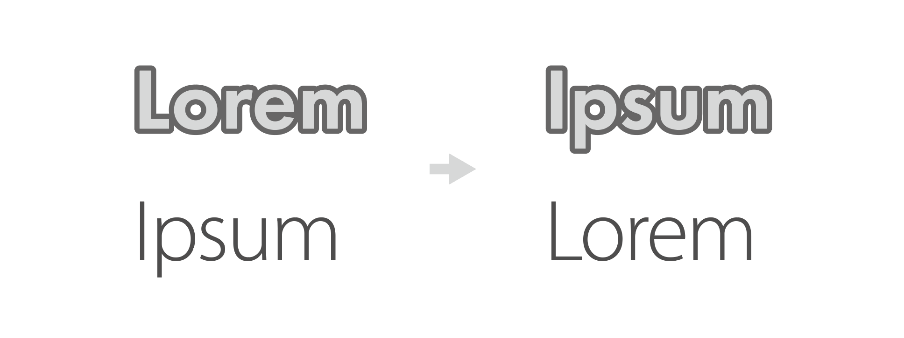

### Usage
Select two text objects, and run this script.

### Requirements
Illustrator CS or higher

<div align="right">[ <a href="#text">↑ Back to Top ↑</a> ]</div>
<br>


# <a name="syncViewjs">syncView.js</a>
[](https://github.com/sky-chaser-high/adobe-illustrator-scripts/releases/latest/download/Utility.zip)  
This script synchronizes the scale ratio and the position of the current work area for all documents.  


### Usage
Just run this script.

> **Note**  
> Open at least two files.  

### Requirements
Illustrator CS or higher

<div align="right">[ <a href="#utility">↑ Back to Top ↑</a> ]</div>
<br>


# <a name="textAlign_CenterjstextAlign_LeftjstextAlign_Rightjs">textAlign_Center.js<br>textAlign_Left.js<br>textAlign_Right.js</a>
[](https://github.com/sky-chaser-high/adobe-illustrator-scripts/releases/latest/download/Text.zip)  
This script changes the text alignment without moving the text position.  
Vertical text is also supported.

For example, textAlign_Center.js:


### Usage
Select the text objects, and run this script.

### Requirements
Illustrator CS or higher

<div align="right">[ <a href="#text">↑ Back to Top ↑</a> ]</div>
<br>


# <a name="unifyLayerColorsjs">unifyLayerColors.js</a>
[](https://github.com/sky-chaser-high/adobe-illustrator-scripts/releases/latest/download/Layer.zip)  
This script unifies layer colors.


### Usage
Select a target layer, and run this script.

> **Note**  
> Sublayers are also supported.

### Requirements
Illustrator CS or higher

<div align="right">[ <a href="#layer">↑ Back to Top ↑</a> ]</div>
<br>


# <a name="XmpFunctionsjs">XmpFunctions.js</a>
[](https://github.com/sky-chaser-high/adobe-illustrator-scripts/releases/latest/download/Utility.zip)  
These functions get the font, color, or history properties that are used in the document from XMP.  
**See also:** [Adobe XMP Document](https://www.adobe.io/xmp/docs/)

### Usage
You can include this script or copy the function to use it.

```javascript
// @include '/Path1/Path2/XmpFunctions.js'
var fonts = xmpGetFonts(app.activeDocument.fullName);
```
It can also be used for linked files.
```javascript
// @include '/Path1/Path2/XmpFunctions.js'
var src = app.activeDocument.placedItems[0].file;
var history = xmpGetHistory(src);
```

### Functions
- [xmpGetFonts(src)](#xmpGetFonts(src))
- [xmpGetHistory(src)](#xmpGetHistory(src))
- [xmpGetLinkedFiles(src)](#xmpGetLinkedFiles(src))
- [xmpGetPlateNames(src)](#xmpGetPlateNames(src))
- [xmpGetSwatches(src)](#xmpGetSwatches(src))

### <a name="xmpGetFonts(src)">xmpGetFonts(src)</a>
Get font properties that are used in the document from XMP.  

**Param**: `src` `<File>`  
**Returns**: `Array<Object>` An unordered array of font properties.  
- `composite` `<boolean>` When true, this is a composite font.
- `face` `<string>` The font face name.
- `family` `<string>` The font family name.
- `filename` `<string>` The font file name. (not a complete path)
- `name` `<string>` PostScript name of the font.
- `type` `<string>` The font type, such as TrueType, Type 1, Open Type, and so on.
- `version` `<string>` The version string.

##### Example
```javascript
// @include '/Path1/Path2/XmpFunctions.js'
var fonts = xmpGetFonts(app.activeDocument.fullName);
alert(fonts[0].face);
```

### <a name="xmpGetHistory(src)">xmpGetHistory(src)</a>
Get history properties from XMP.

**Param**: `src` `<File>`  
**Returns**: `Array<Object>` An ordered array of user actions that resulted in the document.  
- `action` `<string>` The action that occurred.
- `parameter` `<string> | null` Additional description of the action.
- `software` `<string> | null` The software agent that performed the action.
- `when` `<Date> | null` Timestamp of when the action occurred.

##### Example
```javascript
// @include '/Path1/Path2/XmpFunctions.js'
var history = xmpGetHistory(app.activeDocument.fullName);
var date = history[0].when;
alert(date.getFullYear());
```

### <a name="xmpGetLinkedFiles(src)">xmpGetLinkedFiles(src)</a>
Get linked file properties from XMP.

**Param**: `src` `<File>`  
**Returns**: `Array<Object>` References to resources that were incorporated, by inclusion or reference, into this resource.  
- `exists` `<boolean>` When true, the path name of this object refers to an existing file.
- `filePath` `<string>` The referenced resource's file path or URL.

##### Example
```javascript
// @include '/Path1/Path2/XmpFunctions.js'
var files = xmpGetLinkedFiles(app.activeDocument.fullName);
alert(files[0].filePath);
```

### <a name="xmpGetPlateNames(src)">xmpGetPlateNames(src)</a>
Get plate names that are used in the document from XMP.

**Param**: `src` `<File>`  
**Returns**: `Array<string>` An ordered array of plate names that are needed to print the document.  

##### Example
```javascript
// @include '/Path1/Path2/XmpFunctions.js'
var platenames = xmpGetPlateNames(app.activeDocument.fullName);
alert(platenames[0]);
```

### <a name="xmpGetSwatches(src)">xmpGetSwatches(src)</a>
Get swatch properties that are used in the document from XMP.

**Param**: `src` `<File>`  
**Returns**: `Array<Object>` A structure containing the characteristics of a colorant (swatch) used in the document.  
- `colorant` `<Object>` The color values.
    - `cyan` `<number>` Cyan color value when the mode is CMYK. Range 0-100.
    - `magenta` `<number>` Magenta color value when the mode is CMYK. Range 0-100.
    - `yellow` `<number>` Yellow color value when the mode is CMYK. Range 0-100.
    - `black` `<number>` Black color value when the mode is CMYK. Range 0-100.
    - `gray` `<number>` Gray color value when the mode is GRAY. Range 0-255.
    - `l` `<number>` L value when the mode is LAB. Range 0-100.
    - `a` `<number>` A value when the mode is LAB. Range -128 to 127.
    - `b` `<number>` B value when the mode is LAB. Range -128 to 127.
    - `red` `<number>` Red color value when the mode is RGB. Range 0-255.
    - `green` `<number>` Green color value when the mode is RGB. Range 0-255.
    - `blue` `<number>` Blue color value when the mode is RGB. Range 0-255.
- `mode` `<string>` The color space in which the color is defined.
- `name` `<string>` Name of the swatch.
- `swatch` `<swatch> | null` Swatch object.
- `tint` `<number>` The tint of the color.
- `type` `<string>` The type of color, one of PROCESS or SPOT.

##### Example
```javascript
// @include '/Path1/Path2/XmpFunctions.js'
var swatches = xmpGetSwatches(app.activeDocument.fullName);
alert(swatches[0].colorant.cyan);
```

### Requirements
Illustrator CS or higher

<div align="right">[ <a href="#utility">↑ Back to Top ↑</a> ]</div>
<br>


# License
All scripts are licensed under the MIT license.  
See the included LICENSE file for more details.  
