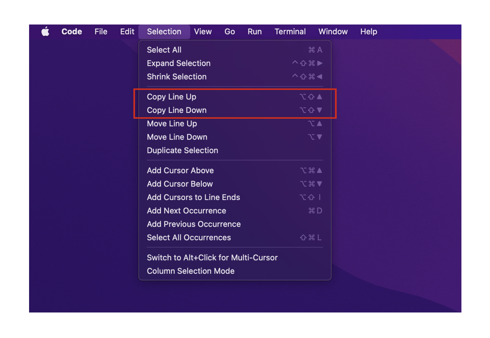
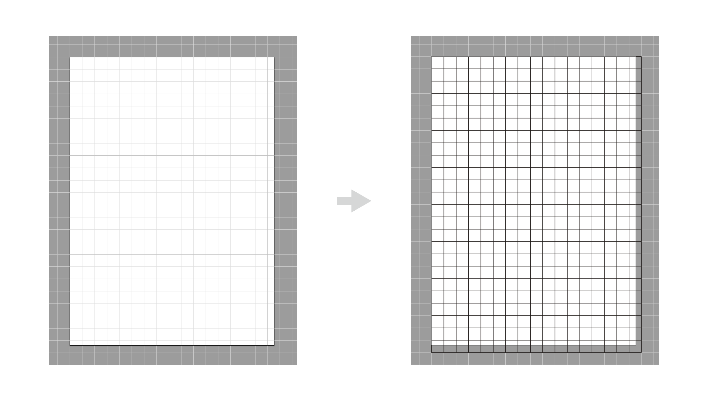
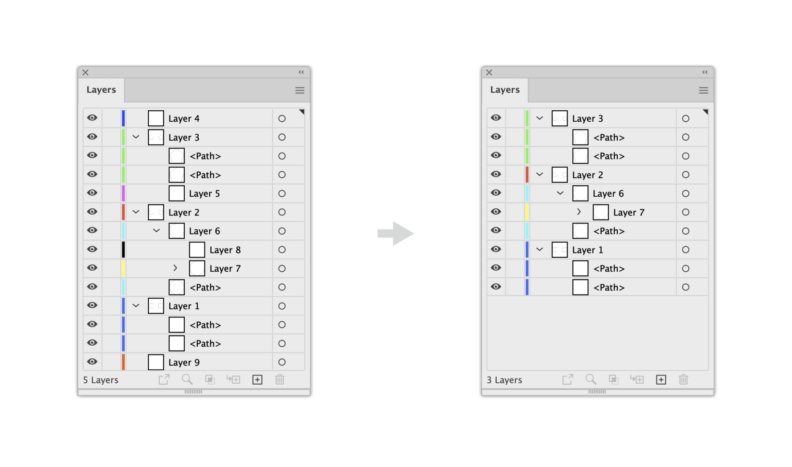
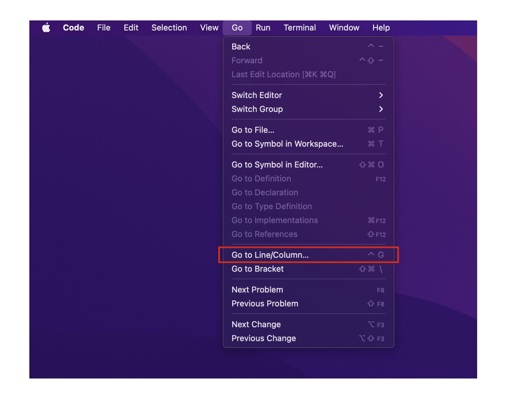
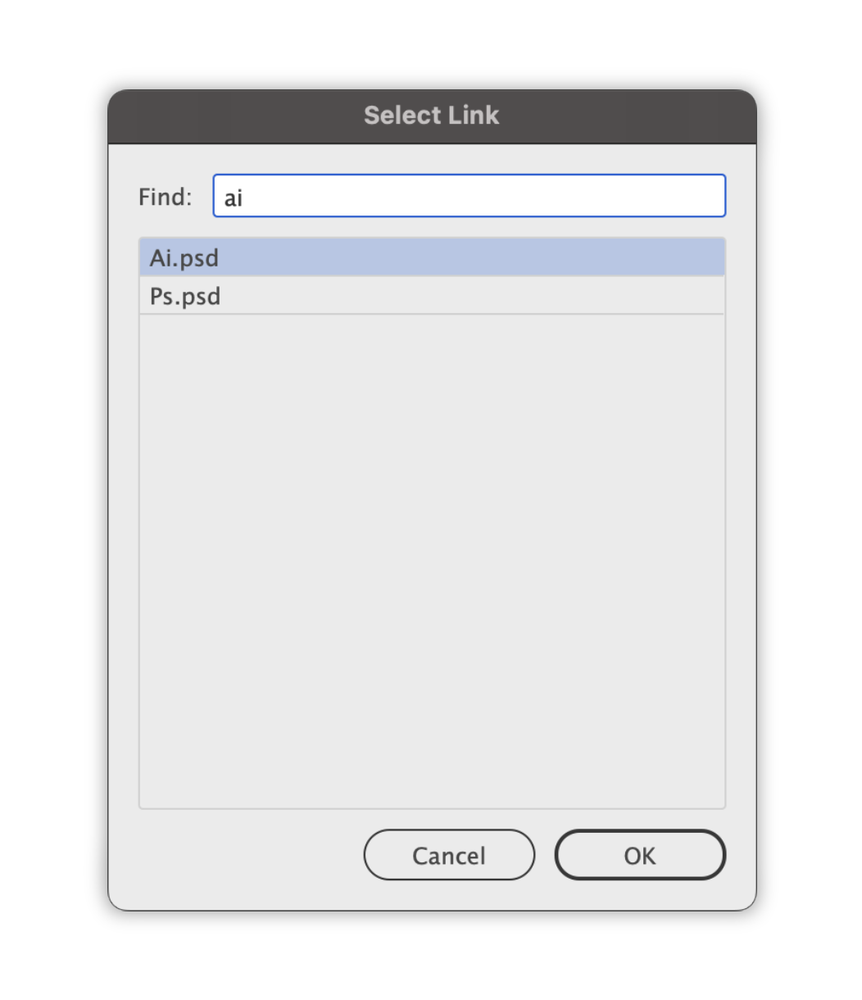

# Adobe Illustrator Scripts
[](https://github.com/sky-chaser-high/adobe-illustrator-scripts/releases/latest/download/AllScripts.zip)

Adobe Illustratorのスクリプト集です。  
スクリプト名をクリックすると詳細説明にジャンプします。  
[](https://github.com/sky-chaser-high/adobe-illustrator-scripts/releases/latest) からスクリプトをダウンロードしてください。
<br><br>

### アートボード [](https://github.com/sky-chaser-high/adobe-illustrator-scripts/releases/latest/download/Artboard.zip)
| スクリプト | 概要 |
| --- | --- |
| [showArtboardName.js](#showArtboardName.js) | アートボード名とサイズを表示 |
| [sortArtboards.js](#sortArtboards.js) | アートボードをソート（アートボードパネル内のみ） |

<br>

### カラー [](https://github.com/sky-chaser-high/adobe-illustrator-scripts/releases/latest/download/Color.zip)
| スクリプト | 概要 |
| --- | --- |
| [createColorChart.js](#createColorChart.js) | カラーチャート作成 |
| [extractColorsFromGradient.js](#extractColorsFromGradient.js) | グラデーションのカラー分岐点から色を取り出す |
| [generateGradientColor.js](#generateGradientColor.js) | グラデーションを生成 |
| [highlightWord.js](#highlightWord.js) | 指定した単語の塗り色を変更 |
| [matchLocationOfGradientStop.js](#matchLocationOfGradientStop.js) | グラデーションのカラー分岐点、中間点の位置を同期 |
| [randomTextColor.js](#randomTextColor.js) | テキストの塗り色をランダムに変更 |
| [removeDeletedGlobalColor.js](#removeDeletedGlobalColor.js) | Deleted Global Color を削除 |
| [roundColorValue.js](#roundColorValue.js) | カラー数値を四捨五入 |
| [roundLocationOfGradientStop.js](#roundLocationOfGradientStop.js) | グラデーションのカラー分岐点、中間点の数値を四捨五入 |
| [shuffleGradientColor.js](#shuffleGradientColor.js) | グラデーションをシャッフル |

<br>

### レイヤー [](https://github.com/sky-chaser-high/adobe-illustrator-scripts/releases/latest/download/Layer.zip)
| スクリプト | 概要 |
| --- | --- |
| [deleteHiddenLayers.js](#deleteHiddenLayers.js) | 非表示レイヤーを削除 |
| [deleteLockedLayers.js](#deleteLockedLayers.js) | ロック状態のレイヤーを削除 |
| [deleteUnusedLayers.js](#deleteUnusedLayers.js) | 未使用（空）のレイヤーを削除 |
| [invertLockedLayer.js](#invertLockedLayer.js) | ロック状態を反転 |
| [invertVisibleLayer.js](#invertVisibleLayer.js) | 表示状態を反転 |
| [moveSublayerToMainLayer.js](#moveSublayerToMainLayer.js) | サブレイヤーを親レイヤーの外へ移動 |

<br>

### リンク [](https://github.com/sky-chaser-high/adobe-illustrator-scripts/releases/latest/download/Link.zip)
| スクリプト | 概要 |
| --- | --- |
| [relinkFileExtension.js](#relinkFileExtension.js) | ファイル拡張子にリンクを再設定 |
| [relinkFileExtensionExtra.js](#relinkFileExtensionExtra.js) | ファイル拡張子にリンクを再設定（機能拡張版） |
| [relinkToFolder.js](#relinkToFolder.js) | フォルダに再リンク |
| [resetToFullScale.js](#resetToFullScale.js) | 画像サイズを100%に戻す |
| [selectEmbeddedLink.js](#selectEmbeddedLink.js) | 埋め込み画像を選択 |
| [selectLink.js](#selectLink.js) | リンクを選択 |

<br>

### パス [](https://github.com/sky-chaser-high/adobe-illustrator-scripts/releases/latest/download/Path.zip)
| スクリプト | 概要 |
| --- | --- |
| [closePath.js](#closePath.js) | パスを閉じる |
| [convertAllAnchorPointsToCorner.js](#convertAllAnchorPointsToCorner.js) | すべてのアンカーをコーナーポイントに切り替え |
| [createGridLines.js](#createGridLines.js) | グリッドラインを作成 |
| [disjoinPath.js](#disjoinPath.js) | パスを分解 |
| [drawRectangle.js](#drawRectangle.js) `New` | オブジェクトの周囲に長方形を描く |
| [extendLine.js](#extendLine.js) `New` | パスを伸縮 |
| [measurePathItems.js](#measurePathItems.js) | パスの寸法を測る |
| [removeColorInGuideObject.js](#removeColorInGuideObject.js) | ガイドオブジェクトの色を削除 |
| [shuffleObjects.js](#shuffleObjects.js) | オブジェクトをシャッフル |
| [stepAndRepeat.js](#stepAndRepeat.js) | 繰り返し複製 |

<br>

### テキスト [](https://github.com/sky-chaser-high/adobe-illustrator-scripts/releases/latest/download/Text.zip)
| スクリプト | 概要 |
| --- | --- |
| [addNumericSeparators.js](#addNumericSeparators.js) | 数字を3桁で区切る |
| [copyLineDown.js](#copyLine) | 行を下へコピー |
| [copyLineUp.js](#copyLine) | 行を上へコピー |
| [copyLine(emptySelection).js](#emptySelection) | 選択なしでコピー |
| [createPageNumbers.js](#createPageNumbers.js) | ノンブル作成 |
| [cutLine(emptySelection).js](#emptySelection) | 選択なしでカット |
| [deleteAllLeft.js](#deleteAll) | カーソルの左側をすべて削除 |
| [deleteAllRight.js](#deleteAll) | カーソルの右側をすべて削除 |
| [deleteTrailingSpaces.js](#deleteTrailingSpaces.js) | 行末のスペースを削除 |
| [deleteWord.js](#deleteWord.js) | カーソル位置の単語を削除 |
| [goToLine.js](#goToLine.js) | 指定の行に移動 |
| [goToNextText.js](#goToText) | カーソルを次のテキストへ移動 |
| [goToPreviousText.js](#goToText) | カーソルを前のテキストへ移動 |
| [insertLineAbove.js](#insertLine) | 上に行を挿入 |
| [insertLineBelow.js](#insertLine) | 下に行を挿入 |
| [moveLineDown.js](#moveLine) | 行を下へ移動 |
| [moveLineUp.js](#moveLine) | 行を上へ移動 |
| [swapTextContents.js](#swapTextContents.js) | 文字列を交換 |
| [textAlign_Center.js](#textAlign) | 文字列の位置を動かさずに中央揃え |
| [textAlign_Left.js](#textAlign) | 文字列の位置を動かさずに左揃え |
| [textAlign_Right.js](#textAlign) | 文字列の位置を動かさずに右揃え |

<br>

### ユーティリティ [](https://github.com/sky-chaser-high/adobe-illustrator-scripts/releases/latest/download/Utility.zip)
| スクリプト | 概要 |
| --- | --- |
| [arrangeWindows.js](#arrangeWindows.js) | ウィンドウを並べて表示 |
| [checkDayOfWeek.js](#checkDayOfWeek.js) | 選択した日付の曜日をチェック |
| [closeAllDocuments.js](#closeAllDocuments.js) | すべてのファイルを閉じる |
| [compareScale.js](#compareScale.js) | 拡大・縮小率を表示 |
| [syncView.js](#syncView.js) | ウィンドウの表示を同期 |
| [XmpFunctions.js](#XmpFunctions.js) | XMP関数 |

<br><br>


### インストール
[](https://github.com/sky-chaser-high/adobe-illustrator-scripts/releases/latest) 
または [Releases](https://github.com/sky-chaser-high/adobe-illustrator-scripts/releases/latest) から
ZIPファイルを[ダウンロード](https://github.com/sky-chaser-high/adobe-illustrator-scripts/releases/latest)してください。  
解凍したスクリプトは好きな場所に置いて管理してください。  
ファイル > スクリプト > その他のスクリプト... ( <kbd>⌘</kbd> / <kbd>Ctrl</kbd> + <kbd>F12</kbd> ) からスクリプトを選択して実行します。  

スクリプトの導入方法は下記のサイトで詳しく解説されています。参考にしてみてください。
- [Illustratorでスクリプトを使ってみよう［標準機能編］](https://hamfactory.net/illustrator/script-basic/)
- [Illustratorでスクリプトを使ってみよう［Mac+SPAi編］](https://hamfactory.net/illustrator/script-spai/)

> **Note**  
> スクリプトを使い続けていると、まれに動作しなくなる場合があります。  
> その場合は、Illustratorを再起動してから実行してみてください。


### ソフトウェア、エクステンション
下記のソフトウェア、エクステンションを使用すると楽にスクリプトを実行できるようになります。
- [SPAi](https://tama-san.com/spai/)（Mac）
- [Sppy](https://sppy.stars.ne.jp/sppyai)（Windows）
- [Scripshon Trees](https://exchange.adobe.com/apps/cc/15873/scripshon-trees)（エクステンション）  
- [LAScripts](https://exchange.adobe.com/apps/cc/19405/lascripts)（エクステンション）


### ファイル名
スクリプトのファイル名は日本語に変更しても問題なく動作します。  
例えば、textAlign_Center.js を「テキスト中央揃え.js」のように変更しても大丈夫です。


### UI デザイン
UIのあるスクリプトはすべて日本語の表示になります。  
UIデザインツールには、[ScriptUI Dialog Builder (SDB)](https://scriptui.joonas.me/) を使用しました。  
ツールの詳細は [ScriptUI-Dialog-Builder-Joonas](https://github.com/joonaspaakko/ScriptUI-Dialog-Builder-Joonas) を参照してください。
<br><br><br>


# <a name="addNumericSeparators.js">addNumericSeparators.js</a>
[](https://github.com/sky-chaser-high/adobe-illustrator-scripts/releases/latest/download/Text.zip)  
数値をカンマで3桁区切りにします。


#### 使用方法
テキストオブジェクトを選択してスクリプトを実行します。  
または、テキスト編集状態でスクリプトを実行します。


#### 動作条件
Illustrator CS以降
<br><br>


# <a name="arrangeWindows.js">arrangeWindows.js</a>
[](https://github.com/sky-chaser-high/adobe-illustrator-scripts/releases/latest/download/Utility.zip)  
開いているすべてのウィンドウを分割して並べて表示します。


#### 使用方法
このスクリプトを実行するだけです。

#### 動作条件
Illustrator CS6以降
<br><br>


# <a name="checkDayOfWeek.js">checkDayOfWeek.js</a>
[](https://github.com/sky-chaser-high/adobe-illustrator-scripts/releases/latest/download/Utility.zip)  
選択した日付の曜日をチェックします。


> **Note** Illustrator日本語版を使用している場合は、UIは日本語で表示します。

#### 使用方法
カーソルで日付を選択してスクリプトを実行します。

> **Note**  
> 年がない場合（月日のみ）は、今年とみなします。  
> 日付が正しくない場合は警告を表示します。  
> チェック可能な日付の書式は下記になります。

> **書式**  
> `YYYY/MM/DD`, `MM/DD/YYYY`, `DD/MM/YYYY`,   
> `YYYY-MM-DD`, `MM-DD-YYYY`, `DD-MM-YYYY`,  
> `YYYY.MM.DD`, `MM.DD.YYYY`, `DD.MM.YYYY`,  
> `YYYY MM DD`,  
> `YYYY年MM月DD日`,  
> `Jan(uary) (the) DD(st|nd|rd|th)(,) YYYY`, `MM DD(st|nd|rd|th)(,) YYYY`,  
> `DD(st|nd|rd|th) (of) Jan(uary)(,) YYYY`, `DD(st|nd|rd|th) MM(,) YYYY`

#### 動作条件
Illustrator CS以降
<br><br>


# <a name="closeAllDocuments.js">closeAllDocuments.js</a>
[](https://github.com/sky-chaser-high/adobe-illustrator-scripts/releases/latest/download/Utility.zip)  
すべてのファイルを閉じます。  
編集中のファイルがある場合は、保存してから閉じるかを選択します。

> **Note**  
> バージョン2021からファイルメニューに実装されています。

#### 使用方法
このスクリプトを実行するだけです。  

#### 動作条件
Illustrator CS4以降
<br><br>


# <a name="closePath.js">closePath.js</a>
[](https://github.com/sky-chaser-high/adobe-illustrator-scripts/releases/latest/download/Path.zip)  
開いているパスを閉じます。


#### 使用方法
パスオブジェクトを選択してスクリプトを実行します。

#### 動作条件
Illustrator CS以降
<br><br>


# <a name="compareScale.js">compareScale.js</a>
[](https://github.com/sky-chaser-high/adobe-illustrator-scripts/releases/latest/download/Utility.zip)  
2つのオブジェクトを比較して拡大・縮小率を表示します。


> **Note** Illustrator日本語版を使用している場合は、UIは日本語で表示します。

#### 使用方法
2つのオブジェクトを選択してスクリプトを実行します。

> **Note**  
> 寸法の単位はルーラー単位により変わります。

#### 動作条件
Illustrator CS以降
<br><br>


# <a name="convertAllAnchorPointsToCorner.js">convertAllAnchorPointsToCorner.js</a>
[](https://github.com/sky-chaser-high/adobe-illustrator-scripts/releases/latest/download/Path.zip)  
すべてのアンカーポイントをコーナーポイントに切り替えます。  
コントロールパネルの機能ではアンカーポイントを選択しなければなりませんが、このスクリプトではオブジェクト全体を選択します。


#### 使用方法
選択ツールでパスオブジェクト全体を選択してスクリプトを実行します。

> **Note**  
> ダイレクト選択ツールでアンカーポイントを選択する必要はありません。

#### 動作条件
Illustrator CS以降
<br><br>


# <a name="copyLine">copyLineDown.js<br>copyLineUp.js</a>
[](https://github.com/sky-chaser-high/adobe-illustrator-scripts/releases/latest/download/Text.zip)  
Visual Studio Code の「行を下へコピー」( <kbd>Option</kbd> / <kbd>Alt</kbd> + <kbd>Shift</kbd> + <kbd>↓</kbd> )、
「行を上へコピー」( <kbd>Option</kbd> / <kbd>Alt</kbd> + <kbd>Shift</kbd> + <kbd>↑</kbd> )と同様のことができます。  
[Keyboard Maestro](https://www.keyboardmaestro.com/main/)、
[SPAi](https://tama-san.com/spai/) や
[Sppy](https://sppy.stars.ne.jp/sppyai)
などでショートカットを割り当てると、より一層Visual Studio Codeの操作感が出せると思います。  
ポイント文字、エリア内文字のどちらにも対応しています。



例 copyLineDown.js:


#### 使用方法
コピーしたい行にカーソルを合わせてスクリプトを実行します。  
1行すべてを選択する必要はありません。

> **Warning**  
> カーソルを移動させるためにスクリプト内部でコピー＆ペーストを行っています。そのため、あらかじめ文字列等をコピーしていた場合はその内容が失われてしまいます。  
> エリア内文字で文字の折り返しがある行をコピーする場合、うまく動作しないことがあります。  
> copyLineDown.jsで最終行をコピーする場合は、バグを回避するために空行を追加します。

> **Note**  
> コピーできるのは1行のみです。複数行には対応していません。  
> バージョン2020以前の場合は、スクリプトを実行するとキーボードが反応しなくなります。  
> テキストを編集する場合はマウスでテキストをクリックしてください。

#### 動作条件
Illustrator CC 2018以降
<br><br>


# <a name="emptySelection">copyLine(emptySelection).js<br>cutLine(emptySelection).js</a>
[](https://github.com/sky-chaser-high/adobe-illustrator-scripts/releases/latest/download/Text.zip)  
Visual Studio Code のショートカット「コピー（選択なし）」( <kbd>⌘</kbd> / <kbd>Ctrl</kbd> + <kbd>C</kbd> )、
「切り取り（選択なし）」( <kbd>⌘</kbd> / <kbd>Ctrl</kbd> + <kbd>X</kbd> )と同様のことができます。  
[Keyboard Maestro](https://www.keyboardmaestro.com/main/)、
[SPAi](https://tama-san.com/spai/) や
[Sppy](https://sppy.stars.ne.jp/sppyai)
などでショートカットを割り当てると、より一層Visual Studio Codeの操作感が出せると思います。  
ポイント文字、エリア内文字のどちらにも対応しています。

例 cutLine(emptySelection).js:


#### 使用方法
コピーまたは、カットしたい行にカーソルを合わせてスクリプトを実行します。  
1行すべてを選択する必要はありません。

> **Warning**  
> バグを回避するために改行は含みません。  
> エリア内文字で文字の折り返しがある行をコピーまたはカットする場合、うまく動作しないことがあります。

> **Note**  
> バージョン2020以前の場合は、スクリプトを実行するとキーボードが反応しなくなります。  
> テキストを編集する場合はマウスでテキストをクリックしてください。

#### 動作条件
Illustrator CC 2018以降
<br><br>


# <a name="createColorChart.js">createColorChart.js</a>
[](https://github.com/sky-chaser-high/adobe-illustrator-scripts/releases/latest/download/Color.zip)  
カラーチャートを作成します。CMYK、RGB のどちらにも対応しています。


> **Note** Illustrator日本語版を使用している場合は、UIは日本語で表示します。

#### 使用方法
1. スクリプトを実行します。
2. カラーモード「CMYK」または「RGB」を選択します。  
   パスオブジェクトを選択している場合は、塗りの値が初期値として使用されます。
3. 垂直方向、水平方向で増減させたい色を選択します。
4. 増減値を入力します。
5. アートボードサイズ、カラーチップサイズ、単位を設定します。

> **Note**  
> 新規ドキュメントにカラーチャートを作成します。

#### 動作条件
Illustrator CS4以降
<br><br>


# <a name="createGridLines.js">createGridLines.js</a>
[](https://github.com/sky-chaser-high/adobe-illustrator-scripts/releases/latest/download/Path.zip)  
アートボードにグリッドを作成します。



#### 使用方法
このスクリプトを実行するだけです。

> **Note**  
> グリッドの間隔は環境設定のガイド・グリッド項目の設定に依存します。

#### 動作条件
Illustrator CS以降
<br><br>


# <a name="createPageNumbers.js">createPageNumbers.js</a>
[](https://github.com/sky-chaser-high/adobe-illustrator-scripts/releases/latest/download/Text.zip)  
InDesignの書式メニュー > 特殊文字を挿入 > マーカー > 現在のページ番号 に相当します。  
アートボードの指定した位置にノンブルを配置します。


> **Note** Illustrator日本語版を使用している場合は、UIは日本語で表示します。

#### 使用方法
1. スクリプトを実行します。
2. 各項目を設定します。
   - `位置` ノンブルの表示位置。
   - `見開き` チェックを入れると見開きページに対応します。
   - `開始ページ番号` 始まりの番号を指定します。
   - `セクションプレフィックス` ノンブルの前に文字列を追加します。見開きページの場合は、後ろに追加します。
   - `フォントサイズ` ノンブルのフォントサイズ。
   - `マージン` アートボードからの距離を指定します。現在のルーラー設定で単位が切り替わります。

> **Note**  
> ノンブルに指定できるスタイルは数字のみです。  
> アートボード順にノンブルを割り当てます。

#### 動作条件
Illustrator CS4以降
<br><br>


# <a name="deleteAll">deleteAllLeft.js<br>deleteAllRight.js</a>
[](https://github.com/sky-chaser-high/adobe-illustrator-scripts/releases/latest/download/Text.zip)  
Visual Studio Code のショートカット「左側をすべて削除」( <kbd>⌘</kbd> + <kbd>Backspace</kbd> )、
「右側をすべて削除」( <kbd>⌘</kbd> + <kbd>Delete</kbd> )と同様のことができます。  
[Keyboard Maestro](https://www.keyboardmaestro.com/main/)、
[SPAi](https://tama-san.com/spai/) や
[Sppy](https://sppy.stars.ne.jp/sppyai)
などでショートカットを割り当てると、より一層Visual Studio Codeの操作感が出せると思います。  
ポイント文字、エリア内文字のどちらにも対応しています。

例 deleteAllRight.js:


#### 使用方法
削除したい場所にカーソルを合わせてスクリプトを実行します。  
削除する文字列を選択する必要はありません。

> **Warning**  
> カーソルを移動させるためにスクリプト内部でコピー＆ペーストを行っています。そのため、あらかじめ文字列等をコピーしていた場合はその内容が失われてしまいます。

> **Note**  
> 削除できるのは1行のみです。複数行には対応していません。  
> バージョン2020以前の場合は、スクリプトを実行するとキーボードが反応しなくなります。  
> テキストを編集する場合はマウスでテキストをクリックしてください。

#### 動作条件
Illustrator CC 2018以降
<br><br>


# <a name="deleteHiddenLayers.js">deleteHiddenLayers.js</a>
[](https://github.com/sky-chaser-high/adobe-illustrator-scripts/releases/latest/download/Layer.zip)  
非表示のレイヤーを削除します。

> **Note**  
> バージョン2021からレイヤーパネルメニューに実装されています。


#### 使用方法
このスクリプトを実行するだけです。  

#### 動作条件
Illustrator CS以降
<br><br>


# <a name="deleteLockedLayers.js">deleteLockedLayers.js</a>
[](https://github.com/sky-chaser-high/adobe-illustrator-scripts/releases/latest/download/Layer.zip)  
ロックしているレイヤーを削除します。


#### 使用方法
このスクリプトを実行するだけです。  

#### 動作条件
Illustrator CS以降
<br><br>


# <a name="deleteTrailingSpaces.js">deleteTrailingSpaces.js</a>
[](https://github.com/sky-chaser-high/adobe-illustrator-scripts/releases/latest/download/Text.zip)  
行末のスペースを削除します。
ポイント文字、エリア内文字のどちらにも対応しています。


#### 使用方法
テキストオブジェクトを選択してスクリプトを実行します。  
スペースがある文字列を選択する必要はありません。

> **Warning**  
> エリア内文字で文字の折り返しがある場合、うまく動作しないことがあります。

> **Note**  
> タブも削除の対象になります。

#### 動作条件
Illustrator CS以降
<br><br>


# <a name="deleteUnusedLayers.js">deleteUnusedLayers.js</a>
[](https://github.com/sky-chaser-high/adobe-illustrator-scripts/releases/latest/download/Layer.zip)  
未使用（空）のレイヤーを削除します。サブレイヤーも対象です。



#### 使用方法
このスクリプトを実行するだけです。  
未使用レイヤーを選択する必要はありません。

#### 動作条件
Illustrator CS以降
<br><br>


# <a name="deleteWord.js">deleteWord.js</a>
[](https://github.com/sky-chaser-high/adobe-illustrator-scripts/releases/latest/download/Text.zip)  
カーソル位置の単語を削除します。
ポイント文字、エリア内文字のどちらにも対応しています。


#### 使用方法
削除したい単語の位置にカーソルを合わせてスクリプトを実行します。  
削除する単語を選択する必要はありません。

> **Warning**  
> カーソルを移動させるためにスクリプト内部でコピー＆ペーストを行っています。そのため、あらかじめ文字列等をコピーしていた場合はその内容が失われてしまいます。  
> エリア内文字で文字の折り返しがある場合、うまく動作しないことがあります。

> **Note**  
> バージョン2020以前の場合は、スクリプトを実行するとキーボードが反応しなくなります。  
> テキストを編集する場合はマウスでテキストをクリックしてください。

#### 動作条件
Illustrator CC 2018以降
<br><br>


# <a name="disjoinPath.js">disjoinPath.js</a>
[](https://github.com/sky-chaser-high/adobe-illustrator-scripts/releases/latest/download/Path.zip)  
アンカーポイントごとにパスオブジェクトを分割します。


#### 使用方法
パスオブジェクトを選択してスクリプトを実行します。

> **Warning**  
> 元のパスオブジェクトは削除されます。

#### 動作条件
Illustrator CS以降
<br><br>


# <a name="drawRectangle.js">drawRectangle.js</a>
[](https://github.com/sky-chaser-high/adobe-illustrator-scripts/releases/latest/download/Path.zip)  
オブジェクトの周囲に長方形を描きます。


> **Note** Illustrator日本語版を使用している場合は、UIは日本語で表示します。

#### 使用方法
1. パスオブジェクトを選択してスクリプトを実行します。
2. マージンを入力します。  
   線幅を含めたい場合は、線幅を含むチェックボックスにチェックを入れます。

> **Note**  
> 塗りと線幅なしの長方形を描きます。  
> マージンの単位はルーラー単位により変わります。

#### 動作条件
Illustrator CS以降
<br><br>


# <a name="extendLine.js">extendLine.js</a>
[](https://github.com/sky-chaser-high/adobe-illustrator-scripts/releases/latest/download/Path.zip)  
パスオブジェクトを伸縮します。


> **Note** Illustrator日本語版を使用している場合は、UIは日本語で表示します。

#### 使用方法
1. ダイレクト選択ツールでアンカーポイントを選択してスクリプトを実行します。
2. 数値を入力します。正の値で伸び、負の値で縮みます。

> **Warning**  
> 閉じたパスと曲線には対応していません。

> **Note**  
> 距離の単位はルーラー単位により変わります。

#### 動作条件
Illustrator CS以降
<br><br>


# <a name="extractColorsFromGradient.js">extractColorsFromGradient.js</a>
[](https://github.com/sky-chaser-high/adobe-illustrator-scripts/releases/latest/download/Color.zip)  
グラデーションのカラー分岐点からそれぞれ色を取り出してスウォッチに追加します。


#### 使用方法
パスオブジェクトまたはスウォッチから色を選択してスクリプトを実行します。

> **Note**  
> パスオブジェクトを優先します。  
> スウォッチから色を取り出したい場合はパスオブジェクトの選択を解除してください。  
> テキスト、線の色には対応していません。

#### 動作条件
Illustrator CS以降
<br><br>


# <a name="generateGradientColor.js">generateGradientColor.js</a>
[](https://github.com/sky-chaser-high/adobe-illustrator-scripts/releases/latest/download/Color.zip)  
オブジェクトの塗り色またはスウォッチからグラデーションを生成します。


#### 使用方法
パスオブジェクトまたはスウォッチからグラデーションを選択してスクリプトを実行します。

> **Note**  
> パスオブジェクトを優先します。  
> スウォッチからグラデーションを生成したい場合はパスオブジェクトの選択を解除してください。  
> テキスト、線の色には対応していません。

#### 動作条件
Illustrator CS4以降
<br><br>


# <a name="goToLine.js">goToLine.js</a>
[](https://github.com/sky-chaser-high/adobe-illustrator-scripts/releases/latest/download/Text.zip)  
Visual Studio Code の「行/列に移動...」( <kbd>Ctrl</kbd> + <kbd>G</kbd> )と同様のことができます。  
[Keyboard Maestro](https://www.keyboardmaestro.com/main/)、
[SPAi](https://tama-san.com/spai/) や
[Sppy](https://sppy.stars.ne.jp/sppyai)
などでショートカットを割り当てると、より一層Visual Studio Codeの操作感が出せると思います。  
ポイント文字、エリア内文字のどちらにも対応しています。




> **Note** Illustrator日本語版を使用している場合は、UIは日本語で表示します。

#### 使用方法
1. テキスト編集状態でスクリプトを実行します。
2. 行番号を入力するか、リストから移動したい行を選択します。

> **Warning**  
> カーソルを移動させるためにスクリプト内部でコピー＆ペーストを行っています。そのため、あらかじめ文字列等をコピーしていた場合はその内容が失われてしまいます。

> **Note**  
> 選択した行がウィンドウの中央に来るようにパンします。  
> バージョン2020以前の場合は、スクリプトを実行するとキーボードが反応しなくなります。  
> テキストを編集する場合はマウスでテキストをクリックしてください。

#### 動作条件
Illustrator CC 2018以降
<br><br>


# <a name="goToText">goToNextText.js<br>goToPreviousText.js</a>
[](https://github.com/sky-chaser-high/adobe-illustrator-scripts/releases/latest/download/Text.zip)  
テキスト編集状態のまま、カーソルを次または前のテキストの先頭に移動します。  
ポイント文字、エリア内文字のどちらにも対応しています。

例 goToNextText.js:


#### 使用方法
テキスト編集状態でスクリプトを実行します。

> **Warning**  
> カーソルを移動させるためにスクリプト内部でカット＆ペーストを行っています。そのため、あらかじめ文字列等をコピーしていた場合はその内容が失われてしまいます。  
> ロック、非表示状態またはスレッドテキストには移動しません。レイヤーの状態も同様です。

> **Note**  
> カーソルの移動順は、テキストの作成順になります。  
> 次または前のテキストがウィンドウの中央に来るようにパンします。  
> バージョン2020以前の場合は、スクリプトを実行するとキーボードが反応しなくなります。  
> テキストを編集する場合はマウスでテキストをクリックしてください。

#### 動作条件
Illustrator CC 2018以降
<br><br>


# <a name="highlightWord.js">highlightWord.js</a>
[](https://github.com/sky-chaser-high/adobe-illustrator-scripts/releases/latest/download/Color.zip)  
入力した単語の塗り色を変更します。CMYK、RGB のどちらにも対応しています。


> **Note** Illustrator日本語版を使用している場合は、UIは日本語で表示します。

#### 使用方法
1. テキストオブジェクトを選択してスクリプトを実行します。
2. 単語を入力します。
3. 必要に応じて色を設定します。

#### 動作条件
Illustrator CS4以降
<br><br>


# <a name="insertLine">insertLineAbove.js<br>insertLineBelow.js</a>
[](https://github.com/sky-chaser-high/adobe-illustrator-scripts/releases/latest/download/Text.zip)  
Visual Studio Code のショートカット「上に行を挿入」( <kbd>⌘</kbd> / <kbd>Ctrl</kbd> + <kbd>Shift</kbd> + <kbd>Enter</kbd> )、
「下に行を挿入」( <kbd>⌘</kbd> / <kbd>Ctrl</kbd> + <kbd>Enter</kbd> )と同様のことができます。  
[Keyboard Maestro](https://www.keyboardmaestro.com/main/)、
[SPAi](https://tama-san.com/spai/) や
[Sppy](https://sppy.stars.ne.jp/sppyai)
などでショートカットを割り当てると、より一層Visual Studio Codeの操作感が出せると思います。  
ポイント文字、エリア内文字のどちらにも対応しています。

例 insertLineBelow.js:


#### 使用方法
行を追加したい位置の下または上の行にカーソルを合わせてスクリプトを実行します。  
行末にカーソルを移動する必要はありません。

> **Warning**  
> エリア内文字で文字の折り返しがある行に対して挿入する場合、うまく動作しないことがあります。

> **Note**  
> バージョン2020以前の場合は、スクリプトを実行するとキーボードが反応しなくなります。  
> テキストを編集する場合はマウスでテキストをクリックしてください。

#### 動作条件
Illustrator CC 2018以降
<br><br>


# <a name="invertLockedLayer.js">invertLockedLayer.js</a>
[](https://github.com/sky-chaser-high/adobe-illustrator-scripts/releases/latest/download/Layer.zip)  
レイヤーの表示／非表示を切り替えます。


#### 使用方法
このスクリプトを実行するだけです。  

#### 動作条件
Illustrator CS以降
<br><br>


# <a name="invertVisibleLayer.js">invertVisibleLayer.js</a>
[](https://github.com/sky-chaser-high/adobe-illustrator-scripts/releases/latest/download/Layer.zip)  
レイヤーのロック状態を切り替えます。


#### 使用方法
このスクリプトを実行するだけです。  

#### 動作条件
Illustrator CS以降
<br><br>


# <a name="matchLocationOfGradientStop.js">matchLocationOfGradientStop.js</a>
[](https://github.com/sky-chaser-high/adobe-illustrator-scripts/releases/latest/download/Color.zip)  
グラデーションのカラー分岐点、中間点を同期します。


> **Note** Illustrator日本語版を使用している場合は、UIは日本語で表示します。

#### 使用方法
1. スウォッチからグラデーションを2つ以上選択してスクリプトを実行します。
2. 元になるグラデーションを選択します。

> **Note**  
> スウォッチにあるグラデーションが対象となります。

#### 動作条件
Illustrator CS4以降
<br><br>


# <a name="measurePathItems.js">measurePathItems.js</a>
[](https://github.com/sky-chaser-high/adobe-illustrator-scripts/releases/latest/download/Path.zip)  
パスオブジェクトの2点間のアンカーポイントの距離を測定します。


#### 使用方法
パスオブジェクトを選択してスクリプトを実行します。

#### 特徴
パスオブジェクトごとに測定値をグループ化し色を付けます。  
測定値の単位は、ドキュメントのルーラ設定により切り替わります。

> **Warning**  
> 曲線には対応していません。

> **Note**  
> オブジェクトが複雑な形状や小さい場合、測定値が重なって表示されることがあります。  

#### 動作条件
Illustrator CS4以降
<br><br>


# <a name="moveLine">moveLineDown.js<br>moveLineUp.js</a>
[](https://github.com/sky-chaser-high/adobe-illustrator-scripts/releases/latest/download/Text.zip)  
Visual Studio Code の「行を下へ移動」( <kbd>Option</kbd> / <kbd>Alt</kbd> + <kbd>↓</kbd> )、
「行を上へ移動」( <kbd>Option</kbd> / <kbd>Alt</kbd> + <kbd>↑</kbd> )と同様のことができます。  
[Keyboard Maestro](https://www.keyboardmaestro.com/main/)、
[SPAi](https://tama-san.com/spai/) や
[Sppy](https://sppy.stars.ne.jp/sppyai)
などでショートカットを割り当てると、より一層Visual Studio Codeの操作感が出せると思います。  
ポイント文字、エリア内文字のどちらにも対応しています。


例 moveLineDown.js:


#### 使用方法
移動したい行にカーソルを合わせてスクリプトを実行します。  
移動する行を選択する必要はありません。

> **Warning**  
> カーソルを移動させるためにスクリプト内部でコピー＆ペーストを行っています。そのため、あらかじめ文字列等をコピーしていた場合はその内容が失われてしまいます。  
> エリア内文字で文字の折り返しがある行を移動する場合、うまく動作しないことがあります。  
> moveLineUp.jsで最終行を移動する場合は、バグを回避するために空行を追加します。

> **Note**  
> 移動できるのは1行のみです。複数行には対応していません。  
> バージョン2020以前の場合は、スクリプトを実行するとキーボードが反応しなくなります。  
> テキストを編集する場合はマウスでテキストをクリックしてください。

#### 動作条件
Illustrator CC 2018以降
<br><br>


# <a name="moveSublayerToMainLayer.js">moveSublayerToMainLayer.js</a>
[](https://github.com/sky-chaser-high/adobe-illustrator-scripts/releases/latest/download/Layer.zip)  
サブレイヤーを親レイヤーの外へ移動します。


#### 使用方法
このスクリプトを実行するだけです。

#### 動作条件
Illustrator CS以降
<br><br>


# <a name="randomTextColor.js">randomTextColor.js</a>
[](https://github.com/sky-chaser-high/adobe-illustrator-scripts/releases/latest/download/Color.zip)  
単語または、1文字、1文ごとにランダムに色を適用します。CMYK、RGB のどちらにも対応しています。


> **Note** Illustrator日本語版を使用している場合は、UIは日本語で表示します。

#### 使用方法
1. テキストオブジェクトを選択してスクリプトを実行します。
2. スライダーで各色のしきい値を指定します。
3. ランダムボタンをクリックすると、しきい値に応じた色が割り当てられます。

> **Note**  
> 文字数が多いと変換に時間がかかります。  
> 英文の場合、ピリオドやカンマなど一部適用されない文字があります。

#### 動作条件
Illustrator CS4以降
<br><br>


# <a name="relinkFileExtension.js">relinkFileExtension.js</a>
[](https://github.com/sky-chaser-high/adobe-illustrator-scripts/releases/latest/download/Link.zip)  
InDesignのリンクパネルメニュー > ファイル拡張子にリンクを再設定... に相当します。


#### 使用方法
1. 置き換えたいリンク画像を選択しスクリプトを実行します。  
   リンク画像を選択しない場合は、ドキュメント内のすべてのリンク画像が対象となります。
2. 表示されたプロンプトに置き換えるファイルの拡張子を入力します。


> **Note** Illustrator日本語版を使用している場合は、UIは日本語で表示します。

> **Warning**  
> リンク切れ画像は置き換えることはできません。埋め込み画像も対象外です。  
> 再配置するリンク画像は、元のリンク画像と同じフォルダに置いてください。

> **Note**  
> 画像を選択する場合は、リンクパネル内の画像ではなく、ドキュメント内の画像を選択してください。

#### 動作条件
Illustrator CS4以降
<br><br>


# <a name="relinkFileExtensionExtra.js">relinkFileExtensionExtra.js</a>
[](https://github.com/sky-chaser-high/adobe-illustrator-scripts/releases/latest/download/Link.zip)  
このスクリプトは、relinkFileExtension.js を機能拡張したものです。


> **Note** Illustrator日本語版を使用している場合は、UIは日本語で表示します。

#### 使用方法
1. 置き換えたいリンク画像を選択しスクリプトを実行します。  
   リンク画像を選択しない場合は、ドキュメント内のすべてのリンク画像が対象となります。
2. 「文字列を置換する」または「文字列を追加する」を選択します。  
   「文字列を置換する」の場合は、正規表現が使用できます。  
   「文字列を追加する」の場合は、元のファイル名の先頭か末尾またはその両方に追加する文字列を入力します。
3. 置き換えるファイルの拡張子を入力します。  
   拡張子を入力しない場合は、元のファイルの拡張子が使用されます。

> **Warning**  
> リンク切れ画像は置き換えることはできません。埋め込み画像も対象外です。  
> 再配置するリンク画像は、元のリンク画像と同じフォルダに置いてください。

> **Note**  
> 画像を選択する場合は、リンクパネル内の画像ではなく、ドキュメント内の画像を選択してください。

#### 動作条件
Illustrator CS4以降
<br><br>


# <a name="relinkToFolder.js">relinkToFolder.js</a>
[](https://github.com/sky-chaser-high/adobe-illustrator-scripts/releases/latest/download/Link.zip)  
指定したフォルダーにある同名の画像と置き換えます。  
InDesignのリンクパネルメニュー > フォルダに再リンク... に相当します。


#### 使用方法
1. 置き換えたいリンク画像を選択しスクリプトを実行します。  
   リンク画像を選択しない場合は、ドキュメント内のすべてのリンク画像が対象となります。
2. 表示されたダイアログからフォルダを選択します。

> **Warning**  
> リンク切れ画像は置き換えることはできません。埋め込み画像も対象外です。

> **Note**  
> 画像を選択する場合は、リンクパネル内の画像ではなく、ドキュメント内の画像を選択してください。

#### 動作条件
Illustrator CS4以降
<br><br>


# <a name="removeColorInGuideObject.js">removeColorInGuideObject.js</a>
[](https://github.com/sky-chaser-high/adobe-illustrator-scripts/releases/latest/download/Path.zip)  
すべてのガイドオブジェクトの塗りと線の色を削除します。


#### 使用方法
このスクリプトを実行するだけです。  
ガイドオブジェクトを選択する必要はありません。

> **Note**  
> すべてのレイヤーを表示してロックを解除します。  
> <kbd>⌘</kbd> / <kbd>Ctrl</kbd> + <kbd>3</kbd> で非表示のガイドオブジェクトは対象になりません。  
> アピアランスで塗りや線の色を追加している場合は、削除できない場合があります。

#### 動作条件
Illustrator CS6以降
<br><br>


# <a name="removeDeletedGlobalColor.js">removeDeletedGlobalColor.js</a>
[](https://github.com/sky-chaser-high/adobe-illustrator-scripts/releases/latest/download/Color.zip)  
分版プレビューパネルに表示される Deleted Global Color を削除します。


#### 使用方法
このスクリプトを実行するだけです。  
オブジェクトを選択する必要はありません。

> **Note**  
> まれに削除できない場合があります。  
> 削除後にファイルを保存して再度開くと復活する場合があります。

#### 動作条件
Illustrator CS以降
<br><br>


# <a name="resetToFullScale.js">resetToFullScale.js</a>
[](https://github.com/sky-chaser-high/adobe-illustrator-scripts/releases/latest/download/Link.zip)  
リンク画像のスケールを100%に、回転角度を0°に戻します。  
埋め込み画像にも対応しています。


#### 使用方法
リンク画像または埋め込み画像を選択してスクリプトを実行します。

#### 動作条件
Illustrator CS6以降
<br><br>


# <a name="roundColorValue.js">roundColorValue.js</a>
[](https://github.com/sky-chaser-high/adobe-illustrator-scripts/releases/latest/download/Color.zip)  
カラーの数値を四捨五入します。  
塗り、線のどちらにも対応しています。


#### 使用方法
オブジェクトを選択してスクリプトを実行します。

#### 動作条件
Illustrator CS以降
<br><br>


# <a name="roundLocationOfGradientStop.js">roundLocationOfGradientStop.js</a>
[](https://github.com/sky-chaser-high/adobe-illustrator-scripts/releases/latest/download/Color.zip)  
グラデーションのカラー分岐点、中間点の数値を四捨五入します。  
塗り、線のどちらにも対応しています。


#### 使用方法
オブジェクトを選択してスクリプトを実行します。

#### 動作条件
Illustrator CS以降
<br><br>


# <a name="selectEmbeddedLink.js">selectEmbeddedLink.js</a>
[](https://github.com/sky-chaser-high/adobe-illustrator-scripts/releases/latest/download/Link.zip)  
埋め込み画像を選択します。

#### 使用方法
このスクリプトを実行するだけです。

> **Warning**  
> ロックまたは非表示状態では選択しません。レイヤーの状態も同様です。

#### 動作条件
Illustrator CS以降
<br><br>


# <a name="selectLink.js">selectLink.js</a>
[](https://github.com/sky-chaser-high/adobe-illustrator-scripts/releases/latest/download/Link.zip)  
リンクを選択します。


> **Note** Illustrator日本語版を使用している場合は、UIは日本語で表示します。

#### 使用方法
1. スクリプトを実行します。
2. ファイル名を入力します。ファイル名の一部でも可能です。  
   何も入力しない場合は、すべてのリンクを選択します。

> **Warning**  
> ロックまたは非表示状態では選択しません。レイヤーの状態も同様です。  
> リンク切れ画像は選択できない場合があります。

> **Note**  
> 正規表現に対応しています。

#### 動作条件
Illustrator CS4以降
<br><br>


# <a name="showArtboardName.js">showArtboardName.js</a>
[](https://github.com/sky-chaser-high/adobe-illustrator-scripts/releases/latest/download/Artboard.zip)  
ドキュメント内にアートボード名とサイズを表示します。


#### 使用方法
このスクリプトを実行するだけです。  

> **Note**  
> サイズの単位はルーラー単位により変わります。

#### 動作条件
Illustrator CS4以降
<br><br>


# <a name="shuffleGradientColor.js">shuffleGradientColor.js</a>
[](https://github.com/sky-chaser-high/adobe-illustrator-scripts/releases/latest/download/Color.zip)  
グラデーションをシャッフルします。


#### 使用方法
パスオブジェクトを選択してスクリプトを実行します。

> **Note**  
> 線のカラーには対応していません。  
> 複合パスの場合は、ダイレクト選択ツールでパスを選択してください。

#### 動作条件
Illustrator CS以降
<br><br>


# <a name="shuffleObjects.js">shuffleObjects.js</a>
[](https://github.com/sky-chaser-high/adobe-illustrator-scripts/releases/latest/download/Path.zip)  
選択したオブジェクトをシャッフルします。


#### 使用方法
オブジェクトを選択してスクリプトを実行します。

#### 動作条件
Illustrator CS以降
<br><br>


# <a name="sortArtboards.js">sortArtboards.js</a>
[](https://github.com/sky-chaser-high/adobe-illustrator-scripts/releases/latest/download/Artboard.zip)  
アートボードパネル内のアートボード名を昇順でソートします。


#### 使用方法
このスクリプトを実行するだけです。  

> **Note**  
> ドキュメント内のアートボードはソートしません。（位置はそのまま）

#### 動作条件
Illustrator CS5以降
<br><br>


# <a name="stepAndRepeat.js">stepAndRepeat.js</a>
[](https://github.com/sky-chaser-high/adobe-illustrator-scripts/releases/latest/download/Path.zip)  
InDesignの編集メニュー > 繰り返し複製... に相当します。


> **Note** Illustrator日本語版を使用している場合は、UIは日本語で表示します。

#### 使用方法
1. オブジェクトを選択してスクリプトを実行します。
2. グリッド状にしたい場合は、「グリッドとして作成」にチェックを入れてください。
3. 繰り返しの場合はカウントに繰り返す回数を入力します。  
   グリッドの場合は行・段数にそれぞれ繰り返す回数を入力します。
4. オフセット値（オブジェクトの間隔）を入力します。

> **Note**  
> オフセット値の単位は、ルーラー単位により切り替わります。

#### 動作条件
Illustrator CS4以降
<br><br>


# <a name="swapTextContents.js">swapTextContents.js</a>
[](https://github.com/sky-chaser-high/adobe-illustrator-scripts/releases/latest/download/Text.zip)  
2つの文字列の内容を交換します。


#### 使用方法
2つのテキストオブジェクトを選択してスクリプトを実行します。

#### 動作条件
Illustrator CS以降
<br><br>


# <a name="syncView.js">syncView.js</a>
[](https://github.com/sky-chaser-high/adobe-illustrator-scripts/releases/latest/download/Utility.zip)  
アクティブなウィンドウの表示スケールと表示位置に、開いているすべてのウィンドウを同期させます。


#### 使用方法
このスクリプトを実行するだけです。  
オブジェクトを選択する必要はありません。

> **Note**  
> 2ファイル以上開いてください。

#### 動作条件
Illustrator CS以降  
<br><br>


# <a name="textAlign">textAlign_Center.js<br>textAlign_Left.js<br>textAlign_Right.js</a>
[](https://github.com/sky-chaser-high/adobe-illustrator-scripts/releases/latest/download/Text.zip)  
テキストの位置を移動させずにテキスト揃えを変更します。  
縦書きにも対応しています。

例 textAlign_Center.js:


#### 使用方法
テキストオブジェクトを選択してスクリプトを実行します。

#### 動作条件
Illustrator CS以降
<br><br>


# <a name="XmpFunctions.js">XmpFunctions.js</a>
[](https://github.com/sky-chaser-high/adobe-illustrator-scripts/releases/latest/download/Utility.zip)  
XMPから取得できるフォント・カラー・リンク画像・更新履歴の情報を関数としてまとめました。  
XMPの詳しい内容については、[Adobeのサイト](https://www.adobe.io/xmp/docs/)を参照してください。

#### 使用方法
このスクリプトファイルをインクルードするか、関数をコピー＆ペーストして使用してください。

```javascript
// @include '/Path1/Path2/XmpFunctions.js'
var fonts = xmpGetFonts(app.activeDocument.fullName);
```
また、リンク画像にも使用できます。
```javascript
// @include '/Path1/Path2/XmpFunctions.js'
var src = app.activeDocument.placedItems[0].file;
var history = xmpGetHistory(src);
```

#### 関数
- [xmpGetFonts(src)](#xmpGetFonts(src))
- [xmpGetHistory(src)](#xmpGetHistory(src))
- [xmpGetLinkedFiles(src)](#xmpGetLinkedFiles(src))
- [xmpGetPlateNames(src)](#xmpGetPlateNames(src))
- [xmpGetSwatches(src)](#xmpGetSwatches(src))

### <a name="xmpGetFonts(src)">xmpGetFonts(src)</a>
ドキュメント内で使用しているフォント情報を取得します。

**引数**: `src` `<File>`  
**返り値**: `Array<Object>`  
- `composite` `<boolean>` 合成フォントの場合、true。
- `face` `<string>` フォントフェイス。
- `family` `<string>` フォントファミリー。
- `filename` `<string>` フォントファイル名。
- `name` `<string>` フォントのポストスクリプト名。
- `type` `<string>` TrueType、Type1、OpenTypeなどのフォントタイプ。
- `version` `<string>` バージョン。

##### 例
```javascript
// @include '/Path1/Path2/XmpFunctions.js'
var fonts = xmpGetFonts(app.activeDocument.fullName);
alert(fonts[0].face);
```

### <a name="xmpGetHistory(src)">xmpGetHistory(src)</a>
更新履歴を取得します。

**引数**: `src` `<File>`  
**返り値**: `Array<Object>`  
- `action` `<string>` 発生したアクション。
- `parameter` `<string> | null` アクションの追加説明。
- `software` `<string> | null` アクションを実行したアプリケーション。
- `when` `<Date> | null` アクションが発生したときの時刻。

##### 例
```javascript
// @include '/Path1/Path2/XmpFunctions.js'
var history = xmpGetHistory(app.activeDocument.fullName);
var date = history[0].when;
alert(date.getFullYear());
```

### <a name="xmpGetLinkedFiles(src)">xmpGetLinkedFiles(src)</a>
ドキュメント内で使用しているリンク画像を取得します。

**引数**: `src` `<File>`  
**返り値**: `Array<Object>`  
- `exists` `<boolean>` ファイルの有無。
- `filePath` `<string>` リソースのファイルパスまたはURL。

##### 例
```javascript
// @include '/Path1/Path2/XmpFunctions.js'
var files = xmpGetLinkedFiles(app.activeDocument.fullName);
alert(files[0].filePath);
```

### <a name="xmpGetPlateNames(src)">xmpGetPlateNames(src)</a>
ドキュメント内で使用している色名を取得します。

**引数**: `src` `<File>`  
**返り値**: `Array<string>` 印刷に必要な色名。  

##### 例
```javascript
// @include '/Path1/Path2/XmpFunctions.js'
var platenames = xmpGetPlateNames(app.activeDocument.fullName);
alert(platenames[0]);
```

### <a name="xmpGetSwatches(src)">xmpGetSwatches(src)</a>
ドキュメント内で使用しているスウォッチを取得します。

**引数**: `src` `<File>`  
**返り値**: `Array<Object>`  
- `colorant` `<Object>` 色の値。
    - `cyan` `<number>` カラーモードがCMYKのときのシアンの値。範囲: 0〜100。
    - `magenta` `<number>` カラーモードがCMYKのときのマゼンタの値。範囲: 0〜100。
    - `yellow` `<number>` カラーモードがCMYKのときのイエローの値。範囲: 0〜100。
    - `black` `<number>` カラーモードがCMYKのときのブラックの値。範囲: 0〜100。
    - `gray` `<number>` カラーモードがグレースケールのときの値。範囲: 0〜255。
    - `l` `<number>` カラーモードがLABのときのLの値。範囲: 0〜100。
    - `a` `<number>` カラーモードがLABのときのAの値。範囲: -128〜127。
    - `b` `<number>` カラーモードがLABのときのBの値。範囲: -128〜127。
    - `red` `<number>` カラーモードがRGBのときのレッドの値。範囲: 0〜255。
    - `green` `<number>` カラーモードがRGBのときのグリーンの値。範囲: 0〜255。
    - `blue` `<number>` カラーモードがRGBのときのブルーの値。範囲: 0〜255。
- `mode` `<string>` カラーモード。
- `name` `<string>` スウォッチ名。
- `swatch` `<swatch> | null` スウォッチオブジェクト。
- `tint` `<number>` 色合い。範囲: 0〜100。
- `type` `<string>` スウォッチのカラータイプ。 `PROCESS` または `SPOT`。

##### 例
```javascript
// @include '/Path1/Path2/XmpFunctions.js'
var swatches = xmpGetSwatches(app.activeDocument.fullName);
alert(swatches[0].colorant.cyan);
```

#### 動作条件
Illustrator CS以降
<br><br>


# ライセンス
MITライセンスのもとで公開しています。  
詳しくはLICENSEファイルをご覧ください。
