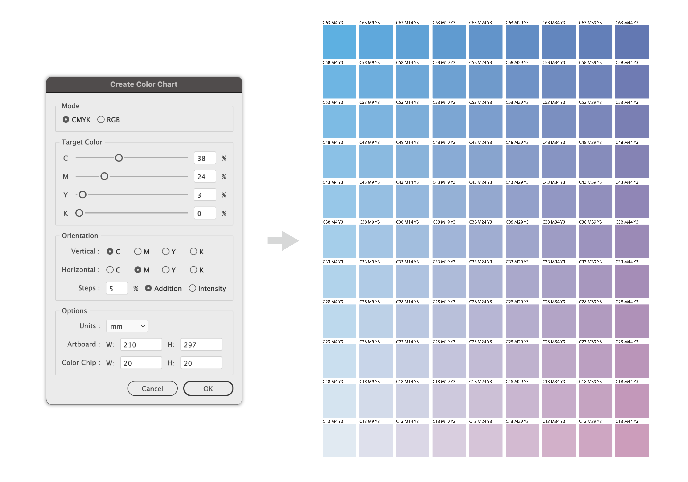
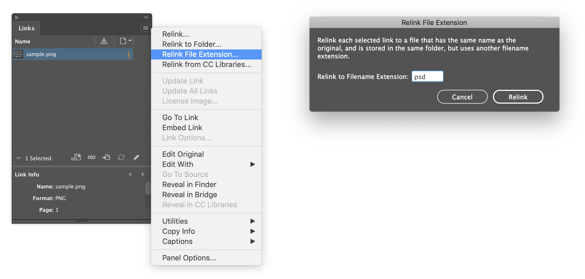
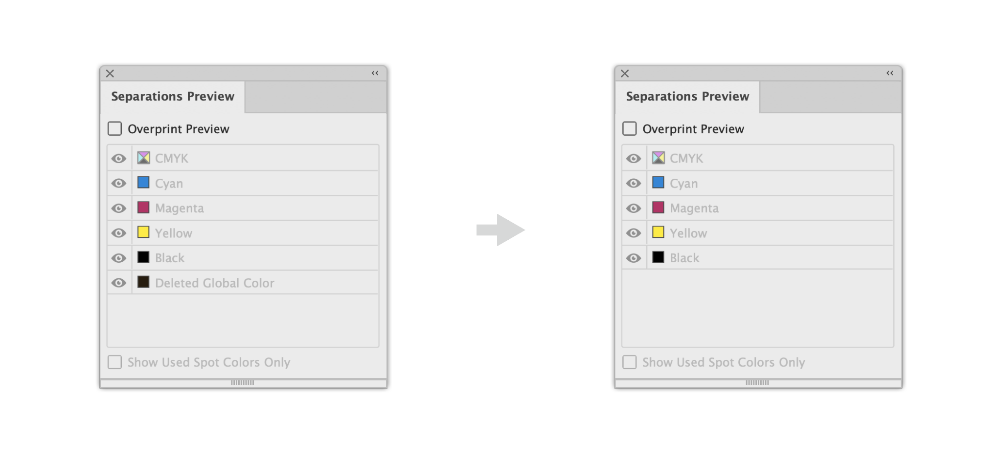

# Adobe Illustrator Scripts
Adobe Illustratorのスクリプト集です。

- [closePath.js](#closePath.js)
- [createColorChart.js](#createColorChart.js)
- [createPageNumbers.js](#createPageNumbers.js)
- [deleteUnusedLayers.js](#deleteUnusedLayers.js)
- [disjoinPath.js](#disjoinPath.js)
- [measurePathItems.js](#measurePathItems.js)
- [randomTextColor.js](#randomTextColor.js) `update`
- [relinkFileExtension.js](#relinkFileExtension.js)
- [relinkFileExtensionExtra.js](#relinkFileExtensionExtra.js)
- [relinkToFolder.js](#relinkToFolder.js)
- [removeDeletedGlobalColor.js](#removeDeletedGlobalColor.js)
- [resetToFullScale.js](#resetToFullScale.js)
- [stepandRepeat.js](#stepandRepeat.js)
- [syncView.js](#syncView.js)
- [textAlign_Center.js<br>textAlign_Left.js<br>textAlign_Right.js](#textAlign)
- [XmpFunctions.js](#XmpFunctions.js)


### インストール
右上の緑色のボタンからZIPファイルをダウンロードしてください。  
解凍したフォルダは好きな場所に置いてください。  
ファイル > スクリプト > その他のスクリプト... からスクリプトを選択し実行します。  
Macを使用している場合は、[SPAi](https://tama-san.com/spai/) がおすすめです。


### 注意事項
スクリプトを使い続けていると、まれに動作しなくなる場合があります。  
その場合は、Illustratorを再起動してから実行してみてください。


# <a name="closePath.js">closePath.js</a>

開いているパスを閉じます。


#### 使用方法
パスオブジェクトを選択してスクリプトを実行します。

#### 動作条件
Illustrator CS以降


# <a name="createColorChart.js">createColorChart.js</a>

カラーチャートを作成します。



#### 使用方法
1. スクリプトを実行します。
2. カラーモード「CMYK」または「RGB」を選択します。  
   パスオブジェクトを選択している場合は、塗りの値が初期値として使用されます。
3. 上下、左右で増減させたい色を選択します。
4. 増減値を入力します。
5. アートボードサイズ、カラーチップサイズ、単位を設定します。

#### 注意事項
CMYKの場合、K値の増減はできません。

#### 動作条件
Illustrator CS4以降


# <a name="createPageNumbers.js">createPageNumbers.js</a>

InDesignの書式メニュー > 特殊文字を挿入 > マーカー > 現在のページ番号 に相当します。  
アートボードの指定した位置にノンブルを配置します。


#### 使用方法
1. スクリプトを実行します。
2. 各項目を設定します。
   - `位置` ノンブルの表示位置。
   - `見開き` チェックを入れると見開きページに対応します。
   - `開始ページ番号` 始まりの番号を指定します。
   - `セクションプレフィックス` ノンブルの前に文字列を追加します。見開きページの場合は、後ろに追加します。
   - `フォントサイズ` ノンブルのフォントサイズ。
   - `マージン` アートボードからの距離を指定します。現在のルーラー設定で単位が切り替わります。

#### 注意事項
ノンブルに指定できるスタイルは数字のみです。  
アートボード順にノンブルを割り当てます。

#### 動作条件
Illustrator CS4以降


# <a name="deleteUnusedLayers.js">deleteUnusedLayers.js</a>

未使用（空）のレイヤーを削除します。サブレイヤーも対象です。


#### 使用方法
このスクリプトを実行するだけです。  
未使用レイヤーを選択する必要はありません。

#### 動作条件
Illustrator CS以降


# <a name="disjoinPath.js">disjoinPath.js</a>

アンカーポイントごとにパスオブジェクトを分割します。


#### 使用方法
パスオブジェクトを選択してスクリプトを実行します。

#### 注意事項
元のパスオブジェクトは削除されます。

#### 動作条件
Illustrator CS以降


# <a name="measurePathItems.js">measurePathItems.js</a>

パスオブジェクトの2点間のアンカーポイントの距離を測定します。


#### 使用方法
パスオブジェクトを選択してスクリプトを実行します。

#### 特徴
パスオブジェクトごとに測定値をグループ化し色を付けます。  
測定値の単位は、ドキュメントのルーラ設定により切り替わります。

#### 注意事項
オブジェクトが複雑な形状や小さい場合、測定値が重なって表示されることがあります。  
曲線には対応していません。

#### 動作条件
Illustrator CS4以降


# <a name="randomTextColor.js">randomTextColor.js</a>

単語または、1文字、1文ごとにランダムに色を適用します。CMYK、RGB のどちらにも対応しています。


#### 使用方法
1. テキストオブジェクトを選択してスクリプトを実行します。
2. スライダーで各色のしきい値を指定します。
3. ランダムボタンをクリックすると、しきい値に応じた色が割り当てられます。

#### 注意事項
文字数が多いと変換に時間がかかります。  
英文の場合、ピリオドやカンマなど一部適用されない文字があります。

#### UI デザイン
UIデザインツールには [ScriptUI Dialog Builder (SDB)](https://scriptui.joonas.me/) を利用しました。  
ツールの詳細は [ScriptUI-Dialog-Builder-Joonas](https://github.com/joonaspaakko/ScriptUI-Dialog-Builder-Joonas) を参照してください。

#### 動作条件
Illustrator CS4以降


# <a name="relinkFileExtension.js">relinkFileExtension.js</a>

InDesignのリンクパネルメニュー > ファイル拡張子にリンクを再設定... に相当します。



#### 使用方法
1. 置き換えたいリンク画像を選択しスクリプトを実行します。  
   リンク画像を選択しない場合は、ドキュメント内のすべてのリンク画像が対象となります。
2. 表示されたプロンプトに置き換えるファイルの拡張子を入力します。


#### 注意事項
再配置するリンク画像は、元のリンク画像と同じフォルダに置いてください。  
画像を選択する場合は、リンクパネル内の画像ではなく、アートボード上の画像を選択してください。  
リンク切れ画像は置き換えることはできません。  
埋め込み画像も対象外です。

#### 動作条件
Illustrator CS4以降


# <a name="relinkFileExtensionExtra.js">relinkFileExtensionExtra.js</a>

このスクリプトは、relinkFileExtension.js を機能拡張したものです。


#### 使用方法
1. 置き換えたいリンク画像を選択しスクリプトを実行します。  
   リンク画像を選択しない場合は、ドキュメント内のすべてのリンク画像が対象となります。
2. 「文字列を置換する」または「文字列を追加する」を選択します。  
   「文字列を置換する」の場合は、正規表現が使用できます。  
   「文字列を追加する」の場合は、元のファイル名の先頭か末尾またはその両方に追加する文字列を入力します。
3. 置き換えるファイルの拡張子を入力します。  
   拡張子を入力しない場合は、元のファイルの拡張子が使用されます。

#### 注意事項
再配置するリンク画像は、元のリンク画像と同じフォルダに置いてください。  
画像を選択する場合は、リンクパネル内の画像ではなく、アートボード上の画像を選択してください。  
リンク切れ画像は置き換えることはできません。  
埋め込み画像も対象外です。

#### 動作条件
Illustrator CS4以降


# <a name="relinkToFolder.js">relinkToFolder.js</a>

指定したフォルダーにある同名の画像と置き換えます。  
InDesignのリンクパネルメニュー > フォルダに再リンク... に相当します。


#### 使用方法
1. 置き換えたいリンク画像を選択しスクリプトを実行します。  
   リンク画像を選択しない場合は、ドキュメント内のすべてのリンク画像が対象となります。
2. 表示されたダイアログからフォルダを選択します。

#### 注意事項
画像を選択する場合は、リンクパネル内の画像ではなく、アートボード上の画像を選択してください。  
リンク切れ画像は置き換えることはできません。  
埋め込み画像も対象外です。

#### 動作条件
Illustrator CS4以降


# <a name="removeDeletedGlobalColor.js">removeDeletedGlobalColor.js</a>

分版プレビューパネルに表示される Deleted Global Color を削除します。



#### 使用方法
このスクリプトを実行するだけです。  
オブジェクトを選択する必要はありません。

#### 注意事項
まれに削除できない場合があります。  
削除後にファイルを保存して再度開くと復活する場合があります。

#### 動作条件
Illustrator CS以降


# <a name="resetToFullScale.js">resetToFullScale.js</a>

リンク画像のスケールを100%に、回転角度を0°に戻します。  
埋め込み画像にも対応しています。


#### 使用方法
リンク画像または埋め込み画像を選択してスクリプトを実行します。

#### 動作条件
Illustrator CS6以降


# <a name="stepandRepeat.js">stepandRepeat.js</a>

InDesignの編集メニュー > 繰り返し複製... に相当します。


#### 使用方法
1. オブジェクトを選択してスクリプトを実行します。
2. モードの「繰り返し」または「グリッド」を選択します。
3. 「繰り返し」の場合は、カウントを入力します。  
   「グリッド」の場合は、行・段数を入力します。
4. オフセット値（オブジェクトの間隔）を入力します。

#### 動作条件
Illustrator CS4以降


# <a name="syncView.js">syncView.js</a>

アクティブなファイルのアートボードの表示スケールと表示位置に開いているすべてのファイルを同期させます。


#### 使用方法
このスクリプトを実行するだけです。  
オブジェクトを選択する必要はありません。

#### 注意事項
2ファイル以上開いてください。  

#### 動作条件
Illustrator CS以降  


# <a name="textAlign">textAlign_Center.js<br>textAlign_Left.js<br>textAlign_Right.js</a>

テキストの位置を移動させずにテキスト揃えを変更します。  
縦書きにも対応しています。

#### 使用方法
テキストオブジェクトを選択してスクリプトを実行します。

#### 動作条件
Illustrator CS以降


# <a name="XmpFunctions.js">XmpFunctions.js</a>

XMPから取得できるフォント・カラー・リンク画像・更新履歴の情報を関数としてまとめました。  
XMPの詳しい内容については、[Adobeのサイト](https://www.adobe.io/xmp/docs/)を参照してください。

#### 使用方法
このスクリプトファイルをインクルードするか、関数をコピー＆ペーストして使用してください。

```javascript
// @include '/Path1/Path2/XmpFunctions.js'
var fonts = xmpGetFonts(app.activeDocument.fullName);
```
また、リンク画像にも使用できます。
```javascript
// @include '/Path1/Path2/XmpFunctions.js'
var src = app.activeDocument.placedItems[0].file;
var history = xmpGetHistory(src);
```

#### 関数
- [xmpGetFonts(src)](#xmpGetFonts(src))
- [xmpGetHistory(src)](#xmpGetHistory(src))
- [xmpGetLinkedFiles(src)](#xmpGetLinkedFiles(src))
- [xmpGetPlateNames(src)](#xmpGetPlateNames(src))
- [xmpGetSwatches(src)](#xmpGetSwatches(src))

### <a name="xmpGetFonts(src)">xmpGetFonts(src)</a>
ドキュメント内で使用しているフォント情報を取得します。

**引数**: `src` `<File>`  
**返り値**: `Array<Object>`  
- `composite` `<boolean>` 合成フォントの場合、true。
- `face` `<string>` フォントフェイス。
- `family` `<string>` フォントファミリー。
- `filename` `<string>` フォントファイル名。
- `name` `<string>` フォントのポストスクリプト名。
- `type` `<string>` TrueType、Type1、OpenTypeなどのフォントタイプ。
- `version` `<string>` バージョン。

##### 例
```javascript
// @include '/Path1/Path2/XmpFunctions.js'
var fonts = xmpGetFonts(app.activeDocument.fullName);
alert(fonts[0].face);
```

### <a name="xmpGetHistory(src)">xmpGetHistory(src)</a>
更新履歴を取得します。

**引数**: `src` `<File>`  
**返り値**: `Array<Object>`  
- `action` `<string>` 発生したアクション。
- `parameter` `<string> | null` アクションの追加説明。
- `software` `<string> | null` アクションを実行したアプリケーション。
- `when` `<Date> | null` アクションが発生したときの時刻。

##### 例
```javascript
// @include '/Path1/Path2/XmpFunctions.js'
var history = xmpGetHistory(app.activeDocument.fullName);
var date = history[0].when;
alert(date.getFullYear());
```

### <a name="xmpGetLinkedFiles(src)">xmpGetLinkedFiles(src)</a>
ドキュメント内で使用しているリンク画像を取得します。

**引数**: `src` `<File>`  
**返り値**: `Array<Object>`  
- `exists` `<boolean>` ファイルの有無。
- `filePath` `<string>` リソースのファイルパスまたはURL。

##### 例
```javascript
// @include '/Path1/Path2/XmpFunctions.js'
var files = xmpGetLinkedFiles(app.activeDocument.fullName);
alert(files[0].filePath);
```

### <a name="xmpGetPlateNames(src)">xmpGetPlateNames(src)</a>
ドキュメント内で使用している色名を取得します。

**引数**: `src` `<File>`  
**返り値**: `Array<string>` 印刷に必要な色名。  

##### 例
```javascript
// @include '/Path1/Path2/XmpFunctions.js'
var platenames = xmpGetPlateNames(app.activeDocument.fullName);
alert(platenames[0]);
```

### <a name="xmpGetSwatches(src)">xmpGetSwatches(src)</a>
ドキュメント内で使用しているスウォッチを取得します。

**引数**: `src` `<File>`  
**返り値**: `Array<Object>`  
- `colorant` `<Object>` 色の値。
    - `cyan` `<number>` カラーモードがCMYKのときのシアンの値。範囲: 0〜100。
    - `magenta` `<number>` カラーモードがCMYKのときのマゼンタの値。範囲: 0〜100。
    - `yellow` `<number>` カラーモードがCMYKのときのイエローの値。範囲: 0〜100。
    - `black` `<number>` カラーモードがCMYKのときのブラックの値。範囲: 0〜100。
    - `gray` `<number>` カラーモードがグレースケールのときの値。範囲: 0〜255。
    - `l` `<number>` カラーモードがLABのときのLの値。範囲: 0〜100。
    - `a` `<number>` カラーモードがLABのときのAの値。範囲: -128〜127。
    - `b` `<number>` カラーモードがLABのときのBの値。範囲: -128〜127。
    - `red` `<number>` カラーモードがRGBのときのレッドの値。範囲: 0〜255。
    - `green` `<number>` カラーモードがRGBのときのグリーンの値。範囲: 0〜255。
    - `blue` `<number>` カラーモードがRGBのときのブルーの値。範囲: 0〜255。
- `mode` `<string>` カラーモード。
- `name` `<string>` スウォッチ名。
- `swatch` `<swatch> | null` スウォッチオブジェクト。
- `tint` `<number>` 色合い。範囲: 0〜100。
- `type` `<string>` スウォッチのカラータイプ。 `PROCESS` または `SPOT`。

##### 例
```javascript
// @include '/Path1/Path2/XmpFunctions.js'
var swatches = xmpGetSwatches(app.activeDocument.fullName);
alert(swatches[0].colorant.cyan);
```


#### 動作条件
Illustrator CS以降


# ライセンス
MITライセンスのもとで公開しています。  
詳しくはLICENSEファイルをご覧ください。
